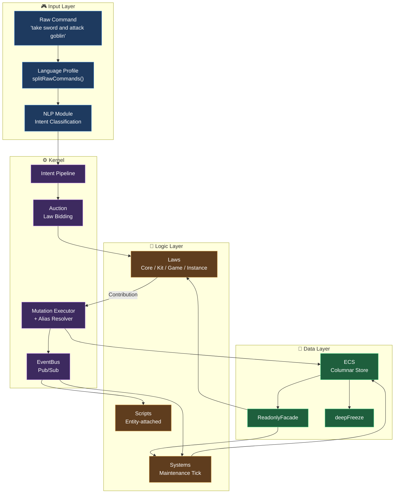
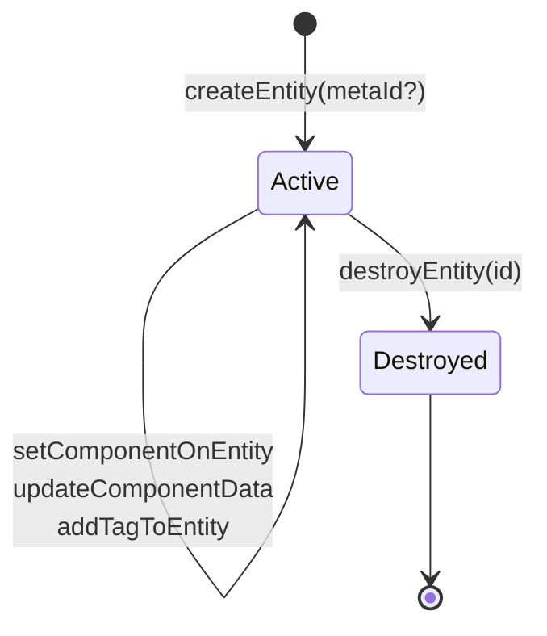
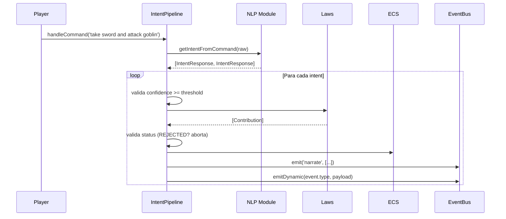
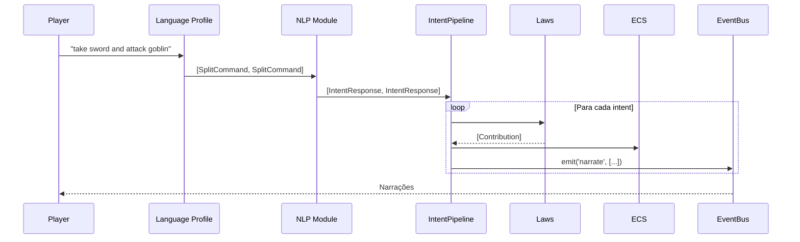
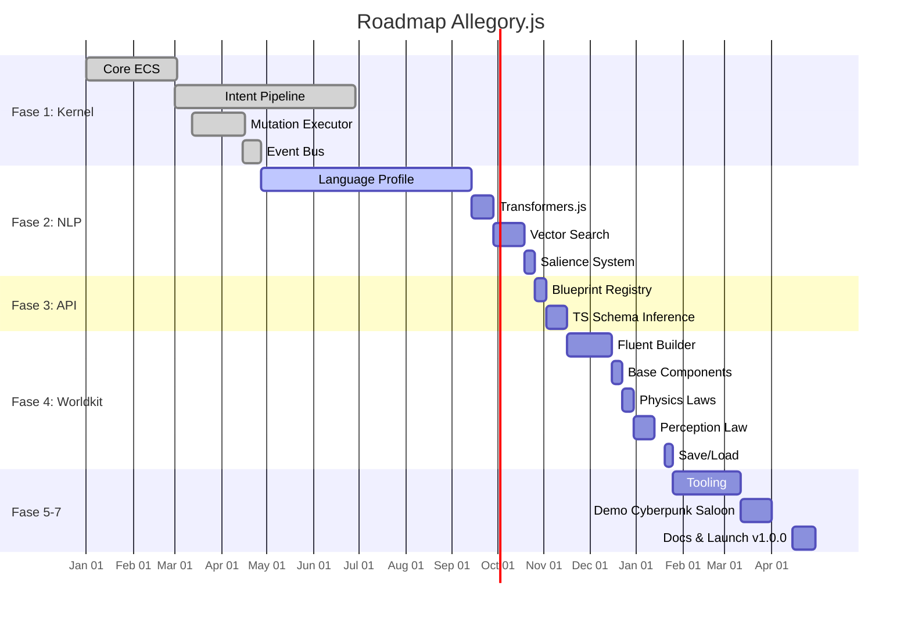

# DeepSeek — Exportação de Conversas

> **Exportado em:** 12/09/2026, 23:18:34
> **Conversas exportadas:** 1
> **Total de mensagens:** 14

---

## 1. Allegory.js

> **ID:** `de561454-37e2-430a-9937-af5afd192492` · **Criada:** 12/09/2026, 19:25:06 · **Atualizada:** 12/09/2026, 23:14:51 · **Mensagens:** 14

### 📄 USER

o que você sabe sobre allegory.js?

### 📄 ASSISTANT

**Allegory.js** é um motor web-native moderno para criar **ficção interativa baseada em simulação**. O projeto está em fase **pré-alpha** (desenvolvimento pesado) e ainda não possui uma versão estável ou documentação pública completa[reference:0].

### 🎯 Visão e Objetivo
O motor busca preencher a lacuna entre jogos de parser tradicionais (como Inform 7 e TADS) e o design de jogos sistêmicos, trazendo **simulação profunda de mundo** para o ecossistema JavaScript[reference:1]. A ideia é que o mundo seja gerenciado por um banco de dados **ECS (Entity-Component-System)**, em vez de uma árvore de narrativa ramificada. Objetos têm física, peso, lógica e agência independente[reference:2].

### 🧠 Principais Características
- **Linguagem Natural**: Construído para suportar NLP moderno, entendendo **intenções** (ex.: *"Bowl the ball"*) em vez de apenas sintaxe rígida (ex.: `USE BALL ON LANE`)[reference:3].
- **Web-Native**: Jogos são escritos em **TypeScript/JavaScript** padrão, rodam em qualquer navegador, funcionam em mobile e podem ser estilizados com CSS comum[reference:4].
- **API Fluente**: Definição do mundo usando sintaxe encadeada legível, como:
  ```js
  ThereIsAContainer('old_chest')
    .withDescription('A rotted wooden chest.')
    .is('locked')
    .containing('rusty_key')
  ```
  [reference:5]

### ⚙️ Arquitetura
O motor é construído sobre um pipeline reativo e orientado a eventos:
1. **Entrada**: Texto do usuário é roteado via *Semantic Embeddings* para determinar a intenção.
2. **Lógica**: "Leis" (middleware) disputam as intenções com base em especificidade.
3. **Dados**: Um banco de dados ECS relacional e plano gerencia o estado.
4. **Reação**: Eventos do mundo disparam comportamentos emergentes em NPCs e sistemas[reference:6].

### 📦 Status Atual e Roadmap
O repositório está em **construção ativa**. O roadmap inclui fases como:
- **Fase 1 (Kernel)**: Implementação do ECS, pipeline de intenções, executor de mutações e event bus.
- **Fase 2 (NLP)**: Integração com Transformers.js (WASM), busca por similaridade vetorial e sistema de saliência.
- **Fase 3 (API)**: Registro de blueprints e inferência de esquema TypeScript.
- **Fase 4 (Adventure Game Worldkit)**: Construtor fluente, componentes base (localização, etc.), leis de física (mover, pegar, largar) e leis de percepção (olhar, descrever)[reference:7].

### ⚠️ Observação sobre o pacote npm "allegory"
Existe um pacote npm chamado `allegory` (v0.1.0) com a descrição *"Turns your code into an executable image"*, mas ele **não parece estar relacionado** ao Allegory.js do GitHub. Além disso, esse pacote não possui arquivo principal (`index.js`) e não pode ser exigido diretamente[reference:8].

### 🔍 Como Acompanhar
O projeto está hospedado no GitHub em **`allegoryjs/allegoryjs`**. Para detalhes técnicos mais profundos, há um documento `TDD.md` no repositório[reference:9]. Como está em pré-alpha, ainda não há uma versão publicada para uso em produção.

### 📄 USER

BUSQUE O PROJETO ALLEGORY NO GITHUB

### 📄 ASSISTANT

Encontrei o repositório oficial do **Allegory.js** no GitHub. Ele está em **fase pré-alpha (desenvolvimento pesado)** e é um motor web-native para ficção interativa baseada em simulação[reference:0].

### 🎯 Visão Geral
O motor busca preencher a lacuna entre jogos de parser tradicionais (como Inform 7 e TADS) e o design de jogos sistêmicos, trazendo **simulação profunda de mundo** para o ecossistema JavaScript[reference:1]. A ideia central é que o mundo seja gerenciado por um banco de dados **ECS (Entity-Component-System)**, e não por uma árvore narrativa ramificada. Objetos têm física, peso, lógica e agência independente[reference:2].

### 🧠 Principais Características
- **Linguagem Natural**: Construído para entender **intenções** (ex.: *"Bowl the ball"*) em vez de apenas sintaxe rígida (ex.: `USE BALL ON LANE`), usando embeddings semânticos[reference:3].
- **Web-Native**: Jogos são escritos em **TypeScript/JavaScript** padrão, rodam em qualquer navegador, funcionam em mobile e podem ser estilizados com CSS comum[reference:4].
- **API Fluente**: Definição do mundo usando sintaxe encadeada legível, como:
  ```js
  ThereIsAContainer('old_chest')
    .withDescription('A rotted wooden chest.')
    .is('locked')
    .containing('rusty_key')
  ```
  [reference:5]

### ⚙️ Arquitetura
O motor é construído sobre um pipeline reativo e orientado a eventos[reference:6]:
1. **Entrada**: Texto do usuário é roteado via *Semantic Embeddings* para determinar a intenção.
2. **Lógica**: "Leis" (Middleware) disputam as intenções com base em especificidade.
3. **Dados**: Um banco de dados ECS relacional e plano gerencia o estado.
4. **Reação**: Eventos do mundo disparam comportamentos emergentes em NPCs e sistemas.

Um documento `TDD.md` no repositório oferece uma visão técnica mais profunda[reference:7].

### 📦 Roadmap
O repositório lista um roadmap detalhado em fases[reference:8]:
- **Fase 1 (Kernel)**: ECS central, pipeline de intenções, executor de mutações e event bus.
- **Fase 2 (NLP)**: Integração com Transformers.js (WASM), busca por similaridade vetorial e sistema de saliência.
- **Fase 3 (API)**: Registro de blueprints e inferência de esquema TypeScript.
- **Fase 4 (Adventure Game Worldkit)**: Construtor fluente, componentes base, leis de física e percepção.
- **Fases 5 a 7**: Ferramentas, validação com demo "Cyberpunk Saloon", documentação e lançamento da v1.0.0 no NPM.

### 🤝 Contribuição
O projeto está em construção e a equipe convida interessados na arquitetura de motores de texto a **acompanhar o repositório** ou **abrir uma discussão**[reference:9].

### 🧠 Nota sobre IA
O Allegory.js usa IA para **empoderar o jogador**, não para substituir o autor. A IA local (no navegador) interpreta a intenção do jogador, mas a lógica do jogo — escrita à mão — determina o que acontece. A simulação é determinística, depurável e funciona offline[reference:10].

### 📄 Licença
O projeto é distribuído sob a **licença MIT**[reference:11].

Se quiser explorar algum aspecto específico do repositório (como o `TDD.md` ou a estrutura de pastas), é só me avisar.

### 📄 USER

INTEGREI ALGUNS ARQUIVOS DO PROJETO ALLEGORY TENTE ENTENDER MAIS A FUNDO O PROJETO

### 📄 ASSISTANT

# Análise Profunda do Allegory.js

Analisei todos os arquivos que você compartilhou. Aqui está uma visão integrada e aprofundada do projeto.

---

## 1. Filosofia Central

O Allegory.js é um **motor de ficção interativa web-native baseado em simulação**, não em narrativa ramificada. Três pilares fundamentais:

| Pilar | Significado |
|-------|-------------|
| **Simulação sobre Scripting** | O estado do mundo vive num banco ECS, não numa árvore de escolhas |
| **Intenção sobre Sintaxe** | O jogador digita linguagem natural; o motor interpreta *intenções*, não verbos rígidos |
| **Micro-Kernel** | O núcleo só gerencia fluxo de dados; a lógica de jogo vem de "Kits" substituíveis |

O README deixa explícito: **IA para empoderar o jogador, não para substituir o autor**. O NLP roda localmente (Transformers.js/WASM), e a lógica é determinística e escrita à mão.

---

## 2. O ECS (`ecs.ts` + `ecs.types.ts`)

O coração do motor. É um banco relacional plano com armazenamento colunar:

```ts
#components = new Map<
  keyof ComponentSchema & string,
  Map<Entity, ComponentSchema[keyof ComponentSchema]>
>()
```

**Decisões de design notáveis:**

- **Entidades são inteiros incrementais** (`#nextEntityId`), começando em 1.
- **Componentes embutidos**: `Tags` (um `Set<string>`) e `Meta` (nome, id pretty, timestamp). Toda entidade nasce com ambos.
- **Pretty IDs separados dos IDs numéricos**: `#prettyIdMap` permite `createEntity('player-1')` e `getEntityByPrettyId('player-1')`.
- **Query otimizada por "Smallest-Set Intersection"**: `getEntitiesByComponents` ordena os stores por tamanho e itera o menor primeiro — garante que a query seja O(N) relativo ao menor grupo, não ao mundo inteiro.
- **Deep freeze na leitura**: `getEntityComponentData` retorna um clone profundamente congelado via `deepFreeze`, impedindo mutação acidental fora da API.
- **`ReadonlyFacade`**: Laws e Systems nunca acessam o ECS diretamente; recebem uma fachada somente-leitura que expõe `get`, `query`, `entityHasComponent`, etc. mas esconde `set`, `add`, `destroy`. Isso força o **Command Pattern**.
- **Systems ordenados por prioridade** (ascendente, com default configurável de 50).
- **Erros granulares**: `#assertEntityExists` distingue "não existe" de "foi destruída" — crucial para debugging.

O `destroyEntity` limpa todas as stores de componentes + `#activeEntities` + `#prettyIdMap`, prevenindo "Zombie References".

---

## 3. O EventBus (`event-bus.ts` + `event-bus.types.ts`)

Um pub/sub sofisticado, com recursos que vão além de um EventEmitter típico:

| Recurso | Detalhe |
|---------|---------|
| **Prioridade** | Listeners executam em ordem decrescente de `priority` (default 0) |
| **Wildcard** | `WILDCARD` (`*`) recebe todos os eventos |
| **Namespaces** | Padrões como `'combat:*'` casam com `'combat:damage'`, `'combat:heal'`, etc. |
| **`once`** | Auto-remove após primeira execução |
| **Buffering** | Se `enableBuffering: true`, eventos sem listeners são guardados e reproduzidos quando alguém se inscreve |
| **Cancelamento** | `ctx.cancel()` interrompe listeners restantes |
| **Isolamento de erro** | Um listener que lança não quebra os demais; erros vão para `onError` ou logger |
| **`emitDynamic`** | Emissão sem type-safety, para dispatch interno do motor |
| **`maxListeners`** | Alerta de possível memory leak |

O `EmitContext` carrega `type`, `payload`, `timestamp`, `cancelled` e o método `cancel()`. A tipagem genérica `EventMap` permite streams tipados (`typedBus.emit('combat:damage', { target, amount })`).

Os testes cobrem fases: **Core** (subscribe/emit/unsubscribe/once), **Advanced** (wildcard, namespaces, priority, cancelamento), e **Nice-to-haves** (buffering, max listeners).

---

## 4. O Intent Pipeline (`intent-pipeline.ts`) — o componente mais complexo

Este é o cérebro do motor. O fluxo é:

```
Comando do jogador
  → IntentClassificationModule (NLP)
    → Array<IntentClassificationResponse>
      → Para cada intent: #auctionIntent
        → Laws dão lance (bid) por especificidade
          → Ordena por [Layer, Score]
            → Executa Laws em ordem
              → Contribution { status, mutations, narrations, events }
                → Se REJECTED: aborta
                → Se COMPLETED: para
                → Se PASS: continua
```

### 4.1 Intents

```ts
interface Intent {
  name: string
  actors?: Array<Entity>
  targets?: Array<Entity>
  auxiliary?: Array<Entity>  // ferramentas/implements
}
```

### 4.2 Laws — Middleware com Lances

Uma **Law** é um encapsulamento plugável de um sistema de jogo (combate, inventário, percepção, diálogo). Ela tem:

- `layer`: `Core(0) < Kit(1) < Game(2) < Instance(3)`
- `intents`: quais nomes de intent ela trata
- `matchers`: cenários que ela considera
- `apply`: a lógica em si

### 4.3 Especificidade — Inspirada em CSS

A ordenação é um **tuple sort** `[Layer, Score]`:

1. **Layer** domina (hard hierarchy).
2. **Score** é a soma do melhor matcher.

**Pesos dos concerns:**
| Concern | Peso |
|---------|------|
| ID match | 100 |
| Prop match (`Component.prop === value`) | 20 |
| Component presence | 10 |
| Tag match | 2.5 |

**Regra crítica de matchers:** se um concern declara `ids`, `components`, `props` ou `tags` e a entidade não casa com **nenhum** deles, o score é **-1** → o matcher inteiro falha. Isso é um "tudo ou nada" por categoria.

### 4.4 Permutação de Auxiliares

Um dos detalhes mais engenhosos: quando o jogador digita *"fix the car with the wrench, dielectric grease, and spark plug"*, a ordem dos auxiliares pode não coincidir com a ordem dos concerns da Law. O motor calcula **todas as permutações** dos auxiliares, pontua cada uma, e usa a de maior score para o lance. A Law recebe tanto a lista reordenada (`auxiliary`) quanto a original (`originalAuxiliaries`) — porque às vezes a ordem *importa* (ex.: ritual que mata se a ordem estiver errada).

### 4.5 Contribution Status

| Status | Efeito |
|--------|--------|
| `PASS` | Adiciona flavor/mutations, mas a cadeia continua |
| `COMPLETED` | Commit e **para** a propagação |
| `REJECTED` | **Rollback** total e aborta o intent |

### 4.6 Mutations e Aliases

Mutations têm ops: `CREATE`, `UPDATE`, `SET`, `REMOVE`, `DESTROY`.

O sistema de **aliases** resolve um problema real: uma Law pode querer criar um goblin (`CREATE` com `alias: 'goblin_1'`) e logo em seguida atualizar um componente nesse goblin — mas o ID numérico ainda não existe. `#validateMutations` pré-valida que todo alias referenciado foi criado antes, e `#executeMutations` mantém um `aliasMap` para resolver strings → IDs.

### 4.7 Dry Run

Se a classificação marca `dryRun: true` (ex.: *"Can I break that door?"*), o pipeline:
- Executa as Laws (para validar)
- **Não** executa mutations
- **Não** emite eventos
- **Sim** emite narrações

Isso permite que o jogador pergunte "é possível?" sem alterar o mundo.

### 4.8 Ordem-Independência de Atores/Targets

Os testes `'ensures ordering of actors does not affect which law wins the bid'` garantem que a ordem dos atores/targets no intent não afeta o vencedor do lance. A lógica usa `Math.max` entre scores dos atores — captura a maior especificidade, independente de ordem.

---

## 5. NLP / Language Profile (`profile-en-us.ts`)

O `splitRawCommands` é uma peça de engenharia de regex notável:

- Divide comandos compostos em `.`, `;`, `!`, `?`, `?!`, `!?`, `..`, `...` e variantes com `then`/`and then`/`& then`.
- **Não** divide em abreviações comuns (`Mr.`, `Dr.`, `Ph.D.`, `St.`, `approx.`, etc.) nem em contrações (`don't`, `can't`).
- Detecta prefixos interrogativos (`can i`, `could i`, `is it possible to`, `may i`, `am i able to`, `would i be able to`) e marca `dryRun: true`.
- **Propaga dryRun**: uma vez que um comando é interrogativo, os subsequentes também são (regra explícita no comentário).
- Ignora maiúsculas/minúsculas para prefixos e delimitadores.

O teste é exaustivo — cobre combinações de prefixos × pontuações × delimitadores × posições, com uma nota inteligente sobre evitar explosão O(n²) testando cada delimitador independentemente em cada posição.

---

## 6. Utilitários

### `deepFreeze.ts`
Um clone profundamente congelado que:
- Trata primitivos, Date, RegExp, Map, Set, ArrayBuffer, TypedArrays, DataView, arrays e objetos com protótipos customizados.
- **Preserva referências circulares** via `WeakMap` (self-referencing e mutual referencing).
- Preserva symbol keys e descritores de propriedade.
- **Não muta o original** — sempre clona.

Isso é fundamental para o ECS: `getEntityComponentData` retorna dados que não podem ser alterados acidentalmente.

---

## 7. Tooling e Qualidade

O projeto usa um stack moderno e opinativo:

- **Bun** como runtime, package manager e test runner.
- **oxfmt** para formatação (sem semicolons, single quotes, trailing commas, printWidth 100, sortImports).
- **oxlint** para linting (plugins: typescript, unicorn, oxc, import; `consistent-type-imports`, `no-relative-parent-imports` com alias `@/`).
- **TypeScript estrito** com `verbatimModuleSyntax`, `noUncheckedIndexedAccess`, `noImplicitOverride`, target ESNext, module Preserve.
- **Dev Container** com `ghcr.io/nhaef/devcontainer-bun`.
- **AGENTS.md** documenta convenções para agentes de IA que forem contribuir.

---

## 8. Roadmap (do README)

| Fase | Conteúdo | Status |
|------|----------|--------|
| **1. Kernel** | ECS, Intent Pipeline, Mutation Executor, Event Bus | Concluído |
| **2. NLP** | Language Profile, Transformers.js, Vector Search, Salience | Em progresso |
| **3. API** | Blueprint Registry, TypeScript Schema Inference | Pendente |
| **4. Adventure Worldkit** | Fluent Builder, Components, Physics Laws, Perception | Pendente |
| **5. Tooling** | AST Extractor (ts-morph), LLM Synonym Generator | Pendente |
| **6. Validação** | Demo "Cyberpunk Saloon" | Pendente |
| **7. Launch** | Docs, site, v1.0.0 no NPM | Pendente |

---

## 9. Observações e Pontos de Atenção

1. **Estado pré-alpha**: o `package.json` é `private: true`, versão `0.0.1`, e o script `test` ainda é `echo "Error: no test specified"`. Os testes existem mas não estão no script padrão.

2. **Divergência entre docs e código**:
   - O `TDD.md` menciona `IntentLayer` com `Core(0) < StdLib(1) < Domain(2) < Instance(3)`, mas o código usa `LawLayer` com `Core(0) < Kit(1) < Game(2) < Instance(3)`.
   - O `intent-pipeline.md` descreve `Intent` com campos singulares (`actor`, `target`, `auxiliary`), mas o código usa arrays (`actors`, `targets`, `auxiliary`).
   - O `TDD.md` fala em "StdLib" e "Domain", o `intent-pipeline.types.ts` fala em "Kit" e "Game".

3. **Bug potencial no teste de ordenação**: o comentário no teste `'ensures ordering of actors does not affect which law wins the bid'` diz *"Wait, in current bugged logic it's 2.5"* — indicando que o autor sabe de uma limitação na lógica de captura de score por ator.

4. **`getComponentsOnEntity` chama `entityHasComponent` para cada componente**, que por sua vez chama `#assertEntityExists` a cada iteração — custo O(C) em asserts. Funciona, mas é ineficiente para schemas grandes.

5. **`intent-pipeline.ts`** tem um `TODO (temp)` no doc: *"Talk about COMPLETED, PASS, and REJECTED"* — a documentação ainda está sendo escrita.

6. **`localization.ts`** é um stub (`$t` retorna o slug). A localização real ainda não foi implementada.

7. **`ecs.md`, `intent-classification.md` e `world-kits.md`** são placeholders com apenas um heading e uma âncora.

---

## 10. Resumo da Arquitetura em Uma Frase

**Allegory.js é um motor ECS onde o jogador digita linguagem natural, um classificador de intenções extrai a intenção, e um leilão de "Laws" (middleware com especificidade estilo CSS) decide qual lógica executa, produzindo mutações transacionais, narrações e eventos — tudo rodando no navegador, com IA local para NLP e lógica determinística escrita à mão.**

Se quiser, posso aprofundar em algum aspecto específico: a lógica de permutação de auxiliares, o sistema de aliases nas mutations, a integração futura com Transformers.js, ou comparar com outros motores (Inform 7, TADS, Ink).

### 📄 USER

FAÇA UM BLUEPRINT COMPLETO

### 📄 ASSISTANT

# 📘 Blueprint Completo — Allegory.js

> **Documento de referência arquitetural** consolidando código, tipos, testes e documentação do repositório `allegoryjs/allegoryjs`.
> **Status:** Pré-Alpha · **Versão:** 0.0.1 · **Licença:** MIT · **Runtime:** Bun + TypeScript ESM

---

## Sumário

1. [Visão e Filosofia](#1-visão-e-filosofia)
2. [Mapa Arquitetural](#2-mapa-arquitetural)
3. [Camada 1 — Kernel: ECS](#3-camada-1--kernel-ecs)
4. [Camada 2 — Kernel: EventBus](#4-camada-2--kernel-eventbus)
5. [Camada 3 — Kernel: Intent Pipeline](#5-camada-3--kernel-intent-pipeline)
6. [Camada 4 — NLP / Language Profile](#6-camada-4--nlp--language-profile)
7. [Camada 5 — Utilitários](#7-camada-5--utilitários)
8. [Camada 6 — Tooling e DX](#8-camada-6--tooling-e-dx)
9. [Estrutura de Diretórios](#9-estrutura-de-diretórios)
10. [Fluxos de Dados Ponta-a-Ponta](#10-fluxos-de-dados-ponta-a-ponta)
11. [Contratos e Tipos-Chave](#11-contratos-e-tipos-chave)
12. [Pontos de Extensão](#12-pontos-de-extensão)
13. [Invariantes e Regras de Ouro](#13-invariantes-e-regras-de-ouro)
14. [Gaps, Divergências e Roadmap](#14-gaps-divergências-e-roadmap)

---

## 1. Visão e Filosofia

**Allegory.js** é um motor **web-native**, **baseado em simulação** e **orientado a intenções** para ficção interativa. Ele se posiciona entre:

- **Parsers clássicos** (Inform 7, TADS) — ricos em mundo, pobres em NLP e portabilidade.
- **Motores narrativos modernos** (Ink, Twine) — portáveis, mas sem simulação profunda.

### Três Pilares

| Pilar | Manifestação Concreta |
|-------|----------------------|
| **Simulação > Scripting** | Estado vive num banco ECS colunar, não numa árvore de escolhas |
| **Intenção > Sintaxe** | NLP local (Transformers.js/WASM) extrai `Intent`, não verbos rígidos |
| **Micro-Kernel** | Núcleo só orquestra fluxo; lógica vem de "Kits" substituíveis |

### Princípio de IA

> *"AI to empower the player, not to replace the author."*

- IA **só** para **interpretar** input (NLP local).
- Lógica de jogo é **determinística**, **escrita à mão**, **debugável**.
- Modelos rodam **offline** no browser via WASM — sem latência de rede.

---

## 2. Mapa Arquitetural



### Camadas de Responsabilidade

| Camada | Responsabilidade | Não faz |
|--------|-----------------|---------|
| **Input** | Sanitizar, dividir, classificar | Não acessa ECS |
| **Kernel** | Orquestrar, leiloar, executar, emitir | Não contém lógica de jogo |
| **Data** | Armazenar, consultar, proteger | Não contém lógica |
| **Logic** | Decidir, reagir, simular | Não muta ECS diretamente |
| **Tooling** | Extrair, empacotar, gerar | Não roda em runtime |

---

## 3. Camada 1 — Kernel: ECS

### 3.1 Modelo de Dados

**Entities** são **inteiros incrementais** (`1, 2, 3, ...`). Não são objetos; são chaves.

**Components** são **buckets JSON tipados** (`ComponentSchema`). Contêm estado, nunca comportamento.

**Storage colunar**:

```ts
#components = new Map<
  ComponentName,          // ex: 'position', 'health', 'Tags'
  Map<Entity, ComponentData>
>()
```

Isso permite consultas do tipo *"todos os que têm `position`"* em O(1) para obter o store, O(N) para iterar.

### 3.2 Componentes Embutidos

```ts
interface EngineComponentSchema {
  Tags: { list: Set<string> }
  Meta: { name: string; created: number; id: string }
}
```

- **`Tags`**: conjunto de strings. Usado para matching em Laws.
- **`Meta`**: nome legível, timestamp de criação, e **pretty ID** (string única global).

### 3.3 Ciclo de Vida



- **Criação**: `createEntity(metaId?)` → atribui ID, registra `Tags` vazio + `Meta` completo, mapeia pretty ID.
- **Destruição**: `destroyEntity(id)` → remove de **todas** as stores + `#activeEntities` + `#prettyIdMap`.
- **Zombie prevention**: `#assertEntityExists` distingue *"nunca existiu"* de *"foi destruída"*.

### 3.4 API Pública

| Método | Propósito |
|--------|-----------|
| `createEntity(metaId?)` | Cria entidade |
| `destroyEntity(id)` | Remove entidade |
| `defineComponent(name)` | Registra novo tipo de componente |
| `setComponentOnEntity(id, name, data)` | Define (sobrescreve) |
| `updateComponentData(id, name, partial)` | Merge raso |
| `removeComponentFromEntity(id, name)` | Remove componente |
| `getEntityComponentData(id, name)` | Leitura (deep-frozen clone) |
| `entityHasComponent(id, name)` | Predicado |
| `getComponentsOnEntity(id)` | Lista componentes |
| `getEntitiesByComponents(...names)` | Query (smallest-set first) |
| `addTagToEntity(id, tag)` / `entityHasTag(id, tag)` | Tags |
| `getEntityByPrettyId(prettyId)` | Lookup por string |
| `entityExists(id)` | Predicado |
| `registerSystem(sys)` / `deregisterSystem(name)` | Systems |
| `getReadonlyFacade()` | Fachada para Laws |

### 3.5 ReadonlyFacade — O Contrato de Segurança

Laws e Systems **nunca** tocam o ECS diretamente. Recebem:

```ts
interface ReadonlyFacade<ComponentSchema> {
  entityExists(entity: Entity): boolean
  entityHasTag(entity: Entity, tag: string): boolean
  entityHasComponent(entity, name): boolean
  getEntityByPrettyId(prettyId: string): Entity | undefined
  getComponentsOnEntity(entity): ComponentName[]
  getEntitiesByComponents(...types): Entity[]
  getEntityComponentData(entity, name): Readonly<...>
}
```

**Sem** `createEntity`, `destroyEntity`, `setComponentOnEntity`, `updateComponentData`, `removeComponentFromEntity`, `defineComponent`, `addTagToEntity`. Isso força o **Command Pattern**: toda mutação passa pelo Intent Pipeline.

### 3.6 Query — Smallest-Set Intersection

```ts
getEntitiesByComponents('position', 'velocity', 'health')
```

1. Ordena os stores por tamanho ascendente.
2. Itera o **menor** store.
3. Para cada entidade, verifica se tem os demais componentes.

**Complexidade:** O(|menor store| × |demais componentes|) em vez de O(|mundo inteiro|).

### 3.7 Systems

```ts
interface System<ComponentSchema> {
  readonly name: string
  readonly priority?: number   // default 50
  run(ecs: ReadonlyFacade<ComponentSchema>): Promise<void>
}
```

- **Ordenação ascendente** por prioridade.
- Getter `systems` retorna array **deep-frozen** (clone imutável).
- Executados **no fim de cada Tick** para manutenção (decay, salience, IA).

---

## 4. Camada 2 — Kernel: EventBus

### 4.1 Modelo

Pub/sub com **prioridade**, **namespaces**, **wildcard**, **buffering** e **cancelamento**.

```ts
class EventBus<T extends EventMap = DefaultEventMap> {
  subscribe<K>(stream: K, cb: Listener<T[K]>, opts?): Disposer
  once<K>(stream: K, cb, opts?): Disposer
  emit<K>(stream: K, payload: T[K]): Promise<void>
  emitDynamic(stream: string, payload?: unknown): Promise<void>
  unsubscribe<K>(stream: K, cb?): void
  clear(): void
  dispose(): void
  listenerCount(stream): number
  eventNames(): string[]
}
```

### 4.2 Matching de Streams

Um emit em `'combat:damage'` casa com:

| Padrão registrado | Casa? |
|-------------------|-------|
| `'combat:damage'` | ✅ exato |
| `'combat:*'` | ✅ namespace |
| `'*'` (WILDCARD) | ✅ global |
| `'inventory:*'` | ❌ |

### 4.3 Prioridade e Cancelamento

- Listeners ordenados por `priority` **decrescente** (default 0).
- `ctx.cancel()` interrompe listeners restantes.
- `ctx.timestamp` e `ctx.type` disponíveis.
- Erros isolados: um listener que lança não derruba os demais.

### 4.4 Buffering

```ts
new EventBus({ enableBuffering: true })
```

- Eventos emitidos **sem listeners** são guardados.
- Quando um listener se inscreve, o buffer daquele stream é **drenado e reproduzido em ordem**.
- Após replay, o buffer é limpo (novos subscribers não recebem eventos antigos).

### 4.5 Tipagem

```ts
interface GameEvents extends EventMap {
  narrate: string[]
  'combat:damage': { target: number; amount: number }
}

const bus = new EventBus<GameEvents>()
bus.emit('combat:damage', { target: 1, amount: 50 })  // ✅ type-safe
bus.emitDynamic('custom:event', { any: 'thing' })      // sem type-safety
```

---

## 5. Camada 3 — Kernel: Intent Pipeline

O componente mais complexo e central do motor.

### 5.1 Pipeline Geral



### 5.2 Estruturas de Dados

```ts
interface Intent {
  name: string
  actors?: Array<Entity>
  targets?: Array<Entity>
  auxiliary?: Array<Entity>   // ferramentas, implements
}

interface IntentClassificationResponse {
  intent?: Intent
  confidence: number          // 0..1
  dryRun: boolean             // pergunta vs. ação
}

interface Law<ComponentSchema> {
  layer: LawLayer
  name: string
  intents: Array<string>
  apply: (ctx: LawContext) => Promise<Contribution>
  matchers: Array<LawMatcher>
}

interface Contribution<ComponentSchema> {
  status: ContributionStatus  // PASS | COMPLETED | REJECTED
  mutations?: Array<MutationOp>
  narrations?: Array<string>
  events?: Array<EngineEvent>
}
```

### 5.3 Layers

```ts
enum LawLayer {
  Core = 0,       // engine-builtin (save, fallthrough)
  Kit = 1,        // world kits (adventure: move, take, look)
  Game = 2,       // jogo específico (default do dev)
  Instance = 3,   // por entidade (via Script)
}
```

**Hierarquia dura**: `Instance` sempre vence `Game`, que sempre vence `Kit`, que sempre vence `Core`.

### 5.4 Matchers e Concerns

Um **matcher** é um cenário. Contém concerns opcionais para `actor`, `target`, `auxiliary[]`.

```ts
interface LawConcern<ComponentSchema> {
  components?: Array<ComponentName>
  props?: Array<{ prop: string; value: string | number | boolean }>
  tags?: Array<string>
  ids?: Array<number | string>  // ECS IDs ou pretty IDs
}
```

### 5.5 Especificidade — Regras

**Pesos default** (configuráveis via `IntentPipelineConfig`):

| Concern | Peso | Exemplo |
|---------|------|---------|
| ID match | **100** | `ids: ['player-1']` |
| Prop match | **20** | `prop: 'Equipment.mainHand', value: 'flint'` |
| Component presence | **10** | `components: ['FireMagicSkill']` |
| Tag match | **2.5** | `tags: ['flammable']` |

**Regra do "tudo ou nada" por categoria**:
> Se um concern declara `ids`, `components`, `props` ou `tags`, e a entidade não casa com **nenhum** deles, o score daquela categoria é **-1** → o matcher inteiro falha.

**Score do matcher** = `actorScore + targetScore + auxiliaryScore`.
**Score da Law** = **max** entre todos os matchers.
**Ordenação final** = tuple sort `[Layer desc, Score desc]`.

### 5.6 Auxiliary Permutation — Detalhe Crítico

Quando o jogador digita *"fix the car with the wrench, dielectric grease, and spark plug"*, a ordem dos auxiliares pode não coincidir com a ordem dos concerns da Law.

**Solução**: gerar **todas as permutações** de `auxiliary`, pontuar cada uma, usar a de maior score. A Law recebe:

- `ctx.auxiliary` → lista **reordenada** (melhor match).
- `ctx.originalAuxiliaries` → lista **como o jogador digitou** (para casos onde ordem importa, ex.: ritual).

### 5.7 Auction — Algoritmo

```ts
#auctionIntent(intent, dryRun):
  bids = []
  for law in laws:
    if intent.name not in law.intents: continue
    bid = #calculateBid(law, intent)
    if bid: bids.push(bid)
  
  bids.sortBy(b => [-b.law.layer, -b.score])
  
  contributions = []
  for bid in bids:
    ctx = new LawContext({ actors, targets, auxiliary: bid.reorderedAuxiliaries, ... })
    result = await bid.law.apply(ctx)
    
    if result.status === REJECTED:
      return [result]   // aborta tudo
    contributions.push(result)
    if result.status === COMPLETED:
      break             // para a cadeia
  return contributions
```

### 5.8 Contribution Status

| Status | Semântica |
|--------|-----------|
| `PASS` | "Adicionei flavor/mutations, mas não sou a palavra final" — cadeia continua |
| `COMPLETED` | "Resolvi tudo" — commit e **para** |
| `REJECTED` | "Impossível" — **rollback** total e aborta |

### 5.9 Mutations e Aliases

**Tipos de mutation**:

```ts
enum LawMutationOpType {
  create = 'CREATE',    // { alias?, components? }
  destroy = 'DESTROY',  // { entity }
  remove = 'REMOVE',    // { entity, component }
  set = 'SET',          // { entity, component, value } — substitui
  update = 'UPDATE',    // { entity, component, value } — merge
}
```

**Problema dos aliases**: uma Law pode querer `CREATE goblin_1` e depois `UPDATE goblin_1.TestComponent`. Mas o ID numérico ainda não existe no momento da declaração.

**Solução em duas fases**:

1. **`#validateMutations`**: percorre a lista, rastreia aliases criados, e lança se um alias for referenciado antes de ser criado.
2. **`#executeMutations`**: mantém `aliasMap: Map<string, Entity>`, resolve strings → IDs conforme executa.

### 5.10 Dry Run

Se `dryRun: true`:
- Laws **executam** (para validar).
- **Mutations NÃO executam**.
- **Eventos NÃO emitem**.
- **Narrações SIM emitem**.

Permite *"Can I break that door?"* sem alterar o mundo.

### 5.11 Ordem-Independência

Testes garantem que a ordem de `actors` e `targets` no intent **não afeta** qual Law vence. A lógica usa `Math.max` entre scores — captura a maior especificidade.

### 5.12 LawContext

```ts
class LawContext<ComponentSchema> {
  readonly dryRun: boolean
  readonly actors?: Array<Entity>
  readonly targets?: Array<Entity>
  readonly auxiliary?: Array<Entity>          // reordenado
  readonly originalAuxiliaries?: Array<Entity> // ordem do jogador
  readonly ecsUtils: ReadonlyFacade<ComponentSchema>

  get actor(): Entity | undefined   // actors[0]
  get target(): Entity | undefined  // targets[0]
  get aux(): Entity | undefined     // auxiliary[0]
}
```

### 5.13 Configuração

```ts
interface IntentPipelineConfig {
  confidenceThreshold: number       // default 0.7
  biddingIdMatchPrice: number       // default 100
  biddingComponentMatchPrice: number // default 10
  biddingPropsMatchPrice: number    // default 20
  biddingTagsMatchPrice: number     // default 2.5
}
```

---

## 6. Camada 4 — NLP / Language Profile

### 6.1 `splitRawCommands(rawCommand)`

Divide um comando composto em comandos individuais com flag `dryRun`.

```ts
splitRawCommands("take sword. can i attack? go north.")
// → [
//   { dryRun: false, raw: 'take sword' },
//   { dryRun: true,  raw: 'attack' },
//   { dryRun: true,  raw: 'go north' },
// ]
```

### 6.2 Delimitadores

- **Hard stops**: `.` `;` `!` `?` `?!` `!?` `..` `...` e variantes com `?`/`!`.
- **Compostos**: `then`, `, then`, `and then`, `& then` (com espaçamento flexível).

### 6.3 Proteções

- **Não divide** em abreviações: `Mr.`, `Dr.`, `Ph.D.`, `St.`, `Ave.`, `approx.`, `etc.`
- **Não divide** em contrações: `don't`, `can't`, `it's`, `I'm`, `you're`.

### 6.4 Dry Run Detection

**Prefixos interrogativos** detectados no início:
- `would i be able to`
- `am i able to`
- `could i`
- `can i`
- `is it possible to`
- `may i`

**Propagação**: uma vez que um comando é interrogativo, **todos os subsequentes** também são (regra explícita).

### 6.5 NLP Module (Futuro)

Interface definida, implementação pendente:

```ts
interface IntentClassificationModule {
  getIntentFromCommand(command: string): Promise<Array<IntentClassificationResponse>>
}
```

**Plano (TDD §3.2)**:
1. **Embeddings** via `Transformers.js` (WASM).
2. **Vector search** contra índice pré-computado de exemplos de intent.
3. **Few-shot**: dev define exemplos; sem fine-tuning.
4. **Entity resolution**: mesma estratégia para substantivos, com candidatos ranqueados por score + saliência.

---

## 7. Camada 5 — Utilitários

### 7.1 `deepFreeze<T>(input): Readonly<T>`

Clone profundamente congelado que **não muta o original**.

**Suporte**:
- Primitivos (retorna como está)
- Plain objects (preserva protótipo customizado)
- Arrays
- `Date`, `RegExp`
- `Map`, `Set`
- `ArrayBuffer`, `DataView`, `TypedArrays`
- **Referências circulares** (via `WeakMap`)
- **Symbol keys**
- **Property descriptors** (getters/setters preservados)

**Uso crítico**: `ECS.getEntityComponentData` retorna deep-frozen clone — Laws não podem mutar dados acidentalmente.

### 7.2 `DefaultLogger`

```ts
class DefaultLogger implements Logger {
  constructor(opts: Partial<LoggerChannelOpts>)
  setLevel('error' | 'warn' | 'info' | 'debug' | 'silent')
  info(...) / debug(...) / error(...) / warn(...)
}
```

Default: `error` e `warn` ligados; `info` e `debug` desligados.

### 7.3 `LocalizationModule` (Stub)

```ts
class LocalizationModule {
  $t(slug: string): string {
    return slug  // passthrough; implementação real pendente
  }
}
```

---

## 8. Camada 6 — Tooling e DX

### 8.1 Stack

| Ferramenta | Papel |
|-----------|-------|
| **Bun** | Runtime, package manager, test runner |
| **TypeScript** | Linguagem (strict, ESNext, Preserve) |
| **oxfmt** | Formatação (sem `;`, single quotes, trailing commas, 100 cols) |
| **oxlint** | Linting (typescript, unicorn, oxc, import) |
| **Dev Container** | `ghcr.io/nhaef/devcontainer-bun` |

### 8.2 Convenções (AGENTS.md)

| Regra | Detalhe |
|-------|---------|
| Sem semicolons | `const x = 1` |
| Single quotes | `'string'` |
| Trailing commas | Sempre em multi-linha |
| 100 chars | Largura máxima |
| `import type` | Obrigatório para tipos (`verbatimModuleSyntax`) |
| Sem `../` parent imports | Usar `@/` alias |
| `await` em loops | Permitido |
| Correctness & perf | Erros |
| Suspicious | Warnings |

### 8.3 Path Alias

```json
"paths": { "@/*": ["./src/*"] }
```

### 8.4 Comandos

```bash
bun lint        # oxlint + oxfmt --check
bun lint:fix    # oxlint --fix + oxfmt
bun lint:style  # oxfmt apenas
```

### 8.5 Tooling Planejado (Fase 5)

- **AST Code Extractor** (`ts-morph`) — extrai entidades de código TS.
- **LLM Synonym Generator** — gera sinônimos para entidades (cloud API).
- **Vector Packer** — empacota embeddings em `.bin`.
- **Runtime Index Loader** — carrega índice no engine.

---

## 9. Estrutura de Diretórios

```
allegoryjs/
├── .devcontainer/
│   └── devcontainer.json
├── .vscode/
│   ├── extensions.json
│   └── settings.json
├── docs/
│   ├── TDD.md
│   ├── ecs.md
│   ├── intent-classification.md
│   ├── intent-pipeline.md
│   └── world-kits.md
├── images/
│   ├── allegory_logo_horizontal.png
│   └── allegory_logo_horizontal_light.png
├── src/
│   ├── helpers/
│   │   ├── event-bus/
│   │   │   ├── event-bus.ts
│   │   │   ├── event-bus.types.ts
│   │   │   └── event-bus.test.ts
│   │   ├── localization/
│   │   │   └── localization.ts
│   │   └── logger/
│   │       ├── logger.ts
│   │       └── logger.types.ts
│   ├── kernel/
│   │   ├── ecs/
│   │   │   ├── ecs.ts
│   │   │   ├── ecs.types.ts
│   │   │   └── ecs.test.ts
│   │   └── intent-pipeline/
│   │       ├── intent-pipeline.ts
│   │       ├── intent-pipeline.types.ts
│   │       └── intent-pipeline.test.ts
│   ├── nlp/
│   │   └── language-profile/
│   │       ├── language-profile.types.ts
│   │       └── profiles/
│   │           ├── profile-en-us.ts
│   │           └── profile-en-us.test.ts
│   └── utilities/
│       └── deepFreeze/
│           ├── deepFreeze.ts
│           ├── deepFreeze.types.ts
│           └── deepFreeze.test.ts
├── AGENTS.md
├── README.md
├── bun.lock
├── package.json
├── tsconfig.json
├── .oxfmtrc.json
└── .oxlintrc.json
```

---

## 10. Fluxos de Dados Ponta-a-Ponta

### 10.1 Comando Imperativo Simples

```
Player: "take the rusty sword"
   │
   ▼
[Language Profile] splitRawCommands → [{ dryRun: false, raw: 'take the rusty sword' }]
   │
   ▼
[NLP] getIntentFromCommand → [{ intent: { name: 'TAKE', actors: [player], targets: [sword] }, confidence: 0.95, dryRun: false }]
   │
   ▼
[IntentPipeline] valida confidence ≥ 0.7 ✅
   │
   ▼
[IntentPipeline] #auctionIntent('TAKE', ...)
   │
   ├─ InventoryLaw (Kit, score 20) → bid
   ├─ CursedItemLaw (Game, score 120) → bid
   └─ ordena: [CursedItemLaw, InventoryLaw]
   │
   ▼
CursedItemLaw.apply(ctx) → { status: COMPLETED, mutations: [SET sword.Cursed=true], narrations: ['The sword burns your hand!'] }
   │
   ▼
[IntentPipeline] #validateMutations ✅
[IntentPipeline] #executeMutations → ECS.setComponentOnEntity(sword, 'Cursed', { value: true })
[IntentPipeline] emit('narrate', ['The sword burns your hand!'])
```

### 10.2 Comando Interrogativo (Dry Run)

```
Player: "can i break the door with my sword?"
   │
   ▼
[Language Profile] → [{ dryRun: true, raw: 'break the door with my sword' }]
   │
   ▼
[NLP] → [{ intent: { name: 'BREAK', actors: [player], targets: [door], auxiliary: [sword] }, confidence: 0.88, dryRun: true }]
   │
   ▼
[IntentPipeline] #auctionIntent('BREAK', dryRun=true)
   │
   ▼
CombatLaw.apply(ctx) → { status: REJECTED, narrations: ['The door is reinforced; your sword would shatter.'] }
   │
   ▼
[IntentPipeline] detecta REJECTED → emite narração, aborta mutações
```

### 10.3 Cadeia PASS → COMPLETED

```
Player: "attack the goblin"
   │
   ▼
[IntentPipeline] #auctionIntent('ATTACK', ...)
   │
   ├─ CombatLaw (Kit, score 10) → { status: PASS, mutations: [UPDATE goblin.Health -= 5] }
   ├─ PoisonedBladeLaw (Game, score 20) → { status: PASS, mutations: [UPDATE goblin.Poisoned = true] }
   └─ GoblinDeathLaw (Instance, score 100) → { status: COMPLETED, mutations: [DESTROY goblin], narrations: ['The goblin falls.'] }
   │
   ▼
[IntentPipeline] acumula todas as contributions
[IntentPipeline] #executeMutations executa na ordem declarada
[IntentPipeline] emite todas as narrações
```

### 10.4 Rejeição com Rollback

```
Player: "put the cursed idol on the altar"
   │
   ▼
[IntentPipeline] #auctionIntent('PUT', ...)
   │
   ├─ AltarLaw (Kit, score 15) → { status: PASS, mutations: [UPDATE altar.HasIdol = true] }
   └─ BoulderTrapLaw (Instance, score 100) → { status: REJECTED }
   │
   ▼
[IntentPipeline] detecta REJECTED → descarta TODAS as contributions acumuladas
[IntentPipeline] nenhuma mutation executa
```

---

## 11. Contratos e Tipos-Chave

### 11.1 ECS

```ts
type Entity = number

interface EngineComponentSchema {
  Tags: { list: Set<string> }
  Meta: { name: string; created: number; id: string }
}

interface System<ComponentSchema> {
  readonly name: string
  readonly priority?: number
  run(ecs: ReadonlyFacade<ComponentSchema>): Promise<void>
}

interface ReadonlyFacade<ComponentSchema> { /* ver §3.5 */ }
```

### 11.2 EventBus

```ts
type Listener<P = unknown> = (payload: P, ctx: EmitContext<P>) => void | Promise<void>

interface EmitContext<P = unknown> {
  type: string
  payload: P
  timestamp: number
  cancelled: boolean
  cancel(): void
}

interface EventBusConfig {
  maxListeners?: number
  enableBuffering?: boolean
  logger?: Logger
  onError?: (error, stream, listener) => void
}
```

### 11.3 Intent Pipeline

```ts
enum LawLayer { Core = 0, Kit = 1, Game = 2, Instance = 3 }
enum ContributionStatus { pass = 'PASS', rejected = 'REJECTED', completed = 'COMPLETED' }
enum LawMutationOpType { create = 'CREATE', destroy = 'DESTROY', remove = 'REMOVE', set = 'SET', update = 'UPDATE' }

interface Intent {
  name: string
  actors?: Array<Entity>
  targets?: Array<Entity>
  auxiliary?: Array<Entity>
}

interface Law<ComponentSchema> {
  layer: LawLayer
  name: string
  intents: Array<string>
  apply: (ctx: LawContext<ComponentSchema>) => Promise<Contribution<ComponentSchema>>
  matchers: Array<LawMatcher<ComponentSchema>>
}
```

### 11.4 NLP

```ts
interface SplitCommand {
  dryRun: boolean
  raw: string
}

interface IntentClassificationModule {
  getIntentFromCommand(command: string): Promise<Array<IntentClassificationResponse>>
}
```

---

## 12. Pontos de Extensão

| Ponto | Mecanismo | Onde Registrar |
|-------|-----------|----------------|
| **Novo tipo de componente** | `ecs.defineComponent(name)` | Setup do jogo |
| **Novo System** | `ecs.registerSystem(sys)` | Setup do jogo |
| **Nova Law** | `intentPipeline.ratifyLaw(law)` | Kit ou jogo |
| **Remover Law** | `intentPipeline.repealLaw(name)` | Runtime |
| **Novo stream de evento** | `bus.emitDynamic(type, payload)` | Qualquer lugar |
| **Novo listener** | `bus.subscribe(stream, cb, opts)` | Scripts, Systems |
| **Nova language profile** | Implementar `splitRawCommands` análogo | `src/nlp/language-profile/profiles/` |
| **Novo NLP module** | Implementar `IntentClassificationModule` | Injetado no pipeline |
| **Nova localização** | Estender `LocalizationModule` | Injetado no pipeline |
| **Novo World Kit** | Pacote com Laws de layer `Kit` + componentes + Systems | Separado |

---

## 13. Invariantes e Regras de Ouro

1. **Laws nunca mutam o ECS diretamente.** Retornam `Contribution` com `mutations` declarativas.
2. **Systems nunca mutam o ECS diretamente.** Recebem `ReadonlyFacade`. (Na prática, o código atual permite `run(facade)` mas Systems de manutenção precisarão de alguma forma de mutação — provavelmente via pipeline interno.)
3. **Toda leitura de componente retorna clone deep-frozen.** Não há como mutar estado acidentalmente.
4. **Layers dominam scores.** Uma Law `Game` com score 0 vence uma Law `Kit` com score 1000.
5. **Matcher falha se qualquer concern categórico falhar.** "Tudo ou nada" por categoria (`ids`, `components`, `props`, `tags`).
6. **Contribution `REJECTED` aborta tudo.** Nenhuma mutation é executada, mesmo as de contributions anteriores.
7. **Contribution `COMPLETED` para a cadeia.** Laws de menor prioridade não executam.
8. **Aliases em mutations devem ser criados antes de referenciados.** Validado em `#validateMutations`.
9. **Pretty IDs são únicos globalmente.** Duplicata lança em `createEntity`.
10. **Dry run nunca muta nem emite eventos.** Só valida e narra.
11. **Ordem de actors/targets não afeta o vencedor do leilão.** Score usa `Math.max`.
12. **Ordem de auxiliary afeta o match, mas a Law recebe ambas as ordens.** `auxiliary` (reordenado) e `originalAuxiliaries`.
13. **Uma vez interrogativo, sempre interrogativo.** `dryRun` propaga para comandos subsequentes.
14. **Erros de listener são isolados.** Um listener que lança não derruba o emit.
15. **Buffering só drena uma vez.** Novos subscribers não recebem eventos antigos.

---

## 14. Gaps, Divergências e Roadmap

### 14.1 Divergências Docs ↔ Código

| Documento | Código |
|-----------|--------|
| `TDD.md`: `Core(0) < StdLib(1) < Domain(2) < Instance(3)` | `Core(0) < Kit(1) < Game(2) < Instance(3)` |
| `intent-pipeline.md`: `actor`, `target`, `auxiliary` (singular) | `actors`, `targets`, `auxiliary` (arrays) |
| `TDD.md`: "StdLib" e "Domain" | `intent-pipeline.types.ts`: "Kit" e "Game" |
| `TDD.md §5.1`: Systems mutam via pipeline | Código atual: `System.run(facade)` sem mecanismo de mutação claro |

### 14.2 Gaps de Implementação

| Item | Status |
|------|--------|
| `LocalizationModule` | Stub (`$t` retorna slug) |
| `IntentClassificationModule` | Interface definida; sem implementação |
| `Transformers.js` integration | Planejado (Fase 2) |
| Vector search / salience | Planejado (Fase 2) |
| Fluent API (`ThereIsA...`) | Planejado (Fase 4) |
| World Kits (Adventure) | Planejado (Fase 4) |
| Save/Load serialization | Planejado (Fase 4) |
| AST extractor / CLI | Planejado (Fase 5) |
| Demo "Cyberpunk Saloon" | Planejado (Fase 6) |
| Docs públicas | Planejado (Fase 7) |
| `package.json` script `test` | Ainda `echo "Error: no test specified"` |
| Placeholders `ecs.md`, `intent-classification.md`, `world-kits.md` | Só headings |

### 14.3 Bugs Conhecidos / Notas

- **Comentário no teste**: *"Wait, in current bugged logic it's 2.5"* — indica limitação conhecida na lógica de captura de score por ator.
- **`getComponentsOnEntity`** chama `entityHasComponent` (e portanto `#assertEntityExists`) para cada componente — O(C) asserts.
- **`intent-pipeline.ts`** tem `TODO (temp)`: *"Talk about COMPLETED, PASS, and REJECTED"*.

### 14.4 Roadmap Resumido

| Fase | Foco | Status |
|------|------|--------|
| 1 | Kernel (ECS, Pipeline, EventBus, Mutations) | ✅ Concluído |
| 2 | NLP (Language Profile, Transformers.js, Vector Search, Salience) | 🔄 Em progresso |
| 3 | API (Blueprint Registry, TS Schema Inference) | ⏳ Pendente |
| 4 | Adventure Worldkit (Fluent Builder, Components, Laws, Systems, Save/Load) | ⏳ Pendente |
| 5 | Tooling (AST Extractor, LLM Synonym, Vector Packer, Index Loader) | ⏳ Pendente |
| 6 | Validação (Demo "Cyberpunk Saloon") | ⏳ Pendente |
| 7 | Launch (Docs, Site, v1.0.0 NPM) | ⏳ Pendente |

---

## Apêndice A — Exemplo de Law Completa

```ts
import { LawLayer, ContributionStatus } from '@/kernel/intent-pipeline/intent-pipeline.types'
import type { Law } from '@/kernel/intent-pipeline/intent-pipeline.types'

const CombatLaw: Law<GameSchema> = {
  layer: LawLayer.Kit,
  name: 'combat-law',
  intents: ['ATTACK'],

  matchers: [
    // Cenário 1: atacante com arma na mão principal
    {
      actor: { components: ['Combatant'] },
      target: { components: ['Combatant'] },
      auxiliary: [{ props: [{ prop: 'Equipment.mainHand', value: 'sword' }] }],
    },
    // Cenário 2: ataque desarmado
    {
      actor: { components: ['Combatant'] },
      target: { components: ['Combatant'] },
    },
  ],

  apply: async (ctx) => {
    const { actor, target, aux, ecsUtils, dryRun } = ctx
    if (!actor || !target) {
      return { status: ContributionStatus.rejected, narrations: ['combat.no_target'] }
    }

    const actorStats = ecsUtils.getEntityComponentData(actor, 'Stats')
    const targetStats = ecsUtils.getEntityComponentData(target, 'Stats')

    const damage = actorStats.strength + (aux ? 5 : 0)
    const remaining = targetStats.health - damage

    if (remaining <= 0) {
      return {
        status: ContributionStatus.completed,
        mutations: [
          { op: 'DESTROY', entity: target },
        ],
        narrations: ['combat.target_defeated'],
        events: [{ type: 'combat:kill', payload: { killer: actor, victim: target } }],
      }
    }

    return {
      status: ContributionStatus.pass,
      mutations: [
        { op: 'UPDATE', entity: target, component: 'Stats', value: { health: remaining } },
      ],
      narrations: ['combat.hit'],
      events: [{ type: 'combat:damage', payload: { target, amount: damage } }],
    }
  },
}
```

---

## Apêndice B — Exemplo de System

```ts
import type { System } from '@/kernel/ecs/ecs.types'

const DecaySystem: System<GameSchema> = {
  name: 'decay-system',
  priority: 100,  // roda depois dos sistemas de prioridade menor
  async run(ecs) {
    const perishables = ecs.getEntitiesByComponents('Perishable')
    for (const entity of perishables) {
      const { freshness } = ecs.getEntityComponentData(entity, 'Perishable')
      if (freshness <= 0) {
        // Systems não mutam diretamente; precisam enfileirar mutations
        // (mecanismo ainda em design — ver §14.1)
      }
    }
  },
}
```

---

## Apêndice C — Exemplo de Definição de Mundo (Fluent API — planejada)

```ts
ThereIsAContainer('old_chest')
  .withDescription('A rotted wooden chest.')
  .is('locked')
  .containing('rusty_key')

ThereIsACharacter('goblin')
  .withTag('hostile')
  .withComponent('Stats', { strength: 5, health: 20 })
  .in('dark_cave')

ThereIsALaw('CursedIdolLaw')
  .onIntent('TAKE')
  .matching({ target: { ids: ['cursed_idol'] } })
  .apply(async (ctx) => {
    return {
      status: ContributionStatus.completed,
      mutations: [
        { op: 'UPDATE', entity: ctx.actor!, component: 'Stats', value: { health: -10 } },
      ],
      narrations: ['cursed_idol.burn'],
    }
  })
```

---

**Fim do Blueprint.**

Este documento consolida tudo que está implementado, documentado e planejado no repositório `allegoryjs/allegoryjs`. Se quiser, posso aprofundar em qualquer seção — por exemplo, detalhar o algoritmo de permutação de auxiliares passo a passo, esboçar a integração com `Transformers.js`, ou propor uma correção para as divergências entre docs e código.

### 📄 USER

FAÇA AGORA UMA DOCUMENTAÇAÕ COMPLTA DO ALLEGORY.JS

### 📄 ASSISTANT

# 📚 Documentação Oficial — Allegory.js

> **Versão:** 0.0.1 (Pré-Alpha) · **Licença:** MIT · **Runtime:** Bun + TypeScript
> **Repositório:** `github.com/allegoryjs/allegoryjs`

---

## Índice

1. [Introdução](#1-introdução)
2. [Instalação e Primeiros Passos](#2-instalação-e-primeiros-passos)
3. [Conceitos Fundamentais](#3-conceitos-fundamentais)
4. [Arquitetura](#4-arquitetura)
5. [Guia: O ECS](#5-guia-o-ecs)
6. [Guia: O EventBus](#6-guia-o-eventbus)
7. [Guia: O Intent Pipeline](#7-guia-o-intent-pipeline)
8. [Guia: Escrevendo Laws](#8-guia-escrevendo-laws)
9. [Guia: Escrevendo Systems](#9-guia-escrevendo-systems)
10. [Guia: NLP e Language Profiles](#10-guia-nlp-e-language-profiles)
11. [Tópicos Avançados](#11-tópicos-avançados)
12. [Referência da API](#12-referência-da-api)
13. [Depuração e Ferramentas](#13-depuração-e-ferramentas)
14. [Status do Projeto e Roadmap](#14-status-do-projeto-e-roadmap)
15. [Perguntas Frequentes](#15-perguntas-frequentes)
16. [Contribuindo](#16-contribuindo)

---

## 1. Introdução

### 1.1 O que é Allegory.js?

**Allegory.js** é um motor **web-native** para criar **ficção interativa baseada em simulação**. Ele foi projetado para preencher a lacuna entre:

- **Parsers clássicos** (Inform 7, TADS): mundos ricos, mas NLP limitado e pouca portabilidade.
- **Motores narrativos modernos** (Ink, Twine): portáveis, mas sem simulação profunda.

O Allegory.js roda inteiramente no navegador, usa TypeScript padrão, e trata o mundo do jogo como um **banco de dados ECS** — não como uma árvore de escolhas.

### 1.2 Três Pilares

| Pilar | O que significa |
|-------|----------------|
| **Simulação sobre Scripting** | O estado do mundo vive num banco ECS colunar. Objetos têm física, peso, lógica e agência independente. |
| **Intenção sobre Sintaxe** | O jogador digita linguagem natural. O motor entende *intenções* ("Bowl the ball") em vez de verbos rígidos (`USE BALL ON LANE`). |
| **Micro-Kernel** | O núcleo só orquestra fluxo de dados. Toda lógica de jogo vem de "Kits" substituíveis. |

### 1.3 IA com Propósito

O Allegory.js usa IA para **empoderar o jogador, não para substituir o autor**:

- 🧠 **Interpretação, não alucinação**: Modelos locais (Transformers.js/WASM) interpretam a intenção do jogador.
- ✍️ **Histórias escritas à mão**: A lógica do jogo é determinística, debugável e escrita pelo desenvolvedor.
- 📴 **Offline por padrão**: O pipeline de ML roda no navegador. Sem latência de rede, sem dependência de LLMs externos.

### 1.4 Status Atual

> ⚠️ **Pré-Alpha / Desenvolvimento Pesado**
> O kernel está sendo construído. A arquitetura está definida, mas a API pode mudar sem aviso. Ainda **não** há versão publicada no NPM.

---

## 2. Instalação e Primeiros Passos

### 2.1 Pré-requisitos

- [Bun](https://bun.sh/) ≥ 1.3
- TypeScript ≥ 5
- (Opcional) VS Code com Dev Containers

### 2.2 Clonando e Instalando

```bash
git clone git@github.com:allegoryjs/allegoryjs.git
cd allegoryjs
bun install
```

### 2.3 Comandos Disponíveis

```bash
bun lint        # Verifica formatação e linting
bun lint:fix    # Auto-corrige ambos
bun lint:style  # Corrige apenas formatação
```

### 2.4 Dev Container

O repositório inclui `.devcontainer/devcontainer.json`. No VS Code:

1. Abra a paleta de comandos (`Cmd/Ctrl + Shift + P`).
2. Selecione **Dev Containers: Reopen in Container**.
3. O container instala Bun e as extensões automaticamente.

### 2.5 Seu Primeiro Mundo (Exemplo Mínimo)

> ⚠️ A API fluente (`ThereIsA...`) ainda não está implementada. O exemplo abaixo usa a API de baixo nível atual.

```ts
import ECS from '@/kernel/ecs/ecs'
import EventBus from '@/helpers/event-bus/event-bus'
import IntentPipeline from '@/kernel/intent-pipeline/intent-pipeline'
import { DefaultLogger } from '@/helpers/logger/logger'
import LocalizationModule from '@/helpers/localization/localization'
import { defaultPipelineConfig } from '@/kernel/intent-pipeline/intent-pipeline.types'

// 1. Defina seu schema de componentes
interface GameSchema extends EngineComponentSchema {
  Location: { roomId: string }
  Portable: { weight: number }
  Health: { current: number; max: number }
}

// 2. Crie as dependências
const logger = new DefaultLogger({ info: true })
const ecs = new ECS<GameSchema>(logger)
const bus = new EventBus({ logger })
const i18n = new LocalizationModule()

// 3. Defina componentes
ecs.defineComponent('Location')
ecs.defineComponent('Portable')
ecs.defineComponent('Health')

// 4. Crie entidades
const player = ecs.createEntity('player')
const sword = ecs.createEntity('rusty_sword')

ecs.setComponentOnEntity(player, 'Location', { roomId: 'entrance' })
ecs.setComponentOnEntity(player, 'Health', { current: 100, max: 100 })
ecs.setComponentOnEntity(sword, 'Location', { roomId: 'entrance' })
ecs.setComponentOnEntity(sword, 'Portable', { weight: 3 })

ecs.addTagToEntity(player, 'player')
ecs.addTagToEntity(sword, 'weapon')

// 5. Crie o Intent Pipeline
const pipeline = new IntentPipeline(
  bus,
  ecs,
  /* intentClassificationModule */ { getIntentFromCommand: async () => [] },
  i18n,
  defaultPipelineConfig,
  logger,
)

// 6. Escute narrações
bus.subscribe('narrate', (lines) => {
  for (const line of lines) console.log(line)
})

// 7. Processe um comando
await pipeline.handleCommand('take the sword')
```

---

## 3. Conceitos Fundamentais

### 3.1 Entidades (Entities)

Uma **entidade** é um **número inteiro** que serve como chave para acessar dados. Não é um objeto; não tem comportamento. Existe apenas como ponto de referência.

```ts
const playerId = ecs.createEntity('player')  // → 1
const swordId  = ecs.createEntity('sword')   // → 2
```

### 3.2 Componentes (Components)

Um **componente** é um **bucket de dados JSON** tipado. Contém estado, nunca comportamento.

```ts
ecs.defineComponent('Health')
ecs.setComponentOnEntity(playerId, 'Health', { current: 100, max: 100 })
```

**Componentes embutidos** (toda entidade nasce com eles):

| Componente | Estrutura | Propósito |
|-----------|-----------|-----------|
| `Tags` | `{ list: Set<string> }` | Rótulos para matching em Laws |
| `Meta` | `{ name, created, id }` | Nome legível, timestamp, pretty ID |

### 3.3 Sistemas (Systems)

Um **System** é uma função de manutenção que roda no fim de cada Tick. Ele não responde a input do jogador — ele mantém o mundo consistente (decay, salience, IA).

```ts
ecs.registerSystem({
  name: 'decay-system',
  priority: 100,
  async run(ecs) {
    // Lógica de manutenção
  },
})
```

### 3.4 Leis (Laws)

Uma **Law** é um middleware plugável que responde a **intents**. Ela declara:

- Quais intents ela trata (`intents: ['ATTACK', 'KILL']`).
- Em quais cenários ela se aplica (`matchers`).
- O que ela faz (`apply`).

```ts
pipeline.ratifyLaw({
  layer: LawLayer.Kit,
  name: 'combat-law',
  intents: ['ATTACK'],
  matchers: [{ actor: { components: ['Combatant'] } }],
  apply: async (ctx) => ({
    status: ContributionStatus.completed,
    narrations: ['You strike the enemy.'],
  }),
})
```

### 3.5 Intents

Uma **intent** é uma representação estruturada do que o jogador quer fazer.

```ts
interface Intent {
  name: string                   // 'TAKE', 'ATTACK', 'LOOK'
  actors?: Array<Entity>         // quem age
  targets?: Array<Entity>        // sobre quem/o quê
  auxiliary?: Array<Entity>      // ferramentas/implements
}
```

### 3.6 Contribution

Toda Law retorna uma **Contribution** — uma declaração do que ela quer que aconteça.

```ts
interface Contribution {
  status: 'PASS' | 'COMPLETED' | 'REJECTED'
  mutations?: Array<MutationOp>
  narrations?: Array<string>
  events?: Array<EngineEvent>
}
```

| Status | Semântica |
|--------|-----------|
| `PASS` | "Contribuí, mas não sou a palavra final." A cadeia continua. |
| `COMPLETED` | "Resolvi tudo." Commit e para. |
| `REJECTED` | "Impossível." Rollback total e aborta. |

### 3.7 Layers

Layers definem uma hierarquia dura entre Laws:

```ts
enum LawLayer {
  Core = 0,       // engine-builtin (save, fallthrough)
  Kit = 1,        // world kits (adventure: move, take, look)
  Game = 2,       // jogo específico (default do dev)
  Instance = 3,   // por entidade (via Script)
}
```

**Regra:** uma Law `Instance` sempre vence uma `Game`, que sempre vence uma `Kit`, que sempre vence uma `Core` — independente do score.

---

## 4. Arquitetura

### 4.1 Visão em Camadas

```
┌─────────────────────────────────────────────────┐
│  INPUT LAYER                                    │
│  Raw Command → Language Profile → NLP Module    │
└─────────────────────────────────────────────────┘
                       ↓
┌─────────────────────────────────────────────────┐
│  KERNEL                                         │
│  Intent Pipeline → Auction → Mutation Executor  │
│  EventBus (Pub/Sub)                             │
└─────────────────────────────────────────────────┘
                       ↓
┌─────────────────────────────────────────────────┐
│  DATA LAYER                                     │
│  ECS (Columnar Store) → ReadonlyFacade → deepFreeze │
└─────────────────────────────────────────────────┘
                       ↑
┌─────────────────────────────────────────────────┐
│  LOGIC LAYER                                    │
│  Laws · Systems · Scripts                       │
└─────────────────────────────────────────────────┘
```

### 4.2 Fluxo de um Comando



### 4.3 Princípios Arquiteturais

| Princípio | Implementação |
|-----------|--------------|
| **Command Pattern** | Laws nunca mutam o ECS diretamente; retornam `mutations` declarativas |
| **Imutabilidade de leitura** | `getEntityComponentData` retorna clone deep-frozen |
| **Bidding por especificidade** | Laws disputam intents via score `[Layer, Score]` |
| **Transacionalidade** | `REJECTED` faz rollback de todas as mutations acumuladas |
| **Dry Run** | Valida sem mutar nem emitir eventos |

---

## 5. Guia: O ECS

### 5.1 Criando Entidades

```ts
const id = ecs.createEntity()              // → 1
const player = ecs.createEntity('player')  // → 2, com pretty ID 'player'
```

**Pretty IDs** são strings únicas globais. Duplicatas lançam erro.

### 5.2 Definindo Componentes

```ts
ecs.defineComponent('Health')
ecs.defineComponent('Location')
```

Componentes devem ser definidos **antes** de serem usados. Redefinir lança erro.

### 5.3 Manipulando Componentes

```ts
// Set (substitui)
ecs.setComponentOnEntity(player, 'Health', { current: 100, max: 100 })

// Update (merge raso)
ecs.updateComponentData(player, 'Health', { current: 80 })

// Remove
ecs.removeComponentFromEntity(player, 'Health')

// Read (retorna clone deep-frozen)
const health = ecs.getEntityComponentData(player, 'Health')

// Predicado
ecs.entityHasComponent(player, 'Health')  // → true/false

// Lista
ecs.getComponentsOnEntity(player)  // → ['Tags', 'Meta', 'Health', ...]
```

### 5.4 Query — Smallest-Set Intersection

```ts
const combatants = ecs.getEntitiesByComponents('Health', 'Combatant', 'Location')
```

**Algoritmo:**
1. Ordena os stores por tamanho ascendente.
2. Itera o **menor** store.
3. Para cada entidade, verifica se tem os demais componentes.

**Complexidade:** O(|menor store| × |demais componentes|).

### 5.5 Tags

```ts
ecs.addTagToEntity(player, 'player')
ecs.addTagToEntity(player, 'alive')
ecs.entityHasTag(player, 'player')  // → true
```

Tags são **idempotentes**: adicionar duas vezes não causa erro.

### 5.6 Destruindo Entidades

```ts
ecs.destroyEntity(sword)
```

Remove a entidade de **todas** as stores + `#activeEntities` + `#prettyIdMap`. Destruir duas vezes lança erro.

### 5.7 ReadonlyFacade

Laws e Systems nunca acessam o ECS diretamente. Recebem uma fachada somente-leitura:

```ts
const facade = ecs.getReadonlyFacade()

facade.entityExists(id)              // ✅
facade.entityHasTag(id, 'player')    // ✅
facade.getEntityComponentData(...)   // ✅
facade.createEntity()                // ❌ undefined
facade.destroyEntity(id)             // ❌ undefined
facade.setComponentOnEntity(...)     // ❌ undefined
```

### 5.8 Systems

```ts
ecs.registerSystem({
  name: 'decay-system',
  priority: 100,  // default 50
  async run(ecs) {
    const perishables = ecs.getEntitiesByComponents('Perishable')
    for (const entity of perishables) {
      // lógica de manutenção
    }
  },
})

ecs.deregisterSystem('decay-system')
```

**Ordenação:** ascendente por prioridade. O getter `systems` retorna array deep-frozen.

---

## 6. Guia: O EventBus

### 6.1 Uso Básico

```ts
const bus = new EventBus()

// Subscribe
const dispose = bus.subscribe('narrate', (lines, ctx) => {
  for (const line of lines) console.log(line)
})

// Emit
await bus.emit('narrate', ['You see a dark cave.'])

// Unsubscribe
dispose()
```

### 6.2 Namespaces e Wildcard

```ts
bus.subscribe('combat:*', (payload) => { /* combat:damage, combat:heal, ... */ })
bus.subscribe('*', (payload, ctx) => { /* todos os eventos */ })
```

### 6.3 Prioridade

```ts
bus.subscribe('combat:damage', highPriorityHandler, { priority: 10 })
bus.subscribe('combat:damage', lowPriorityHandler,  { priority: 1 })
// highPriorityHandler executa primeiro
```

### 6.4 `once`

```ts
bus.once('game:start', () => {
  console.log('Bem-vindo!')
})
```

### 6.5 Cancelamento

```ts
bus.subscribe('test', (payload, ctx) => {
  ctx.cancel()  // interrompe listeners restantes
}, { priority: 10 })
```

### 6.6 Buffering

```ts
const bus = new EventBus({ enableBuffering: true })

// Nenhum listener ainda
await bus.emit('test', 'buffered-data')

// Agora um listener se inscreve e recebe o evento
bus.subscribe('test', (payload) => {
  console.log(payload)  // → 'buffered-data'
})
```

### 6.7 Isolamento de Erros

```ts
const bus = new EventBus({
  onError: (error, stream, listener) => {
    console.error(`Erro em ${stream}:`, error)
  },
})
```

Um listener que lança **não** derruba os demais.

### 6.8 Tipagem

```ts
interface GameEvents extends EventMap {
  narrate: string[]
  'combat:damage': { target: number; amount: number }
}

const bus = new EventBus<GameEvents>()
bus.emit('combat:damage', { target: 1, amount: 50 })  // ✅ type-safe
bus.emitDynamic('custom:event', { any: 'thing' })      // sem type-safety
```

---

## 7. Guia: O Intent Pipeline

### 7.1 Fluxo Geral

```
Comando do jogador
  → Language Profile (split)
    → NLP Module (classify)
      → Para cada intent:
        → Auction (Laws dão lance)
          → Ordena por [Layer, Score]
            → Executa Laws
              → Contribution
                → REJECTED? aborta
                → COMPLETED? para
                → PASS? continua
                  → Executa mutations
                  → Emite narrações
                  → Emite eventos
```

### 7.2 Criando o Pipeline

```ts
const pipeline = new IntentPipeline(
  eventBus,
  ecs,
  intentClassificationModule,
  localizationModule,
  {
    confidenceThreshold: 0.7,
    biddingIdMatchPrice: 100,
    biddingComponentMatchPrice: 10,
    biddingPropsMatchPrice: 20,
    biddingTagsMatchPrice: 2.5,
  },
  logger,
)
```

### 7.3 Processando Comandos

```ts
await pipeline.handleCommand('take the sword')
```

Se o comando for desconhecido (confidence < threshold ou intent nulo), o pipeline emite `narrate` com a tradução de `engine.unknown_command`.

### 7.4 Registrando e Removendo Laws

```ts
pipeline.ratifyLaw(myLaw)
pipeline.repealLaw('my-law')
```

Registrar uma Law com nome duplicado lança erro.

### 7.5 Configuração

| Opção | Default | Propósito |
|-------|---------|-----------|
| `confidenceThreshold` | 0.7 | Mínimo de confiança do NLP |
| `biddingIdMatchPrice` | 100 | Peso de match por ID |
| `biddingComponentMatchPrice` | 10 | Peso de match por componente |
| `biddingPropsMatchPrice` | 20 | Peso de match por prop |
| `biddingTagsMatchPrice` | 2.5 | Peso de match por tag |

---

## 8. Guia: Escrevendo Laws

### 8.1 Anatomia de uma Law

```ts
interface Law<ComponentSchema> {
  layer: LawLayer
  name: string
  intents: Array<string>
  apply: (ctx: LawContext) => Promise<Contribution>
  matchers: Array<LawMatcher>
}
```

### 8.2 Exemplo Simples

```ts
import { LawLayer, ContributionStatus } from '@/kernel/intent-pipeline/intent-pipeline.types'

const TakeLaw: Law<GameSchema> = {
  layer: LawLayer.Kit,
  name: 'take-law',
  intents: ['TAKE'],

  matchers: [
    { target: { components: ['Portable'] } },
  ],

  apply: async (ctx) => {
    const { actor, target } = ctx
    if (!actor || !target) {
      return {
        status: ContributionStatus.rejected,
        narrations: ['take.no_target'],
      }
    }

    return {
      status: ContributionStatus.completed,
      mutations: [
        { op: 'UPDATE', entity: target, component: 'Location', value: { roomId: 'inventory' } },
      ],
      narrations: ['take.success'],
      events: [{ type: 'inventory:add', payload: { actor, item: target } }],
    }
  },
}
```

### 8.3 Matchers e Concerns

Um **matcher** é um cenário. Contém concerns opcionais:

```ts
interface LawConcern<ComponentSchema> {
  components?: Array<ComponentName>              // presença de componente
  props?: Array<{ prop: string; value: any }>    // valor de prop
  tags?: Array<string>                           // tags
  ids?: Array<number | string>                   // ECS IDs ou pretty IDs
}
```

**Pesos**:
| Concern | Peso | Exemplo |
|---------|------|---------|
| ID | 100 | `ids: ['player-1']` |
| Prop | 20 | `prop: 'Equipment.mainHand', value: 'flint'` |
| Component | 10 | `components: ['FireMagicSkill']` |
| Tag | 2.5 | `tags: ['flammable']` |

**Regra do "tudo ou nada"**: se um concern declara uma categoria e a entidade não casa com **nenhum** item dela, o score daquela categoria é **-1** → o matcher inteiro falha.

### 8.4 Múltiplos Matchers

Uma Law pode ter vários matchers. O score final é o **máximo** entre eles.

```ts
matchers: [
  // Cenário 1: ataque com arma
  {
    actor: { props: [{ prop: 'Equipment.mainHand', value: 'sword' }] },
    target: { components: ['Combatant'] },
  },
  // Cenário 2: ataque mágico
  {
    actor: { components: ['FireMagicSkill'] },
    target: { components: ['Combatant'] },
  },
]
```

### 8.5 Auxiliary Permutations

Quando o jogador digita múltiplos auxiliares, o motor testa **todas as permutações** para encontrar o melhor match:

```ts
matchers: [
  {
    auxiliary: [
      { tags: ['wrench'] },     // concern 0
      { tags: ['grease'] },     // concern 1
      { tags: ['sparkplug'] },  // concern 2
    ],
  },
]
```

Se o jogador digitar `"fix car with grease, wrench, sparkplug"`, o motor reordena para `[wrench, grease, sparkplug]` — mas a Law recebe **ambas** as ordens:

- `ctx.auxiliary` → reordenado
- `ctx.originalAuxiliaries` → ordem do jogador

### 8.6 LawContext

```ts
class LawContext<ComponentSchema> {
  readonly dryRun: boolean
  readonly actors?: Array<Entity>
  readonly targets?: Array<Entity>
  readonly auxiliary?: Array<Entity>
  readonly originalAuxiliaries?: Array<Entity>
  readonly ecsUtils: ReadonlyFacade<ComponentSchema>

  get actor(): Entity | undefined
  get target(): Entity | undefined
  get aux(): Entity | undefined
}
```

### 8.7 Mutations

```ts
type MutationOp<ComponentSchema> =
  | { op: 'CREATE'; alias?: string; components?: Partial<ComponentSchema> }
  | { op: 'DESTROY'; entity: EntityRef }
  | { op: 'REMOVE'; entity: EntityRef; component: K }
  | { op: 'SET'; entity: EntityRef; component: K; value: ComponentSchema[K] }
  | { op: 'UPDATE'; entity: EntityRef; component: K; value: Partial<ComponentSchema[K]> }
```

**Aliases**: ao criar uma entidade, você pode dar-lhe um alias e referenciá-lo em mutations subsequentes:

```ts
mutations: [
  { op: 'CREATE', alias: 'goblin_1' },
  { op: 'UPDATE', entity: 'goblin_1', component: 'Health', value: { current: 50 } },
]
```

O alias deve ser criado **antes** de ser referenciado, ou `#validateMutations` lança erro.

### 8.8 Dry Run

Se `ctx.dryRun === true`:
- Laws **executam** (para validar).
- Mutations **NÃO** executam.
- Eventos **NÃO** emitem.
- Narrações **SIM** emitem.

---

## 9. Guia: Escrevendo Systems

### 9.1 Anatomia

```ts
interface System<ComponentSchema> {
  readonly name: string
  readonly priority?: number  // default 50
  run(ecs: ReadonlyFacade<ComponentSchema>): Promise<void>
}
```

### 9.2 Exemplo: Decay System

```ts
ecs.registerSystem({
  name: 'decay-system',
  priority: 100,
  async run(ecs) {
    const perishables = ecs.getEntitiesByComponents('Perishable')
    for (const entity of perishables) {
      const { freshness } = ecs.getEntityComponentData(entity, 'Perishable')
      if (freshness <= 0) {
        // Systems não mutam diretamente; precisam enfileirar mutations
        // (mecanismo ainda em design)
      }
    }
  },
})
```

### 9.3 Exemplo: Salience System

O `PerceptionSystem` (a ser implementado) escaneia o mundo relativo ao jogador e popula um cache de saliência para o próximo turno.

### 9.4 Ordem de Execução

Systems executam no fim de cada Tick, em ordem **ascendente** de prioridade.

---

## 10. Guia: NLP e Language Profiles

### 10.1 `splitRawCommands`

```ts
import { splitRawCommands } from '@/nlp/language-profile/profiles/profile-en-us'

splitRawCommands('take sword. can i attack? go north.')
// → [
//   { dryRun: false, raw: 'take sword' },
//   { dryRun: true,  raw: 'attack' },
//   { dryRun: true,  raw: 'go north' },
// ]
```

### 10.2 Delimitadores

- **Hard stops**: `.` `;` `!` `?` `?!` `!?` `..` `...` e variantes.
- **Compostos**: `then`, `, then`, `and then`, `& then`.

### 10.3 Proteções

**Não divide** em:
- Abreviações: `Mr.`, `Dr.`, `Ph.D.`, `St.`, `Ave.`, `approx.`, `etc.`
- Contrações: `don't`, `can't`, `it's`, `I'm`, `you're`.

### 10.4 Dry Run Detection

**Prefixos interrogativos**:
- `would i be able to`
- `am i able to`
- `could i`
- `can i`
- `is it possible to`
- `may i`

**Propagação**: uma vez que um comando é interrogativo, todos os subsequentes também são.

### 10.5 Intent Classification Module

Interface a ser implementada:

```ts
interface IntentClassificationModule {
  getIntentFromCommand(command: string): Promise<Array<IntentClassificationResponse>>
}
```

**Plano de implementação (Fase 2)**:

1. **Embeddings** via `Transformers.js` (WASM).
2. **Vector search** contra índice pré-computado de exemplos.
3. **Few-shot**: dev define exemplos; sem fine-tuning.
4. **Entity resolution**: mesma estratégia para substantivos, com candidatos ranqueados.

### 10.6 Criando um Novo Language Profile

Implemente uma função análoga a `splitRawCommands` para seu idioma:

```ts
// src/nlp/language-profile/profiles/profile-pt-br.ts
export function splitRawCommands(rawCommand: string): SplitCommand[] {
  // Lógica específica para português
}
```

---

## 11. Tópicos Avançados

### 11.1 Especificidade — Algoritmo Completo

Para cada Law e cada matcher:

```
actorScore    = max(score(a) para a em actors)    ou -1 se falhar
targetScore   = max(score(t) para t em targets)   ou -1 se falhar
auxScore      = max(score de permutação de auxiliary)
matcherScore  = actorScore + targetScore + auxScore   (se todos >= 0)
```

Score final da Law = `max(matcherScore)` sobre todos os matchers.

Ordenação: `[Layer desc, Score desc]`.

### 11.2 Cálculo de Concern

Para uma entidade e um concern:

```
idScore        = 100 * |ids matching|
componentScore = 10  * |components matching|
propsScore     = 20  * |props matching|
tagsScore      = 2.5 * |tags matching|

Se concern declara ids e idScore == 0: retorna -1
Se concern declara components e componentScore == 0: retorna -1
Se concern declara props e propsScore == 0: retorna -1
Se concern declara tags e tagsScore == 0: retorna -1

Retorna idScore + componentScore + propsScore + tagsScore
```

### 11.3 Permutação de Auxiliares — Algoritmo

```
permutations = todas as permutações de auxiliary
para cada permutação:
  score = soma de score(perm[i], auxConcerns[i])
escolhe permutação de maior score
retorna { highScore, highestScoringPermutation }
```

**Complexidade**: O(n!) onde n = |auxiliary|. Para n > 6, isso pode ser custoso — uma otimização futura pode usar matching bipartido.

### 11.4 Aliases em Mutations

**Fase 1 — Validação** (`#validateMutations`):
- Rastreia aliases criados em `CREATE`.
- Lança se um alias for referenciado antes de ser criado.

**Fase 2 — Execução** (`#executeMutations`):
- Mantém `aliasMap: Map<string, Entity>`.
- Resolve strings → IDs conforme executa.

### 11.5 Dry Run — Semântica Completa

| Ação | dryRun=false | dryRun=true |
|------|-------------|-------------|
| Laws executam | ✅ | ✅ |
| Mutations executam | ✅ | ❌ |
| Narrações emitem | ✅ | ✅ |
| Eventos emitem | ✅ | ❌ |
| ECS é alterado | ✅ | ❌ |

### 11.6 Deep Freeze — Por que importa

`getEntityComponentData` retorna um **clone profundamente congelado**. Isso significa:

```ts
const health = ecs.getEntityComponentData(player, 'Health')
health.current = 0  // ❌ TypeError em strict mode
// ou silenciosamente ignorado em non-strict
```

Isso força o **Command Pattern**: toda mutação passa pelo pipeline.

### 11.7 Transacionalidade

Quando uma Law retorna `REJECTED`, o pipeline:

1. Descarta **todas** as contributions acumuladas.
2. **Nenhuma** mutation é executada.
3. Emite apenas as narrações da contribution rejeitada (se houver).
4. Aborta o processamento de intents subsequentes.

---

## 12. Referência da API

### 12.1 ECS

```ts
class ECS<ComponentSchema extends EngineComponentSchema> {
  constructor(logger?: Logger, defaultSystemPriority?: number)

  // Entidades
  createEntity(metaId?: string): Entity
  destroyEntity(entity: Entity): void
  entityExists(id: number): boolean
  getEntityByPrettyId(id: string): Entity | undefined

  // Componentes
  defineComponent<Name>(name: Name): Name
  isComponent(name: string): boolean
  setComponentOnEntity<E>(entity: Entity, name: E, data: ComponentSchema[E]): void
  updateComponentData<E>(entity: Entity, name: E, data: Partial<ComponentSchema[E]>): void
  removeComponentFromEntity<E>(entity: Entity, name: E): void
  getEntityComponentData<E>(entity: Entity, name: E): Readonly<ComponentSchema[E]>
  entityHasComponent<E>(entity: Entity, name: E): boolean
  getComponentsOnEntity<E>(entity: Entity): E[]
  getEntitiesByComponents<E>(...names: E[]): Entity[]

  // Tags
  addTagToEntity(entity: Entity, tag: string): void
  entityHasTag(entity: Entity, tag: string): boolean

  // Systems
  registerSystem(system: System<ComponentSchema>): void
  deregisterSystem(name: string): void
  get systems(): readonly System<ComponentSchema>[]

  // Fachada
  getReadonlyFacade(): ReadonlyFacade<ComponentSchema>
}
```

### 12.2 EventBus

```ts
class EventBus<T extends EventMap = DefaultEventMap> {
  constructor(config?: EventBusConfig)

  subscribe<K>(stream: K, cb: Listener<T[K]>, opts?: SubscribeOptions): Disposer
  subscribe(stream: '*', cb: Listener, opts?: SubscribeOptions): Disposer
  subscribe(stream: `${string}:*`, cb: Listener, opts?: SubscribeOptions): Disposer

  once<K>(stream: K, cb: Listener<T[K]>, opts?: Omit<SubscribeOptions, 'once'>): Disposer
  emit<K>(stream: K, payload: T[K]): Promise<void>
  emitDynamic(stream: string, payload?: unknown): Promise<void>
  unsubscribe<K>(stream: K, cb?: Listener<T[K]>): void
  clear(): void
  dispose(): void
  listenerCount(stream: string): number
  eventNames(): string[]
}
```

### 12.3 IntentPipeline

```ts
class IntentPipeline<ComponentSchema extends EngineComponentSchema> {
  constructor(
    emitter: EventBus,
    ecs: ECS<ComponentSchema>,
    intentClassificationModule: IntentClassificationModule,
    localizationModule: LocalizationModule,
    config: IntentPipelineConfig,
    logger?: Logger,
  )

  handleCommand(playerCommand: string): Promise<void>
  ratifyLaw(newLaw: Law<ComponentSchema>): void
  repealLaw(name: string): void
}
```

### 12.4 Tipos do Intent Pipeline

```ts
enum LawLayer { Core = 0, Kit = 1, Game = 2, Instance = 3 }
enum ContributionStatus { pass = 'PASS', rejected = 'REJECTED', completed = 'COMPLETED' }
enum LawMutationOpType { create, destroy, remove, set, update }

interface Intent {
  name: string
  actors?: Array<Entity>
  targets?: Array<Entity>
  auxiliary?: Array<Entity>
}

interface IntentClassificationResponse {
  intent?: Intent
  confidence: number
  dryRun: boolean
}

interface Contribution<ComponentSchema> {
  status: ContributionStatus
  mutations?: Array<MutationOp<ComponentSchema>>
  narrations?: Array<string>
  events?: Array<EngineEvent>
}

interface Law<ComponentSchema> {
  layer: LawLayer
  name: string
  intents: Array<string>
  apply: (ctx: LawContext<ComponentSchema>) => Promise<Contribution<ComponentSchema>>
  matchers: Array<LawMatcher<ComponentSchema>>
}

interface LawConcern<ComponentSchema> {
  components?: Array<keyof ComponentSchema & string>
  props?: Array<{ prop: string; value: string | number | boolean }>
  tags?: Array<string>
  ids?: Array<number | string>
}

interface LawMatcher<ComponentSchema> {
  actor?: LawConcern<ComponentSchema>
  target?: LawConcern<ComponentSchema>
  auxiliary?: Array<LawConcern<ComponentSchema>>
}
```

### 12.5 Language Profile

```ts
interface SplitCommand {
  dryRun: boolean
  raw: string
}

function splitRawCommands(rawCommand: string): SplitCommand[]
```

### 12.6 Utilitários

```ts
function deepFreeze<T>(input: T): Readonly<T>

class DefaultLogger implements Logger {
  constructor(opts?: Partial<LoggerChannelOpts>)
  setLevel(level: 'error' | 'warn' | 'info' | 'debug' | 'silent'): void
  info(...args: any[]): void
  debug(...args: any[]): void
  error(...args: any[]): void
  warn(...args: any[]): void
}

class LocalizationModule {
  $t(slug: string): string
}
```

### 12.7 Constantes

```ts
const WILDCARD = '*'
const defaultEmitStreams = { narrate: 'narrate' } as const
const ERR_INTENT_REJECTED = 'intent-rejected'
const defaultPipelineConfig: IntentPipelineConfig = Object.freeze({
  confidenceThreshold: 0.7,
  biddingIdMatchPrice: 100,
  biddingComponentMatchPrice: 10,
  biddingPropsMatchPrice: 20,
  biddingTagsMatchPrice: 2.5,
})
```

---

## 13. Depuração e Ferramentas

### 13.1 Logging

O `DefaultLogger` tem 4 níveis:

```ts
const logger = new DefaultLogger({ info: true, debug: true, error: true, warn: true })
logger.setLevel('debug')  // 'error' | 'warn' | 'info' | 'debug' | 'silent'
```

Os logs incluem:
- Criação/destruição de entidades
- Definição de componentes
- Cálculo de bids e especificidade
- Execução de mutations
- Emissão de eventos

### 13.2 Testes

O projeto usa o test runner do Bun:

```bash
bun test
```

Os testes existentes cobrem:

- `ecs.test.ts` — ciclo de vida, queries, facade, systems
- `event-bus.test.ts` — subscribe/emit, wildcard, namespaces, buffering
- `intent-pipeline.test.ts` — auction, layers, matchers, mutations, dry run
- `profile-en-us.test.ts` — split de comandos
- `deepFreeze.test.ts` — clonagem e congelamento

### 13.3 Debug de Bids

Ative `logger.setLevel('debug')` para ver:

```
Calculating bid for Law combat-law for intent ATTACK
Actor score: 10
Target score: 10
Auxiliary score: 0
Score for current matcher: 20
Ordered bids (highest bid first): combat-law, inventory-law
```

### 13.4 Linting

```bash
bun lint        # oxlint + oxfmt --check
bun lint:fix    # auto-fix
```

Regras principais:
- Sem semicolons
- Single quotes
- Trailing commas
- 100 chars de largura
- `import type` obrigatório
- `@/` alias em vez de `../`

---

## 14. Status do Projeto e Roadmap

### 14.1 Fases

| Fase | Foco | Status |
|------|------|--------|
| **1. Kernel** | ECS, Intent Pipeline, Mutation Executor, Event Bus | ✅ Concluído |
| **2. NLP** | Language Profile, Transformers.js, Vector Search, Salience | 🔄 Em progresso |
| **3. API** | Blueprint Registry, TS Schema Inference | ⏳ Pendente |
| **4. Adventure Worldkit** | Fluent Builder, Components, Laws, Systems, Save/Load | ⏳ Pendente |
| **5. Tooling** | AST Extractor, LLM Synonym Generator, Vector Packer | ⏳ Pendente |
| **6. Validação** | Demo "Cyberpunk Saloon" | ⏳ Pendente |
| **7. Launch** | Docs, Site, v1.0.0 NPM | ⏳ Pendente |

### 14.2 O que já existe

- ✅ ECS completo com queries otimizadas
- ✅ EventBus com prioridade, namespaces, wildcard, buffering
- ✅ Intent Pipeline com auction, layers, matchers, mutations, aliases, dry run
- ✅ Language Profile EN-US com split robusto
- ✅ `deepFreeze` com suporte a estruturas complexas e referências circulares
- ✅ Sistema de logging configurável

### 14.3 O que falta

- ⏳ NLP real (Transformers.js, vector search)
- ⏳ Localização real (não apenas stub)
- ⏳ Fluent API (`ThereIsA...`)
- ⏳ World Kits prontos
- ⏳ Serialização (save/load)
- ⏳ CLI e ferramentas de build
- ⏳ Demo "Cyberpunk Saloon"

### 14.4 Divergências Conhecidas Docs ↔ Código

| Doc | Código |
|-----|--------|
| `Core(0) < StdLib(1) < Domain(2) < Instance(3)` | `Core(0) < Kit(1) < Game(2) < Instance(3)` |
| `actor`, `target`, `auxiliary` (singular) | `actors`, `targets`, `auxiliary` (arrays) |

---

## 15. Perguntas Frequentes

### 15.1 Por que ECS em vez de árvore narrativa?

Porque simulação profunda permite **emergência**: um NPC pode notar um roubo e reagir, um item pode apodrecer sozinho, uma poção pode congelar se deixada na neve. Árvores narrativas exigem que o autor preveja cada caminho.

### 15.2 Por que NLP local em vez de LLM?

Três razões:
1. **Offline**: funciona sem internet.
2. **Rápido**: sem latência de rede.
3. **Determinístico**: a lógica do jogo é escrita à mão; a IA só interpreta.

### 15.3 Por que Laws em vez de funções normais?

Porque Laws permitem:
- **Bidding por especificidade** — sistemas competem para tratar uma intent.
- **Composição** — múltiplas Laws contribuem para o mesmo resultado.
- **Priorização por layer** — a lógica de instância sempre vence a de jogo, que vence a de kit.

### 15.4 Por que deep-freeze?

Porque força o **Command Pattern**. Se Laws pudessem mutar o ECS diretamente, seria impossível:
- Fazer rollback em caso de `REJECTED`.
- Rastrear quem mudou o quê.
- Garantir consistência transacional.

### 15.5 Posso usar Allegory.js com React/Vue/Svelte?

Sim. O motor é **bundler-agnostic** (ESM puro). Ele não impõe UI. Você pode renderizar narrações como quiser — console, DOM, canvas, terminal.

### 15.6 O projeto está pronto para produção?

Não. Está em **pré-alpha**. A API pode mudar sem aviso. Ainda não há versão publicada no NPM.

### 15.7 Como contribuir?

Veja a seção [Contribuindo](#16-contribuindo).

---

## 16. Contribuindo

### 16.1 Como Começar

1. Faça um fork do repositório.
2. Crie uma branch descritiva (`feat/nlp-embeddings`).
3. Siga as convenções de código (`AGENTS.md`).
4. Rode `bun lint` antes de commitar.
5. Abra um PR com descrição clara.

### 16.2 Convenções de Código

| Regra | Detalhe |
|-------|---------|
| Sem semicolons | `const x = 1` |
| Single quotes | `'string'` |
| Trailing commas | Sempre em multi-linha |
| 100 chars | Largura máxima |
| `import type` | Obrigatório para tipos |
| `@/` alias | Em vez de `../` |
| `await` em loops | Permitido |

### 16.3 Rodando Testes

```bash
bun test                    # Todos
bun test ecs.test.ts        # Arquivo específico
bun test --watch            # Modo watch
```

### 16.4 Áreas Prioritárias

- 🧠 **NLP**: integração com Transformers.js, vector search, salience
- 🎮 **World Kits**: adventure kit com Laws de física e percepção
- 🛠️ **Tooling**: AST extractor, CLI, build pipeline
- 📖 **Documentação**: preencher placeholders (`ecs.md`, `world-kits.md`)
- 🧪 **Testes**: aumentar cobertura de edge cases

### 16.5 Licença

MIT. Veja `LICENSE` no repositório.

---

## Apêndice A — Glossário

| Termo | Definição |
|-------|-----------|
| **Alias** | String que referencia uma entidade ainda não criada em mutations |
| **Auction** | Processo de Laws dando lances por uma intent |
| **Bid** | Lance de uma Law, com score calculado |
| **Concern** | Critério de matching (component, prop, tag, id) |
| **Contribution** | Resultado de uma Law: status + mutations + narrações + eventos |
| **Dry Run** | Execução de validação sem mutar o mundo |
| **ECS** | Entity-Component-System |
| **Entity** | Número inteiro que serve como chave |
| **Intent** | Representação estruturada do que o jogador quer fazer |
| **Law** | Middleware plugável que responde a intents |
| **Layer** | Hierarquia dura entre Laws (Core < Kit < Game < Instance) |
| **Matcher** | Cenário que uma Law considera |
| **Mutation** | Operação declarativa de mudança de estado |
| **Pretty ID** | String única global para uma entidade |
| **Salience** | Cache de entidades relevantes para o jogador no turno |
| **System** | Função de manutenção que roda no fim de cada Tick |
| **Tick** | Ciclo de processamento (input → laws → systems) |

---

## Apêndice B — Comparação com Outros Motores

| Motor | Paradigma | NLP | Portabilidade | Simulação |
|-------|-----------|-----|---------------|-----------|
| **Inform 7** | Parser + regras | Sintaxe rígida | Glulx/Z-machine | Rica |
| **TADS** | Parser + OOP | Sintaxe rígida | VM própria | Rica |
| **Ink** | Narrativa ramificada | Nenhum | Multi-plataforma | Nenhuma |
| **Twine** | Hipertexto | Nenhum | Web | Nenhuma |
| **Allegory.js** | ECS + Intents | NLP local (WASM) | Web nativo | Rica |

---

## Apêndice C — Roadmap Visual



---

**Fim da Documentação.**

Esta documentação cobre tudo que está implementado, documentado e planejado no Allegory.js. Para tópicos específicos não cobertos, abra uma discussão no GitHub ou consulte o `TDD.md` no repositório.

*Última atualização: Pré-Alpha · v0.0.1*

### 📄 USER

FAÇA AGORA ESPECIFICÇAÃO (Especificação: As regras invioláveis e os contratos), COMPLETO DO ALLEGORY.JS

### 📄 ASSISTANT

# 📐 Especificação Formal — Allegory.js

> **Documento:** Especificação de Contratos e Invariantes
> **Versão:** 0.0.1 (Pré-Alpha)
> **Status:** Normativo
> **Licença:** MIT
> **Aplica-se a:** `allegoryjs/allegoryjs@master`

---

## Prefácio

Este documento define as **regras invioláveis** e os **contratos** do motor Allegory.js. Ele é **normativo**: implementações que violarem qualquer cláusula **MUST** (DEVE) são consideradas não-conformes.

### Convenções de Linguagem

Este documento usa as palavras-chave definidas na [RFC 2119](https://www.rfc-editor.org/rfc/rfc2119):

| Palavra | Significado |
|---------|-------------|
| **MUST** / **DEVE** | Requisito absoluto. Violação = não-conformidade. |
| **MUST NOT** / **NÃO DEVE** | Proibição absoluta. |
| **SHOULD** / **DEVERIA** | Recomendação forte. Desvios exigem justificativa. |
| **SHOULD NOT** / **NÃO DEVERIA** | Desencorajamento forte. |
| **MAY** / **PODE** | Opcional. |

### Escopo

Esta especificação cobre:

1. **Contratos de dados** — o que cada tipo representa e garante.
2. **Contratos de comportamento** — pré-condições, pós-condições e invariantes.
3. **Contratos de erro** — quando e como erros são lançados.
4. **Garantias de ordenação** — ordem determinística de execução.
5. **Contratos de extensão** — como estender sem violar o núcleo.

### Fora de Escopo

- Detalhes de implementação (algoritmos internos podem mudar).
- Performance (não é contratual, exceto onde explicitado).
- UI/renderização.
- Persistência (ainda não especificada).

---

## Índice

1. [Terminologia Normativa](#1-terminologia-normativa)
2. [Invariantes Globais](#2-invariantes-globais)
3. [Especificação: ECS](#3-especificação-ecs)
4. [Especificação: EventBus](#4-especificação-eventbus)
5. [Especificação: Intent Pipeline](#5-especificação-intent-pipeline)
6. [Especificação: Laws](#6-especificação-laws)
7. [Especificação: Systems](#7-especificação-systems)
8. [Especificação: Mutations](#8-especificação-mutations)
9. [Especificação: NLP / Language Profile](#9-especificação-nlp--language-profile)
10. [Especificação: deepFreeze](#10-especificação-deepfreeze)
11. [Especificação: Logger e Localization](#11-especificação-logger-e-localization)
12. [Contratos de Erro](#12-contratos-de-erro)
13. [Contratos de Assincronia](#13-contratos-de-assincronia)
14. [Contratos de Extensão](#14-contratos-de-extensão)
15. [Não-Objetivos](#15-não-objetivos)
16. [Conformidade](#16-conformidade)

---

## 1. Terminologia Normativa

| Termo | Definição |
|-------|-----------|
| **Entity** | Inteiro positivo que serve como chave. Não é um objeto. |
| **Pretty ID** | String única globalmente que referencia uma Entity. |
| **Component** | Bucket de dados JSON tipado, associado a uma Entity. |
| **Component Store** | `Map<Entity, ComponentData>` para um dado Component. |
| **Active Entity** | Entity que foi criada e ainda não foi destruída. |
| **Destroyed Entity** | Entity que foi criada e depois destruída. |
| **ReadonlyFacade** | Objeto que expõe apenas leitura do ECS. |
| **Law** | Middleware plugável que responde a Intents. |
| **System** | Função de manutenção que roda no fim de cada Tick. |
| **Intent** | Representação estruturada do que o jogador quer fazer. |
| **Contribution** | Resultado de uma Law: status + mutations + narrações + eventos. |
| **Mutation** | Operação declarativa de mudança de estado. |
| **Auction** | Processo de Laws dando lances por uma Intent. |
| **Bid** | Lance de uma Law, com score calculado. |
| **Concern** | Critério de matching (component, prop, tag, id). |
| **Matcher** | Cenário que uma Law considera; agrupa concerns. |
| **Layer** | Hierarquia dura entre Laws. |
| **Dry Run** | Execução de validação sem mutar o mundo. |
| **Tick** | Ciclo de processamento (input → laws → systems). |

---

## 2. Invariantes Globais

Estas invariantes **DEVEM** valer em todos os momentos, independentemente da operação em curso.

### INV-001 — Isolamento de Mutação

> **Laws e Systems NÃO DEVEM** mutar o ECS diretamente. Toda mutação **DEVE** ser expressa como uma `MutationOp` declarativa em uma `Contribution`.

**Justificativa:** viabiliza transacionalidade (rollback em `REJECTED`), auditoria e consistência.

**Verificação:** Laws e Systems recebem apenas `ReadonlyFacade`, que **NÃO DEVE** expor métodos de mutação.

### INV-002 — Imutabilidade de Leitura

> Toda leitura de componente via `getEntityComponentData` **DEVE** retornar um clone profundamente congelado. O objeto retornado **NÃO DEVE** compartilhar referência com o dado armazenado.

**Justificativa:** impede mutação acidental fora do pipeline.

### INV-003 — Unicidade de Pretty ID

> Pretty IDs **DEVEM** ser únicos globalmente. Tentar criar uma Entity com um Pretty ID já em uso **DEVE** lançar erro.

### INV-004 — Monotonicidade de Entity ID

> Entity IDs **DEVEM** ser inteiros positivos, estritamente crescentes, começando em `1`. IDs **NÃO DEVEM** ser reutilizados, mesmo após destruição.

### INV-005 — Componentes Embutidos

> Toda Entity ativa **DEVE** possuir os componentes `Tags` e `Meta`. Estes **NÃO DEVEM** ser removíveis nem redefiníveis.

### INV-006 — Determinismo de Ordenação

> Dado o mesmo estado do ECS e o mesmo conjunto de Laws registradas, a ordenação de bids para uma Intent **DEVE** ser determinística.

### INV-007 — Isolamento de Erro em Listeners

> Um listener que lança **NÃO DEVE** impedir a execução de outros listeners nem propagar o erro para o chamador de `emit`.

### INV-008 — Atomicidade de Intent

> Uma Intent **DEVE** ser processada atomicamente: se qualquer Law retornar `REJECTED`, **nenhuma** mutation daquela Intent **DEVE** ser executada.

### INV-009 — Não-Mutação em Dry Run

> Se `dryRun === true`, **nenhuma** mutation **DEVE** ser executada e **nenhum** evento **DEVE** ser emitido.

### INV-010 — Propagação de Dry Run em Comandos Compostos

> Em um comando composto dividido por `splitRawCommands`, uma vez que um subcomando seja marcado como `dryRun`, **todos** os subcomandos subsequentes **DEVEM** ser marcados como `dryRun`.

---

## 3. Especificação: ECS

### 3.1 Contrato de `createEntity`

```
createEntity(metaId?: string): Entity
```

**Pré-condições:**
- Se `metaId` for fornecido, **NÃO DEVE** existir Entity ativa com esse Pretty ID.

**Pós-condições:**
- Retorna um `Entity` (inteiro positivo) que **NÃO DEVE** ter sido retornado antes.
- A Entity retornada **DEVE** estar em `#activeEntities`.
- A Entity **DEVE** possuir `Tags` com `list: Set` vazio.
- A Entity **DEVE** possuir `Meta` com `name`, `id`, `created` preenchidos.
- Se `metaId` for fornecido, `getEntityByPrettyId(metaId)` **DEVE** retornar a Entity criada.
- Se `metaId` não for fornecido, um Pretty ID no formato `entity_<id>` **DEVE** ser atribuído.

**Erros:**
- **DEVE** lançar `Error` se `metaId` já estiver em uso.

### 3.2 Contrato de `destroyEntity`

```
destroyEntity(entity: Entity): void
```

**Pré-condições:**
- `entity` **DEVE** estar em `#activeEntities`.

**Pós-condições:**
- `entity` **NÃO DEVE** mais estar em `#activeEntities`.
- `entity` **NÃO DEVE** mais aparecer em nenhum Component Store.
- `entity` **NÃO DEVE** mais ser retornada por `getEntitiesByComponents`.
- O Pretty ID associado **DEVE** ser removido de `#prettyIdMap`.
- `entityExists(entity)` **DEVE** retornar `false`.

**Erros:**
- **DEVE** lançar `Error` se `entity` nunca existiu.
- **DEVE** lançar `Error` se `entity` já foi destruída (distinguindo as duas mensagens).

### 3.3 Contrato de `defineComponent`

```
defineComponent<Name>(name: Name): Name
```

**Pré-condições:**
- `name` **NÃO DEVE** estar registrado como componente.

**Pós-condições:**
- `isComponent(name)` **DEVE** retornar `true`.
- Um Component Store vazio **DEVE** ser criado para `name`.

**Erros:**
- **DEVE** lançar `Error` se `name` já existir (incluindo `Tags` e `Meta`).

### 3.4 Contrato de `setComponentOnEntity`

```
setComponentOnEntity(entity, name, data): void
```

**Pré-condições:**
- `entity` **DEVE** estar em `#activeEntities`.
- `name` **DEVE** ser um componente registrado.

**Pós-condições:**
- `getEntityComponentData(entity, name)` **DEVE** retornar `data` (após clone).
- Se `name` já existia na Entity, o dado anterior **DEVE** ser substituído integralmente (não merge).

**Erros:**
- **DEVE** lançar `Error` se `name` não for componente conhecido.
- **DEVE** lançar `Error` se `entity` não existir ou estiver destruída.

### 3.5 Contrato de `updateComponentData`

```
updateComponentData(entity, name, partial): void
```

**Pré-condições:**
- `entity` **DEVE** estar em `#activeEntities`.
- `name` **DEVE** ser componente registrado.
- `entity` **DEVE** possuir o componente `name`.

**Pós-condições:**
- O dado resultante **DEVE** ser o merge **raso** de `existing` com `partial`.
- Objetos aninhados **DEVEM** ser substituídos integralmente (não merge profundo).

**Erros:**
- **DEVE** lançar `Error` se qualquer pré-condição falhar.

### 3.6 Contrato de `getEntityComponentData`

```
getEntityComponentData(entity, name): Readonly<ComponentData>
```

**Pré-condições:**
- `entity` **DEVE** estar em `#activeEntities`.
- `entity` **DEVE** possuir o componente `name`.

**Pós-condições:**
- O retorno **DEVE** ser profundamente congelado (`Object.isFrozen === true` em todos os níveis).
- O retorno **NÃO DEVE** compartilhar referência com o dado armazenado.
- Duas chamadas consecutivas **DEVEM** retornar objetos iguais em valor mas distintos em referência.
- Mutações no retorno **NÃO DEVEM** afetar o dado armazenado.

**Erros:**
- **DEVE** lançar `Error` se qualquer pré-condição falhar.

### 3.7 Contrato de `getEntitiesByComponents`

```
getEntitiesByComponents(...names): Entity[]
```

**Pré-condições:**
- Todos os `names` **DEVEM** ser componentes registrados.

**Pós-condições:**
- Retorna array (possivelmente vazio) de Entity ativas que possuem **todos** os componentes listados.
- Entities destruídas **NÃO DEVEM** aparecer no retorno.
- Se `names` for vazio, retorna `[]`.

**Garantias de Performance:**
- A implementação **DEVE** iniciar a iteração pelo Component Store de menor cardinalidade.
- Complexidade **DEVE** ser O(|menor store| × |demais componentes|).

**Erros:**
- **DEVE** lançar `Error` se algum `name` não for componente registrado.

### 3.8 Contrato de `getReadonlyFacade`

```
getReadonlyFacade(): ReadonlyFacade
```

**Pós-condições:**
- O retorno **DEVE** expor: `entityExists`, `entityHasTag`, `entityHasComponent`, `getEntityByPrettyId`, `getComponentsOnEntity`, `getEntitiesByComponents`, `getEntityComponentData`.
- O retorno **NÃO DEVE** expor: `createEntity`, `destroyEntity`, `setComponentOnEntity`, `updateComponentData`, `removeComponentFromEntity`, `defineComponent`, `addTagToEntity`, `registerSystem`, `deregisterSystem`.
- Chamar qualquer método da fachada **DEVE** produzir o mesmo resultado que chamar o método correspondente no ECS.

### 3.9 Contrato de `registerSystem`

```
registerSystem(system): void
```

**Pré-condições:**
- `system.name` **NÃO DEVE** estar registrado.

**Pós-condições:**
- `system` **DEVE** aparecer em `ecs.systems`.

**Erros:**
- **DEVE** lançar `Error` se `system.name` já existir.

### 3.10 Contrato de `systems` (getter)

**Pós-condições:**
- Retorna array **congelado** de Systems.
- Ordenação **DEVE** ser ascendente por `priority`.
- Systems sem `priority` **DEVEM** usar o default (`50`, configurável).
- Cada item **DEVE** ser um clone congelado; mutar o item **NÃO DEVE** afetar o registro interno.
- Tentar mutar o array (push, splice) **DEVE** lançar `TypeError` em strict mode.

---

## 4. Especificação: EventBus

### 4.1 Contrato de `subscribe`

```
subscribe(stream, callback, options?): Disposer
```

**Pré-condições:**
- `stream` **DEVE** ser uma string não-vazia.
- `callback` **DEVE** ser uma função.

**Pós-condições:**
- Retorna um `Disposer` que, quando chamado, remove o listener.
- O listener **DEVE** ser notificado de eventos emitidos em `stream` após a inscrição.
- Listeners **DEVEM** ser ordenados por `priority` **decrescente**.

### 4.2 Contrato de `emit`

```
emit(stream, payload): Promise<void>
```

**Pré-condições:**
- Nenhuma.

**Pós-condições:**
- **DEVE** retornar uma Promise que resolve após **todos** os listeners aplicáveis terminarem (incluindo async).
- Listeners **DEVEM** executar em ordem decrescente de prioridade.
- Se `ctx.cancel()` for chamado por um listener, listeners subsequentes **NÃO DEVEM** executar.
- Se um listener lançar, o erro **NÃO DEVE** propagar para o chamador.
- Se `enableBuffering === true` e **não houver** listeners aplicáveis, o evento **DEVE** ser bufferizado.

### 4.3 Contrato de `once`

```
once(stream, callback, options?): Disposer
```

**Pós-condições:**
- Comporta-se como `subscribe` com `once: true`.
- Após a primeira invocação, o listener **DEVE** ser removido automaticamente.
- O `Disposer` retornado **DEVE** remover o listener se chamado antes da primeira invocação.

### 4.4 Contrato de Wildcard

**Stream `'*'` (WILDCARD):**
- **DEVE** receber **todos** os eventos emitidos, independente do stream.
- O `ctx.type` **DEVE** refletir o stream real.

### 4.5 Contrato de Namespace

**Padrão `'<prefix>:*'`:**
- **DEVE** casar com streams que começam com `<prefix>:`.
- **NÃO DEVE** casar com o próprio `<prefix>` sem sufixo.
- **NÃO DEVE** casar com `<prefix>foo` (sem dois-pontos).

**Exemplo:**
- `'combat:*'` casa `'combat:damage'`, `'combat:heal'`.
- `'combat:*'` **NÃO** casa `'combat'`, `'combatx:damage'`.

### 4.6 Contrato de Prioridade

**Ordenação:**
- Maior `priority` executa primeiro.
- Default: `0`.
- Empates **DEVEM** preservar ordem de inscrição (FIFO).

### 4.7 Contrato de Cancelamento

```ts
interface EmitContext {
  cancel(): void
  cancelled: boolean
}
```

**Pós-condições:**
- Após `cancel()`, `ctx.cancelled` **DEVE** ser `true`.
- Listeners subsequentes **NÃO DEVEM** executar.
- O retorno de `emit` **DEVE** resolver normalmente (não rejeitar).

### 4.8 Contrato de Buffering

**Pré-condições:**
- `enableBuffering === true`.

**Pós-condições:**
- Eventos emitidos sem listeners aplicáveis **DEVEM** ser armazenados.
- Quando um listener se inscreve em um stream bufferizado, os eventos **DEVEM** ser reproduzidos **em ordem de emissão**.
- Após o replay, o buffer daquele stream **DEVE** ser limpo.
- Um segundo listener inscrito no mesmo stream **NÃO DEVE** receber eventos já reproduzidos.

### 4.9 Contrato de `clear` / `dispose`

**Pós-condições:**
- Todos os listeners **DEVEM** ser removidos.
- O buffer **DEVE** ser limpo.
- `listenerCount` para qualquer stream **DEVE** retornar `0`.
- `eventNames()` **DEVE** retornar `[]`.

### 4.10 Contrato de `maxListeners`

- Se o número de listeners em um stream exceder `maxListeners`, o `logger.warn` **DEVE** ser chamado.
- Default: `50`.

---

## 5. Especificação: Intent Pipeline

### 5.1 Contrato de `handleCommand`

```
handleCommand(playerCommand: string): Promise<void>
```

**Pré-condições:**
- Nenhuma.

**Pós-condições:**
- Se `getIntentFromCommand` retornar array vazio:
  - **DEVE** emitir `narrate` com `[t('engine.unknown_command')]`.
  - **NÃO DEVE** lançar.
- Se **qualquer** intent response tiver `confidence < threshold` ou `intent` nulo:
  - **DEVE** emitir `narrate` com `[t('engine.unknown_command')]`.
  - **NÃO DEVE** processar nenhum intent.
- Se todos os intents forem válidos:
  - **DEVE** processar cada intent **sequencialmente** (não em paralelo).
  - Se um intent for `REJECTED`, o loop **DEVE** parar (intents subsequentes **NÃO DEVEM** ser processados).
  - Se um intent lançar erro não-`ERR_INTENT_REJECTED`, o erro **DEVE** propagar.

**Erros:**
- **DEVE** lançar erro se `getIntentFromCommand` lançar.
- **DEVE** lançar erro se `t('engine.unknown_command')` lançar.

### 5.2 Contrato de `ratifyLaw`

**Pré-condições:**
- `law.name` **NÃO DEVE** estar registrado.

**Pós-condições:**
- A Law **DEVE** participar de leilões futuros.
- `repealLaw(law.name)` **DEVE** subsequentemente funcionar.

**Erros:**
- **DEVE** lançar `Error` se `law.name` já existir.

### 5.3 Contrato de `repealLaw`

**Pré-condições:**
- `name` **DEVE** estar registrado.

**Pós-condições:**
- A Law **NÃO DEVE** mais participar de leilões futuros.

**Erros:**
- **DEVE** lançar `Error` se `name` não existir.

### 5.4 Contrato de Auction

**Pós-condições:**
- Bids **DEVEM** ser ordenados por tuple `[layer desc, score desc]`.
- Se duas Laws têm o mesmo `layer` e o mesmo `score`, a ordem **DEVE** ser determinística (por ordem de registro ou nome — implementação pode escolher, mas **DEVE** ser estável).
- Laws cujo `intents` não inclui `intent.name` **NÃO DEVEM** entrar no leilão.
- Laws cujo bid é `null` **NÃO DEVEM** entrar no leilão.

**Execução:**
- Laws **DEVEM** executar em ordem de bid (maior prioridade primeiro).
- Se uma Law retorna `REJECTED`:
  - O auction **DEVE** terminar imediatamente.
  - Retorna `[rejectedContribution]`.
  - Contributions anteriores **DEVEM** ser descartadas.
- Se uma Law retorna `COMPLETED`:
  - O loop **DEVE** parar.
  - Contributions acumuladas **DEVEM** ser retornadas.
- Se uma Law retorna `PASS`:
  - A Contribution **DEVE** ser acumulada.
  - O loop **DEVE** continuar.

### 5.5 Contrato de Especificidade — Concern

```
score(entity, concern): number
```

**Regras:**
- Se `concern.ids` está definido e nenhum `id` casa com `entity` → retorna `-1`.
- Se `concern.components` está definido e nenhum componente casa → retorna `-1`.
- Se `concern.props` está definido e nenhuma prop casa → retorna `-1`.
- Se `concern.tags` está definido e nenhuma tag casa → retorna `-1`.
- Caso contrário, retorna a soma:
  - `100 * |ids matching|`
  - `10 * |components matching|`
  - `20 * |props matching|`
  - `2.5 * |tags matching|`

**Pesos configuráveis** via `IntentPipelineConfig`.

### 5.6 Contrato de Especificidade — Matcher

```
matcherScore(intent, matcher): number
```

**Regras:**
- Se `matcher.actor` está definido:
  - Se `intent.actors` está vazio → `actorScore = -1`.
  - Senão, `actorScore = max(score(a, matcher.actor) para a em actors)`.
  - Se algum `score(a, ...)` for `-1` → `actorScore = -1`.
- Se `matcher.target` está definido: análogo.
- Se `matcher.auxiliary` está definido:
  - Gera todas as permutações de `intent.auxiliary`.
  - Pontua cada permutação somando `score(perm[i], matcher.auxiliary[i])`.
  - `auxiliaryScore = max(scores das permutações)`.
- Se qualquer score é `-1` → matcher **NÃO DEVE** casar (retorna `null`).
- Caso contrário, `matcherScore = actorScore + targetScore + auxiliaryScore`.

### 5.7 Contrato de Especificidade — Law

- `lawScore = max(matcherScore sobre todos os matchers)`.
- Se **nenhum** matcher casar → a Law **NÃO DEVE** entrar no leilão.

### 5.8 Contrato de Ordenação de Bids

- Comparação primária: `layer` **decrescente** (`Instance > Game > Kit > Core`).
- Comparação secundária: `score` **decrescente**.
- Empates **DEVEM** ser resolvidos de forma determinística.

### 5.9 Contrato de Ordem-Independência

- A ordem de `intent.actors` **NÃO DEVE** afetar o vencedor do leilão.
- A ordem de `intent.targets` **NÃO DEVE** afetar o vencedor do leilão.
- A ordem de `intent.auxiliary` **NÃO DEVE** afetar o vencedor do leilão (mas afeta a reordenação interna).

### 5.10 Contrato de Dry Run

Se `dryRun === true`:
- Laws **DEVEM** executar.
- `#executeMutations` **NÃO DEVE** ser chamado.
- `bus.emitDynamic` **NÃO DEVE** ser chamado para eventos de contribution.
- `bus.emit('narrate', ...)` **DEVE** ser chamado para cada narração.

### 5.11 Contrato de Erro `ERR_INTENT_REJECTED`

- A constante `ERR_INTENT_REJECTED` **DEVE** ser `'intent-rejected'`.
- O pipeline **DEVE** lançar `Error(ERR_INTENT_REJECTED)` internamente quando uma Intent é rejeitada.
- O loop de `handleCommand` **DEVE** capturar esse erro e parar silenciosamente (sem propagar ao chamador).

---

## 6. Especificação: Laws

### 6.1 Contrato Estrutural

Uma Law **DEVE** ter:
- `layer`: um valor de `LawLayer`.
- `name`: string única.
- `intents`: array de strings (nomes de intents que ela trata).
- `apply`: função `(ctx) => Promise<Contribution>`.
- `matchers`: array de `LawMatcher`.

### 6.2 Contrato de `apply`

**Pré-condições:**
- `ctx.ecsUtils` **DEVE** ser um `ReadonlyFacade`.
- `ctx.dryRun` **DEVE** refletir a flag da Intent.

**Pós-condições:**
- **DEVE** retornar uma `Contribution` válida.
- **NÃO DEVE** mutar o ECS diretamente.
- **NÃO DEVE** mutar `ctx` (é readonly).
- **NÃO DEVE** reter referências a `ctx` após o retorno (pode ser reutilizado).

**Erros:**
- Se `apply` lançar, o pipeline **DEVE** propagar o erro (não é tratado como `REJECTED`).

### 6.3 Contrato de Matcher

- Um matcher vazio (`{}`) **DEVE** casar com qualquer Intent (score `0`).
- Se um matcher tem `actor` mas a Intent não tem `actors`, o matcher **NÃO DEVE** casar.
- Se um matcher tem `auxiliary` com `N` concerns mas a Intent tem `M < N` auxiliares, o matcher **NÃO DEVE** casar (auxiliares faltantes).
- Se um matcher tem `auxiliary` com `N` concerns e a Intent tem `M > N` auxiliares, apenas os primeiros `N` da permutação **DEVEM** ser pontuados.

### 6.4 Contrato de `props`

- `prop` **DEVE** estar no formato `'ComponentName.propName'`.
- Se `componentName` não for um componente registrado → **DEVE** lançar erro.
- Se `property` não existir no dado → **NÃO DEVE** casar (contribui `0`).
- Se o dado não for acessível (entity não tem o componente) → **NÃO DEVE** casar.

### 6.5 Contrato de IDs em Concerns

- `ids` **PODE** conter `number` (ECS ID) ou `string` (Pretty ID).
- Se `number`, **DEVE** casar com `entity` se `id === entity` e `entityExists(id)`.
- Se `string`, **DEVE** casar se `getEntityByPrettyId(id) === entity`.

---

## 7. Especificação: Systems

### 7.1 Contrato Estrutural

Um System **DEVE** ter:
- `name`: string única.
- `priority?`: número (default `50`).
- `run(ecs)`: `Promise<void>`.

### 7.2 Contrato de `run`

**Pré-condições:**
- `ecs` **DEVE** ser um `ReadonlyFacade`.

**Pós-condições:**
- **DEVE** terminar (não bloquear indefinidamente).
- **NÃO DEVE** mutar o ECS diretamente.
- **NÃO DEVE** reter referências ao facade após o retorno.

### 7.3 Contrato de Ordenação

- Systems **DEVEM** executar em ordem **ascendente** de prioridade.
- Empates **DEVEM** ser resolvidos por ordem de registro.

### 7.4 Contrato de Imutabilidade

- `ecs.systems` **DEVE** retornar array congelado.
- Cada item **DEVE** ser um clone congelado do System original.
- Mutar o clone **NÃO DEVE** afetar o registro interno.

---

## 8. Especificação: Mutations

### 8.1 Contrato de Validação (`#validateMutations`)

**Pré-condições:**
- Array de mutations.

**Pós-condições:**
- Se qualquer `UPDATE`/`SET`/`REMOVE`/`DESTROY` referencia um alias **antes** de um `CREATE` com o mesmo alias → **DEVE** lançar erro.
- Se a validação passa, **NENHUMA** mutation **DEVE** ter sido executada.

**Ordem:**
- A validação **DEVE** ser executada **antes** de qualquer mutation ser aplicada.
- Se a validação falha em **qualquer** mutation do array, **nenhuma** mutation **DEVE** ser aplicada.

### 8.2 Contrato de Execução (`#executeMutations`)

**Pré-condições:**
- Array de mutations validado.

**Pós-condições:**
- **DEVE** manter `aliasMap: Map<string, Entity>` para resolver aliases.
- **DEVE** executar mutations em ordem de declaração.
- Cada `CREATE` **DEVE** registrar o alias no `aliasMap`.
- Aliases resolvidos **DEVEM** ser usados em mutations subsequentes.

### 8.3 Contrato de `CREATE`

- Se `alias` fornecido, **DEVE** ser usado como Pretty ID da nova Entity.
- Se `alias` duplicado, **DEVE** lançar erro (via ECS).

### 8.4 Contrato de `DESTROY`

- `entity` **PODE** ser `Entity` ou alias (`string`).
- Se for `string` e não estiver no `aliasMap` → **DEVE** lançar erro.
- **DEVE** remover a Entity do ECS.

### 8.5 Contrato de `SET`

- `value` **DEVE** substituir integralmente o componente.
- Se `entity` não tem o componente, **DEVE** ser criado.

### 8.6 Contrato de `UPDATE`

- `value` **DEVE** ser merge **raso** com o existente.
- Se `entity` não tem o componente → **DEVE** lançar erro.

### 8.7 Contrato de `REMOVE`

- **DEVE** remover o componente da Entity.
- Se `entity` não tem o componente, **NÃO DEVE** lançar (idempotente).

### 8.8 Contrato de Alias

- Alias **DEVE** ser uma string.
- Alias **DEVE** ser criado por um `CREATE` antes de ser referenciado.
- Alias **DEVE** ser resolvido para o `Entity` retornado pelo `createEntity`.
- Alias **NÃO DEVE** ser reutilizado após um `DESTROY` da Entity correspondente.

---

## 9. Especificação: NLP / Language Profile

### 9.1 Contrato de `splitRawCommands`

```
splitRawCommands(rawCommand: string): SplitCommand[]
```

**Pré-condições:**
- Nenhuma.

**Pós-condições:**
- Para `rawCommand` vazio ou whitespace-only: **DEVE** retornar `[]`.
- Para `rawCommand` sem delimitadores: **DEVE** retornar `[{ dryRun: false, raw: trimmed }]`.
- Para `rawCommand` com delimitadores: **DEVE** retornar um array de `SplitCommand`, um por subcomando.
- Cada `SplitCommand.raw` **DEVE** estar trimmed.
- Subcomandos vazios **DEVEM** ser omitidos.

### 9.2 Contrato de Dry Run

- Se um subcomando começa com um prefixo interrogativo (`can i`, `could i`, `is it possible to`, etc.), `dryRun` **DEVE** ser `true` para esse subcomando.
- Uma vez que `dryRun` se torna `true`, **TODOS** os subcomandos subsequentes **DEVEM** ter `dryRun === true` (propagação).

### 9.3 Contrato de Delimitadores

- `splitRawCommands` **DEVE** dividir em: `.`, `;`, `!`, `?`, `?!`, `!?`, `..`, `...` e variantes com `?`/`!`.
- `splitRawCommands` **DEVE** dividir em: `then`, `, then`, `and then`, `& then` (com espaçamento flexível).
- `splitRawCommands` **NÃO DEVE** dividir em abreviações comuns: `Mr.`, `Mrs.`, `Dr.`, `Prof.`, `St.`, `Ave.`, `approx.`, `Ph.D.`, etc.
- `splitRawCommands` **NÃO DEVE** dividir em contrações: `don't`, `can't`, `it's`, `I'm`, `you're`, etc.

### 9.4 Contrato de Case-Insensitivity

- Prefixos interrogativos **DEVEM** ser case-insensitive.
- Delimitadores (`then`, `and then`) **DEVEM** ser case-insensitive.

### 9.5 Contrato de `IntentClassificationModule`

```
getIntentFromCommand(command: string): Promise<Array<IntentClassificationResponse>>
```

**Pré-condições:**
- Nenhuma.

**Pós-condições:**
- **DEVE** retornar um array (possivelmente vazio).
- Cada item **DEVE** ter `confidence: number ∈ [0, 1]` e `dryRun: boolean`.
- `intent` **PODE** ser `undefined` ou `null` (indicando falha de classificação).

---

## 10. Especificação: deepFreeze

### 10.1 Contrato Geral

```
deepFreeze<T>(input: T): Readonly<T>
```

**Pós-condições:**
- Para primitivos: **DEVE** retornar o valor como está.
- Para objetos: **DEVE** retornar um **clone** profundamente congelado.
- O clone **NÃO DEVE** compartilhar referência com `input` (exceto primitivos).
- `input` **NÃO DEVE** ser mutado.
- Mutar `input` após a chamada **NÃO DEVE** afetar o clone.
- Mutar o clone **DEVE** lançar `TypeError` em strict mode (ou ser ignorado).

### 10.2 Contrato de Tipos Especiais

| Tipo | Comportamento |
|------|--------------|
| `Date` | Clone com mesmo `getTime()`, congelado. |
| `RegExp` | Clone com mesmo `source`, `flags`, `lastIndex`, congelado. |
| `Map` | Clone com chaves e valores clonados e congelados. |
| `Set` | Clone com valores clonados e congelados. |
| `ArrayBuffer` | Clone com mesmos bytes, congelado. |
| `DataView` | Clone com buffer independente, congelado. |
| `TypedArray` | Clone com mesmos valores, congelado. |
| `Array` | Clone com itens clonados, congelado. |
| Plain object | Clone com protótipo preservado, congelado. |
| Class instance | Clone com protótipo preservado, congelado. |

### 10.3 Contrato de Referências Circulares

- Self-referencing: `obj.self = obj` **DEVE** resultar em `clone.self === clone`.
- Mutual referencing: `a.ref = b; b.ref = a` **DEVE** resultar em `frozenA.ref.ref === frozenA`.
- A implementação **DEVE** usar um `WeakMap` (ou equivalente) para rastrear visitados.

### 10.4 Contrato de Symbol Keys

- Propriedades com chaves `Symbol` **DEVEM** ser preservadas.
- Propriedades com chaves `Symbol` **DEVEM** ser congeladas.

### 10.5 Contrato de Property Descriptors

- Getters e setters **DEVEM** ser preservados.
- Propriedades non-enumerable **DEVEM** ser preservadas.
- Propriedades non-configurable **DEVEM** ser preservadas.

---

## 11. Especificação: Logger e Localization

### 11.1 Contrato de `Logger`

```
interface Logger {
  info(...args: any[]): void
  debug(...args: any[]): void
  error(...args: any[]): void
  warn(...args: any[]): void
}
```

**Pós-condições:**
- `info` e `debug` **DEVEM** ser silenciosos por default.
- `error` e `warn` **DEVEM** ser ativos por default.
- `setLevel` **DEVE** ajustar os quatro canais de forma consistente.

### 11.2 Contrato de `LocalizationModule`

```
interface LocalizationModule {
  $t(slug: string): string
}
```

**Pós-condições:**
- `$t` **DEVE** retornar uma string.
- Se a tradução não existir, o comportamento **DEVE** ser determinístico (atualmente: retorna o slug).

### 11.3 Contrato de Injeção

- `Logger` e `LocalizationModule` **DEVEM** ser injetáveis.
- O motor **NÃO DEVE** instanciar `console.log` diretamente.
- O motor **NÃO DEVE** hardcodar strings de narração.

---

## 12. Contratos de Erro

### 12.1 Erros do ECS

| Condição | Mensagem |
|----------|----------|
| `createEntity` com Pretty ID duplicado | `Cannot register new entity with pretty ID <id>; entity <n> is already assigned that ID` |
| `destroyEntity` em entidade inexistente | `Can't destroy entity <n>; entity does not exist` |
| `destroyEntity` em entidade destruída | `Can't destroy entity <n>; entity is destroyed` |
| `defineComponent` duplicado | `Component named <name> already exists` |
| `setComponentOnEntity` com componente desconhecido | `Can't set component on entity <n>; unknown component type: <name>` |
| `updateComponentData` sem o componente | `Can't update component data for entity <n>; entity does not have component <name>` |
| `getEntitiesByComponents` com componente desconhecido | `Cannot get entities by component: given components <names> do not exist` |
| `registerSystem` duplicado | `Cannot register system: system with name <name> is already registered` |

### 12.2 Erros do EventBus

- Erros de listener **NÃO DEVEM** propagar para o chamador de `emit`.
- Erros de listener **DEVEM** ser roteados para `onError` se fornecido, senão para `logger.error`.

### 12.3 Erros do Intent Pipeline

| Condição | Ação |
|----------|------|
| Comando desconhecido | Emite `narrate` com `engine.unknown_command` |
| Intent rejeitada | Lança `ERR_INTENT_REJECTED` (capturado internamente) |
| Law duplicada | Lança `Error` |
| Law inexistente em `repealLaw` | Lança `Error` |
| Mutation com alias inválido | Lança `Error` |
| Prop matcher malformado | Lança `Error` |

### 12.4 Contrato de Mensagens

- Mensagens de erro **DEVEM** ser descritivas e incluir IDs/nomes relevantes.
- Mensagens **NÃO DEVEM** vazar detalhes de implementação interna (ex.: nomes de variáveis privadas).

---

## 13. Contratos de Assincronia

### 13.1 `emit` é assíncrono

- `emit` **DEVE** retornar uma Promise.
- Listeners async **DEVEM** ser awaited.
- Listeners síncronos **DEVEM** ser executados na ordem de prioridade.

### 13.2 `handleCommand` é assíncrono

- **DEVE** aguardar cada Intent antes de processar o próximo.
- Intents **NÃO DEVEM** ser processados em paralelo.

### 13.3 `Law.apply` é assíncrono

- **DEVE** retornar uma Promise.
- O pipeline **DEVE** aguardar cada Law antes de executar a próxima.

### 13.4 `System.run` é assíncrono

- **DEVE** retornar uma Promise.
- Systems **DEVEM** ser executados sequencialmente (não em paralelo).

### 13.5 Contrato de Reentrância

- Uma Law **NÃO DEVE** chamar `pipeline.handleCommand` recursivamente.
- Um System **NÃO DEVE** chamar `pipeline.handleCommand`.
- Um listener de evento **PODE** enfileirar intents futuras (via mecanismo a ser especificado).

---

## 14. Contratos de Extensão

### 14.1 Adicionar Componente

- **DEVE** usar `ecs.defineComponent(name)`.
- **DEVE** declarar o tipo no `ComponentSchema`.
- **NÃO DEVE** redefinir `Tags` ou `Meta`.

### 14.2 Adicionar System

- **DEVE** usar `ecs.registerSystem(system)`.
- **DEVE** ter um `name` único.
- **DEVE** declarar `priority` se a ordem importar.
- **NÃO DEVE** mutar o ECS diretamente.

### 14.3 Adicionar Law

- **DEVE** usar `pipeline.ratifyLaw(law)`.
- **DEVE** ter `layer`, `name`, `intents`, `apply`, `matchers`.
- **DEVE** retornar `Contribution` válida.
- **NÃO DEVE** mutar o ECS diretamente.
- **NÃO DEVE** reter referências ao `ctx`.

### 14.4 Adicionar Language Profile

- **DEVE** implementar uma função `splitRawCommands` análoga.
- **DEVE** retornar `SplitCommand[]`.
- **DEVE** respeitar a propagação de `dryRun`.

### 14.5 Adicionar World Kit

- **DEVE** empacotar Laws com `layer: LawLayer.Kit`.
- **PODE** definir componentes próprios.
- **PODE** registrar Systems.
- **NÃO DEVE** modificar Laws de outros kits.
- **NÃO DEVE** modificar o ECS diretamente.

### 14.6 Adicionar Stream de Evento

- **DEVE** usar `bus.emitDynamic(type, payload)`.
- **DEVE** usar um namespace consistente (ex.: `combat:*`).
- **NÃO DEVE** reutilizar streams reservados (`narrate`).

---

## 15. Não-Objetivos

O Allegory.js **NÃO** se propõe a:

### 15.1 Substituir LLMs

- **NÃO DEVE** usar LLMs para gerar lógica de jogo.
- **NÃO DEVE** usar LLMs para gerar narrações em runtime.
- **PODE** usar embeddings locais para classificação.

### 15.2 Ser um Framework de UI

- **NÃO DEVE** impor uma biblioteca de UI.
- **NÃO DEVE** renderizar nada diretamente.
- **DEVE** expor narrações via eventos.

### 15.3 Ser um Motor 3D/2D

- **NÃO DEVE** renderizar gráficos.
- **PODE** ser integrado a motores gráficos.

### 15.4 Ser Multiplayer

- **NÃO DEVE** gerenciar estado de rede.
- **NÃO DEVE** sincronizar ECS entre clientes.

### 15.5 Ser Persistente por Padrão

- **NÃO DEVE** salvar estado automaticamente.
- **PODE** expor serialização (planejado).

### 15.6 Ser Sandbox de Código Não-Confiável

- Laws executam com acesso ao `ReadonlyFacade` e ao `EventBus`.
- **NÃO DEVE** ser usado para executar código de terceiros não-confiáveis.

---

## 16. Conformidade

### 16.1 Níveis de Conformidade

| Nível | Requisito |
|-------|-----------|
| **Core** | Implementa ECS, EventBus, Intent Pipeline conforme especificado. |
| **Full** | Core + NLP + deepFreeze + Logger + Localization. |
| **Extended** | Full + World Kits + Tooling. |

### 16.2 Testes de Conformidade

Uma implementação **DEVE** passar nos seguintes testes (extraídos dos arquivos de teste do repositório):

**ECS:**
- `createEntity` retorna IDs incrementais a partir de `1`.
- `createEntity` com Pretty ID duplicado lança.
- `destroyEntity` remove de todas as stores.
- `getEntityComponentData` retorna clone congelado.
- `getEntitiesByComponents` usa smallest-set first.
- `getReadonlyFacade` não expõe métodos de mutação.
- `systems` getter retorna array congelado ordenado.

**EventBus:**
- `subscribe` / `emit` entrega payload.
- Múltiplos subscribers no mesmo stream.
- Wildcard recebe todos os eventos.
- Namespace `'x:*'` casa com `'x:y'` mas não `'x'`.
- Prioridade ordena execução.
- `cancel()` interrompe listeners restantes.
- Erro de listener não propaga.
- `once` auto-remove após primeira execução.
- Buffering reproduz em ordem e drena uma vez.

**Intent Pipeline:**
- Comando desconhecido emite `engine.unknown_command`.
- Law correta é invocada para uma Intent.
- Layer superior vence layer inferior.
- Matcher por component/prop/tag funciona.
- Dry run não executa mutations nem emite eventos.
- `REJECTED` aborta e não invoca Laws subsequentes.
- Alias em `CREATE` seguido de `UPDATE` resolve corretamente.
- Alias desconhecido lança erro.
- Permutação de auxiliares reordena mas preserva original.
- Ordem de actors/targets não afeta vencedor.

**Language Profile:**
- Input vazio retorna `[]`.
- Delimitadores dividem corretamente.
- Abreviações não dividem.
- Prefixos interrogativos marcam `dryRun: true`.
- `dryRun` propaga para subcomandos subsequentes.

**deepFreeze:**
- Não muta o original.
- Trata referências circulares.
- Preserva protótipos customizados.
- Preserva symbol keys.
- Trata Map, Set, Date, RegExp, TypedArrays, DataView.

### 16.3 Declaração de Conformidade

Uma implementação que se declara conforme **DEVE**:

1. Passar em todos os testes acima.
2. Não violar nenhuma cláusula **MUST** / **MUST NOT**.
3. Documentar desvios de cláusulas **SHOULD** / **SHOULD NOT**.

---

## Apêndice A — Tabela Resumo de Contratos

| Componente | Método | Pré-condição | Pós-condição | Erro |
|-----------|--------|-------------|-------------|------|
| ECS | `createEntity` | Pretty ID único | Entity ativa com Tags+Meta | Duplicata |
| ECS | `destroyEntity` | Entity ativa | Removida de tudo | Inexistente/destruída |
| ECS | `defineComponent` | Não registrado | Componente registrado | Duplicata |
| ECS | `setComponentOnEntity` | Entity ativa, comp conhecido | Dado substituído | Pré-condição |
| ECS | `updateComponentData` | Entity ativa, tem comp | Merge raso | Pré-condição |
| ECS | `getEntityComponentData` | Entity ativa, tem comp | Clone deep-frozen | Pré-condição |
| ECS | `getEntitiesByComponents` | Comps conhecidos | Array de Entities | Desconhecido |
| ECS | `getReadonlyFacade` | — | Fachada sem mutação | — |
| ECS | `registerSystem` | Nome único | System registrado | Duplicata |
| Bus | `subscribe` | Stream+cb válidos | Disposer | — |
| Bus | `emit` | — | Promise resolve após listeners | — |
| Bus | `once` | Stream+cb válidos | Disposer, auto-remove | — |
| Pipeline | `handleCommand` | — | Intents processadas | NLP/translation |
| Pipeline | `ratifyLaw` | Nome único | Law registrada | Duplicata |
| Pipeline | `repealLaw` | Nome registrado | Law removida | Inexistente |
| NLP | `splitRawCommands` | — | `SplitCommand[]` | — |
| Util | `deepFreeze` | — | Clone congelado | — |

---

## Apêndice B — Diagrama de Estados de uma Entity

```
┌──────────┐  createEntity()  ┌──────────┐  destroyEntity()  ┌────────────┐
│  Nunca   │ ───────────────► │  Ativa   │ ────────────────► │ Destruída  │
│  existiu │                  │          │                   │            │
└──────────┘                  └──────────┘                   └────────────┘
                                    │                               │
                                    │ setComponentOnEntity          │ (nenhuma
                                    │ updateComponentData           │  operação
                                    │ addTagToEntity                │  permitida)
                                    │ getEntityComponentData        │
                                    │ entityHasComponent            │
                                    ▼                               ▼
                              ┌──────────┐                   ┌────────────┐
                              │  Válida  │                   │  Inválida  │
                              └──────────┘                   └────────────┘
```

---

## Apêndice C — Diagrama de Estados de uma Contribution

```
                    ┌─────────────┐
                    │ Law.apply() │
                    └──────┬──────┘
                           │
              ┌────────────┼────────────┐
              ▼            ▼            ▼
        ┌─────────┐  ┌──────────┐  ┌──────────┐
        │  PASS   │  │COMPLETED │  │ REJECTED │
        └────┬────┘  └────┬─────┘  └────┬─────┘
             │            │             │
             ▼            ▼             ▼
        Acumula      Commit e       Rollback
        e continua   para          total e
        a cadeia                   aborta
```

---

**Fim da Especificação.**

Este documento é normativo e define os contratos invioláveis do Allegory.js. Qualquer implementação que viole uma cláusula **MUST** é considerada não-conforme.

*Versão: 0.0.1 · Pré-Alpha · Licença: MIT*

### 📄 USER

FAÇA TAMBÉM Machine Context PARA ia ENTENDER COMO ENTENDER O PROJETO COMPLTO DO ALLEGORY .JS

### 📄 ASSISTANT

# 🤖 Machine Context — Allegory.js

> **Propósito:** Documento de contexto para agentes de IA (LLMs, copilotos, assistentes) que precisam entender, responder sobre, ou contribuir para o projeto **Allegory.js**.
> **Formato:** Otimizado para consumo por máquina. Denso, estruturado, sem redundância.
> **Versão:** 0.0.1 (Pré-Alpha) · **Licença:** MIT

---

## 0. TL;DR — Identidade do Projeto

```
NOME:        Allegory.js
TIPO:        Motor de ficção interativa web-native baseado em simulação
LINGUAGEM:   TypeScript (ESM, strict, verbatimModuleSyntax)
RUNTIME:     Bun
STATUS:      Pré-Alpha (v0.0.1, private, sem release NPM)
LICENÇA:     MIT
REPO:        github.com/allegoryjs/allegoryjs

PILARES:
  1. Simulação > Scripting     → estado vive em ECS, não em árvore narrativa
  2. Intenção > Sintaxe        → NLP local extrai Intent, não verbos rígidos
  3. Micro-Kernel              → núcleo orquestra; lógica vem de Kits

IA NO PROJETO:
  - IA SÓ interpreta input (NLP local, WASM, offline)
  - Lógica de jogo é determinística, escrita à mão
  - IA NÃO gera narrativa nem lógica em runtime
```

---

## 1. Quick Reference — Fatos Críticos

| Fato | Valor |
|------|-------|
| Entity ID | Inteiro positivo, começa em 1, nunca reutilizado |
| Pretty ID | String única global (`'player'`, `'rusty_sword'`) |
| Componentes embutidos | `Tags` (Set<string>), `Meta` ({name, created, id}) |
| Storage | Colunar: `Map<ComponentName, Map<Entity, ComponentData>>` |
| Query | Smallest-Set Intersection |
| Leitura de componente | Retorna clone deep-frozen |
| Mutação | Só via `MutationOp` declarativa em `Contribution` |
| Ordenação de Laws | Tuple sort `[layer desc, score desc]` |
| Layers | `Core(0) < Kit(1) < Game(2) < Instance(3)` |
| Status de Contribution | `PASS` \| `COMPLETED` \| `REJECTED` |
| Pesos de matching | ID=100, Prop=20, Component=10, Tag=2.5 |
| Confidence threshold | 0.7 (default) |
| Dry run | Valida sem mutar nem emitir eventos |
| Erro de rejeição | `ERR_INTENT_REJECTED = 'intent-rejected'` |
| Wildcard de evento | `'*'` (WILDCARD) |
| Namespace de evento | `'prefix:*'` casa `'prefix:x'` |
| Stream padrão | `narrate` (array de strings) |
| Path alias | `@/*` → `./src/*` |
| Sem semicolons, single quotes, trailing commas, 100 cols | |

---

## 2. Vocabulário Canônico

Use **exatamente** estes termos. Não invente sinônimos.

| Termo | Definição | Não confundir com |
|-------|-----------|-------------------|
| **Entity** | Inteiro que serve como chave | Objeto, instância |
| **Pretty ID** | String única que referencia uma Entity | Entity ID (número) |
| **Component** | Bucket de dados JSON tipado | Classe, objeto |
| **Component Store** | `Map<Entity, ComponentData>` | ECS inteiro |
| **ReadonlyFacade** | Objeto que expõe só leitura do ECS | ECS |
| **Law** | Middleware que responde a Intent | System, Script |
| **System** | Função de manutenção no fim do Tick | Law |
| **Intent** | O que o jogador quer fazer | Comando, input |
| **Contribution** | Resultado de uma Law | Mutation |
| **Mutation** | Operação declarativa de mudança | Contribution |
| **Auction** | Processo de Laws dando lances | Bidding |
| **Bid** | Lance de uma Law com score | Contribution |
| **Concern** | Critério de matching (comp/prop/tag/id) | Matcher |
| **Matcher** | Cenário que agrupa concerns | Concern |
| **Layer** | Hierarquia dura (Core/Kit/Game/Instance) | Prioridade |
| **Dry Run** | Validação sem mutar | Pergunta |
| **Tick** | Ciclo input → laws → systems | Frame |
| **Kit** | Pacote de Laws de um gênero | Law |

---

## 3. Arquitetura em Um Diagrama

```
┌──────────────────────────────────────────────────────┐
│ INPUT                                                 │
│   raw string → splitRawCommands() → [SplitCommand]    │
│              → IntentClassificationModule             │
│              → [IntentClassificationResponse]         │
└────────────────────────┬─────────────────────────────┘
                         │
┌────────────────────────▼─────────────────────────────┐
│ KERNEL                                                │
│   IntentPipeline.handleCommand()                      │
│     → #auctionIntent()                                │
│       → #calculateBid() por Law                       │
│       → sort [layer, score]                           │
│       → Law.apply(ctx) → Contribution                 │
│     → #validateMutations()                            │
│     → #executeMutations() (se !dryRun)                │
│     → bus.emit('narrate', ...)                        │
│     → bus.emitDynamic(event.type, payload)            │
└────────────────────────┬─────────────────────────────┘
                         │
┌────────────────────────▼─────────────────────────────┐
│ DATA                                                  │
│   ECS (columnar store)                                │
│   ReadonlyFacade (só leitura)                         │
│   deepFreeze (clones congelados)                      │
└────────────────────────▲─────────────────────────────┘
                         │
┌────────────────────────┴─────────────────────────────┐
│ LOGIC                                                 │
│   Laws (respondem a Intents)                          │
│   Systems (manutenção no fim do Tick)                 │
│   Scripts (por entidade — planejado)                  │
└──────────────────────────────────────────────────────┘
```

---

## 4. Os 3 Subsistemas do Kernel

### 4.1 ECS — `src/kernel/ecs/ecs.ts`

**API pública (métodos que você usará):**

```ts
// Entidades
ecs.createEntity(metaId?: string): Entity
ecs.destroyEntity(entity: Entity): void
ecs.entityExists(id: number): boolean
ecs.getEntityByPrettyId(id: string): Entity | undefined

// Componentes
ecs.defineComponent(name): name
ecs.isComponent(name): boolean
ecs.setComponentOnEntity(entity, name, data): void
ecs.updateComponentData(entity, name, partial): void
ecs.removeComponentFromEntity(entity, name): void
ecs.getEntityComponentData(entity, name): Readonly<data>
ecs.entityHasComponent(entity, name): boolean
ecs.getComponentsOnEntity(entity): string[]
ecs.getEntitiesByComponents(...names): Entity[]

// Tags
ecs.addTagToEntity(entity, tag): void
ecs.entityHasTag(entity, tag): boolean

// Systems
ecs.registerSystem(system): void
ecs.deregisterSystem(name): void
ecs.systems  // getter, array congelado

// Fachada
ecs.getReadonlyFacade(): ReadonlyFacade
```

**O que DEVE ser lembrado:**
- Entity é **número**, não objeto.
- `getEntityComponentData` retorna **clone deep-frozen**.
- `getEntitiesByComponents` itera o **menor store** primeiro.
- Componentes `Tags` e `Meta` são **embutidos e imutáveis**.
- `destroyEntity` limpa **tudo** (todas as stores + active set + prettyIdMap).

### 4.2 EventBus — `src/helpers/event-bus/event-bus.ts`

**API pública:**

```ts
bus.subscribe(stream, cb, opts?): Disposer
bus.once(stream, cb, opts?): Disposer
bus.emit(stream, payload): Promise<void>
bus.emitDynamic(stream, payload?): Promise<void>
bus.unsubscribe(stream, cb?): void
bus.clear(): void
bus.dispose(): void
bus.listenerCount(stream): number
bus.eventNames(): string[]
```

**O que DEVE ser lembrado:**
- `'*'` (WILDCARD) recebe tudo.
- `'combat:*'` casa `'combat:damage'`, não `'combat'`.
- Prioridade **decrescente** (maior primeiro).
- `ctx.cancel()` interrompe listeners restantes.
- Erro de listener **não propaga** para o chamador de `emit`.
- Buffering: só com `enableBuffering: true`, drena uma vez.
- Default `maxListeners`: 50.

### 4.3 IntentPipeline — `src/kernel/intent-pipeline/intent-pipeline.ts`

**API pública:**

```ts
pipeline.handleCommand(playerCommand: string): Promise<void>
pipeline.ratifyLaw(law: Law): void
pipeline.repealLaw(name: string): void
```

**Fluxo interno:**

```
handleCommand
  → intentClassificationModule.getIntentFromCommand()
  → valida confidence >= threshold
  → para cada intent:
      → #auctionIntent(intent, dryRun)
          → para cada Law: #calculateBid()
          → sort bids por [layer desc, score desc]
          → para cada bid:
              → law.apply(ctx) → Contribution
              → REJECTED? aborta
              → COMPLETED? para
              → PASS? continua
      → #validateMutations() (aliases)
      → #executeMutations() (se !dryRun)
      → emit('narrate', ...)
      → emitDynamic(event.type, payload) (se !dryRun)
```

**O que DEVE ser lembrado:**
- Comando desconhecido → emite `narrate` com `engine.unknown_command`.
- `REJECTED` → rollback total (nenhuma mutation executa).
- `COMPLETED` → para a cadeia (Laws de menor prioridade não executam).
- `PASS` → acumula e continua.
- Aliases em mutations: criados por `CREATE`, referenciados depois.
- Dry run: Laws executam, mutations **não**, eventos **não**, narrações **sim**.
- Ordem de actors/targets **não** afeta vencedor.

---

## 5. Fluxo de Dados Ponta-a-Ponta

### 5.1 Comando simples

```
Player: "take the sword"
  │
  ▼ splitRawCommands
[{ dryRun: false, raw: 'take the sword' }]
  │
  ▼ IntentClassificationModule
[{ intent: { name: 'TAKE', actors: [player], targets: [sword] },
   confidence: 0.95, dryRun: false }]
  │
  ▼ handleCommand → auction
  Bids ordenados: [CursedItemLaw (Game, 120), InventoryLaw (Kit, 20)]
  │
  ▼ CursedItemLaw.apply(ctx)
  { status: COMPLETED,
    mutations: [{ op: 'SET', entity: sword, component: 'Cursed', value: true }],
    narrations: ['cursed.burn'] }
  │
  ▼ validateMutations ✅
  ▼ executeMutations → ecs.setComponentOnEntity(sword, 'Cursed', true)
  ▼ emit('narrate', ['cursed.burn'])
```

### 5.2 Comando interrogativo (dry run)

```
Player: "can i break the door?"
  │
  ▼ splitRawCommands → [{ dryRun: true, raw: 'break the door' }]
  ▼ NLP → [{ intent: {...}, confidence: 0.88, dryRun: true }]
  ▼ auction → Law retorna REJECTED
  ▼ emite narração, NÃO executa mutations, NÃO emite eventos
```

### 5.3 Cadeia PASS → COMPLETED

```
Player: "attack goblin"
  ▼ auction
    CombatLaw      (Kit, 10)  → PASS, mutations: [UPDATE goblin.Health -= 5]
    PoisonedBlade  (Game, 20) → PASS, mutations: [UPDATE goblin.Poisoned = true]
    GoblinDeath    (Instance, 100) → COMPLETED, mutations: [DESTROY goblin]
  ▼ acumula todas, executa na ordem, emite narrações
```

---

## 6. Invariantes — NUNCA Violar

| # | Invariante |
|---|-----------|
| 1 | Laws e Systems **NÃO** mutam o ECS diretamente |
| 2 | `getEntityComponentData` retorna clone deep-frozen |
| 3 | Pretty IDs são únicos globalmente |
| 4 | Entity IDs são monotônicos, nunca reutilizados |
| 5 | Toda Entity tem `Tags` + `Meta` |
| 6 | Ordenação de bids é determinística |
| 7 | Erro de listener não propaga |
| 8 | `REJECTED` = atomicidade (rollback total) |
| 9 | Dry run **não** muta nem emite eventos |
| 10 | Dry run propaga em comandos compostos |
| 11 | Layer domina score (Instance > Game > Kit > Core) |
| 12 | Matcher falha se qualquer concern categórico falhar |
| 13 | Aliases devem ser criados antes de referenciados |
| 14 | Ordem de actors/targets/auxiliary não afeta vencedor |
| 15 | Contribution `COMPLETED` para a cadeia |

---

## 7. Convenções de Código (Obrigatórias)

```ts
// ❌ ERRADO
import { Foo } from '../../foo'
const x = "hello";
const obj = { a: 1, b: 2 };

// ✅ CORRETO
import { Foo } from '@/foo'
import type { Bar } from '@/bar'
const x = 'hello'
const obj = {
  a: 1,
  b: 2,
}
```

| Regra | Detalhe |
|-------|---------|
| Sem semicolons | `const x = 1` |
| Single quotes | `'string'` |
| Trailing commas | Sempre em multi-linha |
| 100 chars | Largura máxima |
| `import type` | Obrigatório para tipos |
| `@/` alias | Em vez de `../` |
| `await` em loops | Permitido |
| `noUncheckedIndexedAccess` | Acessos indexados são `T \| undefined` |
| `verbatimModuleSyntax` | `import type` é mandatório |
| `strict` | Tipos totalmente sólidos |

**Comandos:**
```bash
bun lint        # oxlint + oxfmt --check
bun lint:fix    # auto-fix
bun lint:style  # só formatação
bun test        # testes
```

---

## 8. Estrutura de Diretórios

```
src/
├── helpers/
│   ├── event-bus/
│   │   ├── event-bus.ts
│   │   ├── event-bus.types.ts
│   │   └── event-bus.test.ts
│   ├── localization/
│   │   └── localization.ts       (stub)
│   └── logger/
│       ├── logger.ts
│       └── logger.types.ts
├── kernel/
│   ├── ecs/
│   │   ├── ecs.ts
│   │   ├── ecs.types.ts
│   │   └── ecs.test.ts
│   └── intent-pipeline/
│       ├── intent-pipeline.ts
│       ├── intent-pipeline.types.ts
│       └── intent-pipeline.test.ts
├── nlp/
│   └── language-profile/
│       ├── language-profile.types.ts
│       └── profiles/
│           ├── profile-en-us.ts
│           └── profile-en-us.test.ts
└── utilities/
    └── deepFreeze/
        ├── deepFreeze.ts
        ├── deepFreeze.types.ts
        └── deepFreeze.test.ts
```

---

## 9. Tarefas Comuns — Como Fazer

### 9.1 Criar uma nova Law

```ts
import { LawLayer, ContributionStatus } from '@/kernel/intent-pipeline/intent-pipeline.types'
import type { Law } from '@/kernel/intent-pipeline/intent-pipeline.types'

const MyLaw: Law<GameSchema> = {
  layer: LawLayer.Game,
  name: 'my-law',
  intents: ['MY_INTENT'],
  matchers: [
    { actor: { components: ['Combatant'] }, target: { tags: ['enemy'] } },
  ],
  apply: async (ctx) => {
    const { actor, target, ecsUtils, dryRun } = ctx
    if (!actor || !target) {
      return { status: ContributionStatus.rejected, narrations: ['my.no_target'] }
    }
    return {
      status: ContributionStatus.completed,
      mutations: [
        { op: 'UPDATE', entity: target, component: 'Health', value: { current: 0 } },
      ],
      narrations: ['my.success'],
      events: [{ type: 'combat:kill', payload: { actor, target } }],
    }
  },
}

pipeline.ratifyLaw(MyLaw)
```

### 9.2 Criar um novo System

```ts
ecs.registerSystem({
  name: 'my-system',
  priority: 100,
  async run(facade) {
    const entities = facade.getEntitiesByComponents('Perishable')
    for (const e of entities) {
      const data = facade.getEntityComponentData(e, 'Perishable')
      // lógica de manutenção
    }
  },
})
```

### 9.3 Escutar narrações

```ts
bus.subscribe('narrate', (lines: string[]) => {
  for (const line of lines) render(line)
})
```

### 9.4 Processar um comando

```ts
await pipeline.handleCommand('take the sword')
```

### 9.5 Adicionar um componente

```ts
interface GameSchema extends EngineComponentSchema {
  Health: { current: number; max: number }
}
ecs.defineComponent('Health')
```

### 9.6 Testar

```ts
import { describe, expect, it, beforeEach } from 'bun:test'

describe('my feature', () => {
  it('does the thing', async () => {
    // arrange, act, assert
  })
})
```

---

## 10. Anti-Padrões — NUNCA Faça

| ❌ Anti-padrão | ✅ Correto |
|---------------|-----------|
| `ecs.setComponentOnEntity(...)` dentro de uma Law | Retornar `mutations` na Contribution |
| Mutar `ctx.ecsUtils.getEntityComponentData(...)` | Tratar como readonly |
| Usar `import { Foo } from '../foo'` | `import { Foo } from '@/foo'` |
| Misturar tipos e valores no import | `import type { Foo } from ...` |
| Lançar dentro de um listener de evento esperando propagar | Roteado para `onError` |
| Assumir ordem de `actors`/`targets` | Usar `ctx.actors`/`ctx.targets` |
| Referenciar alias antes de `CREATE` | `CREATE` primeiro, depois referência |
| Executar mutations em dry run | Checar `ctx.dryRun` |
| Retornar `COMPLETED` quando quer continuar a cadeia | Usar `PASS` |
| Reutilizar stream `narrate` para eventos de jogo | Usar `emitDynamic('meu:evento', ...)` |
| Hardcodar strings de narração | Usar `t('slug')` |
| Instanciar `console.log` diretamente | Injetar `Logger` |
| Usar `Object.freeze` raso | Usar `deepFreeze` |
| Assumir que `getEntityComponentData` retorna referência | É clone |

---

## 11. Divergências Docs ↔ Código (GOTCHA)

**A documentação em `docs/` está desatualizada em relação ao código.** Confie no **código** quando houver conflito.

| Doc diz | Código usa |
|---------|-----------|
| `Core(0) < StdLib(1) < Domain(2) < Instance(3)` | `Core(0) < Kit(1) < Game(2) < Instance(3)` |
| `Intent.actor` (singular) | `Intent.actors` (array) |
| `Intent.target` (singular) | `Intent.targets` (array) |
| "StdLib", "Domain" | "Kit", "Game" |
| Systems mutam via pipeline | `System.run(facade)` sem mecanismo de mutação claro |

**Se o usuário perguntar sobre layers**, responda com os valores do **código** (`Core/Kit/Game/Instance`), e mencione a divergência.

---

## 12. Status do Projeto — O Que Existe vs. O Que Falta

### ✅ Implementado

- ECS completo (entidades, componentes, tags, queries, systems, facade)
- EventBus com prioridade, namespaces, wildcard, buffering, cancelamento
- Intent Pipeline com auction, layers, matchers, mutations, aliases, dry run
- Language Profile EN-US (`splitRawCommands`)
- `deepFreeze` com suporte a estruturas complexas e ciclos
- Logger configurável
- Testes abrangentes para tudo acima

### ⏳ Pendente

| Item | Fase |
|------|------|
| NLP real (Transformers.js, vector search, salience) | 2 |
| Localização real (hoje é stub) | 2 |
| Blueprint Registry + TS Schema Inference | 3 |
| Fluent API (`ThereIsA...`) | 4 |
| Adventure World Kit | 4 |
| Serialização (save/load) | 4 |
| AST Extractor (ts-morph) | 5 |
| LLM Synonym Generator | 5 |
| CLI / build pipeline | 5 |
| Demo "Cyberpunk Saloon" | 6 |
| Docs públicas + v1.0.0 NPM | 7 |

**Comandos `bun test` e `bun lint` funcionam. `bun test` no `package.json` ainda é `echo "Error: no test specified"`.**

---

## 13. Como Responder Perguntas Comuns

### 13.1 "O que é Allegory.js?"

> Motor de ficção interativa web-native baseado em simulação. Estado vive num ECS colunar, input é interpretado por NLP local, lógica é escrita como Laws que competem por intents. Roda no navegador, offline, determinístico.

### 13.2 "Como funciona a priorização de Laws?"

> Tuple sort `[layer desc, score desc]`. Layer domina (Instance > Game > Kit > Core). Score é o máximo entre matchers, cada matcher é a soma de scores de concerns (ID=100, Prop=20, Component=10, Tag=2.5). Concern categórico que falha retorna -1 e mata o matcher.

### 13.3 "Como uma Law muta o mundo?"

> Ela **não muta diretamente**. Retorna uma `Contribution` com `mutations` declarativas. O pipeline valida (aliases) e executa. Se qualquer Law retornar `REJECTED`, tudo é descartado.

### 13.4 "O que é dry run?"

> Quando o jogador pergunta ("can i break the door?"), `dryRun: true`. Laws executam para validar, mas mutations não executam e eventos não emitem. Narrações sim.

### 13.5 "Como funciona o matching por concern?"

> Um concern declara `ids`, `components`, `props`, `tags`. Se declara uma categoria e a entidade não casa com **nenhum** item, o score é -1 (matcher falha). Senão, soma pesos.

### 13.6 "Por que ECS?"

> Simulação profunda e emergência. Objetos têm física, peso, lógica, agência. Árvores narrativas exigem prever cada caminho; ECS permite emergência.

### 13.7 "Por que NLP local?"

> Offline, rápido, determinístico. A IA só interpreta input; a lógica é escrita à mão.

### 13.8 "Qual a diferença entre Law e System?"

> **Law** responde a Intent do jogador, participa de auction, retorna Contribution. **System** roda no fim do Tick, faz manutenção, não responde a input.

### 13.9 "Como crio uma Law?"

> Veja §9.1. Precisa de `layer`, `name`, `intents`, `matchers`, `apply`.

### 13.10 "Por que `getEntityComponentData` retorna clone?"

> Para forçar o Command Pattern. Se Laws pudessem mutar diretamente, rollback em `REJECTED` seria impossível.

---

## 14. Vocabulário de Erros

| Erro | Significado |
|------|-------------|
| `ERR_INTENT_REJECTED` | Intent rejeitada por uma Law; pipeline captura e para |
| `engine.unknown_command` | Slug de tradução para comando não reconhecido |
| `entity does not exist` | Entity nunca foi criada |
| `entity is destroyed` | Entity foi criada e destruída |
| `component <name> does not exist` | Componente não registrado |
| `entity does not have component <name>` | Operação requer componente ausente |
| `Cannot register new entity with pretty ID <id>` | Pretty ID duplicado |
| `Cannot register system: system with name <name>` | System duplicado |
| `Error ratifying Law <name>; a Law with this name is already registered` | Law duplicada |
| `Critical logic error: Law mutation operation referenced unknown alias` | Alias referenciado antes de CREATE |

---

## 15. Sinais de Alerta — Quando Duvidar

Se o usuário pedir algo que envolva:

| Pedido | Resposta |
|--------|----------|
| "Gere narrativa com IA" | ❌ Não é o propósito. A IA só interpreta input. |
| "Integre com OpenAI/Anthropic" | ⚠️ Possível, mas fora do escopo core. NLP é local. |
| "Faça um save/load" | ⏳ Não implementado. Pode esboçar. |
| "Use a Fluent API `ThereIsA...`" | ⏳ Não implementada. Use API de baixo nível. |
| "Use `StdLib` ou `Domain` layer" | ❌ Nomes errados. Use `Kit` e `Game`. |
| "Mute o ECS dentro da Law" | ❌ Violaria INV-001. Retorne `mutations`. |
| "Importe de `../`" | ❌ Use `@/`. |
| "Use ponto e vírgula" | ❌ Sem semicolons. |
| "Retorne `COMPLETED` para continuar" | ❌ Use `PASS` para continuar. |
| "Confie no `TDD.md`" | ⚠️ Divergências conhecidas. Confie no código. |

---

## 16. Checks Antes de Gerar Código

Antes de gerar qualquer código para o projeto, verifique:

- [ ] Sem semicolons no final de statements
- [ ] Single quotes para strings
- [ ] Trailing commas em multi-linha
- [ ] Linhas ≤ 100 chars
- [ ] `import type` para tipos
- [ ] `@/` em vez de `../`
- [ ] Laws retornam `Contribution`, não mutam ECS
- [ ] Systems usam `ReadonlyFacade`
- [ ] Erros têm mensagens descritivas
- [ ] Testes usam `bun:test`
- [ ] Nomes de variáveis são canônicos (Entity, Law, Intent, Contribution, etc.)
- [ ] `dryRun` é respeitado
- [ ] Aliases criados antes de referenciados

---

## 17. Comandos Rápidos

```bash
# Setup
git clone git@github.com:allegoryjs/allegoryjs.git
cd allegoryjs && bun install

# Qualidade
bun lint        # oxlint + oxfmt --check
bun lint:fix    # auto-fix
bun lint:style  # só formatação

# Testes
bun test
bun test ecs.test.ts
bun test --watch
```

---

## 18. Glossário de Símbolos

| Símbolo | Significado |
|---------|-------------|
| `#private` | Campo/método privado (ES private) |
| `@/` | Path alias para `./src/` |
| `T[K]` | Tipo indexado |
| `Partial<T>` | T com todos os campos opcionais |
| `Readonly<T>` | T com todos os campos readonly |
| `Disposer` | Função que remove um listener |
| `EntityRef` | `Entity \| string` (ID numérico ou alias) |
| `T \| undefined` | Resultado de acesso indexado (`noUncheckedIndexedAccess`) |

---

## 19. Referências Rápidas

| Precisa de... | Vá para |
|---------------|---------|
| Tipos do ECS | `src/kernel/ecs/ecs.types.ts` |
| Tipos do Intent Pipeline | `src/kernel/intent-pipeline/intent-pipeline.types.ts` |
| Tipos do EventBus | `src/helpers/event-bus/event-bus.types.ts` |
| Tipos de Language Profile | `src/nlp/language-profile/language-profile.types.ts` |
| Testes de exemplo | `*.test.ts` ao lado de cada módulo |
| Convenções | `AGENTS.md` |
| Visão geral | `README.md` |
| Design técnico | `docs/TDD.md` (com divergências) |
| Config TS | `tsconfig.json` |
| Lint | `.oxlintrc.json` |
| Formatter | `.oxfmtrc.json` |

---

## 20. Resumo Executivo em Uma Frase

> **Allegory.js é um motor ECS web-native onde o jogador digita linguagem natural, um classificador local extrai a intent, Laws competem por especificidade (layer + score) para tratá-la, e o vencedor retorna mutações declarativas que o pipeline valida e executa atomicamente — tudo offline, determinístico e escrito à mão.**

---

**Fim do Machine Context.**

Este documento é o **contexto canônico para IA** sobre o Allegory.js. Use-o como system prompt, contexto de copiloto, ou referência ao responder perguntas ou gerar código para o projeto.

*Versão: 0.0.1 · Pré-Alpha · Licença: MIT*

---

