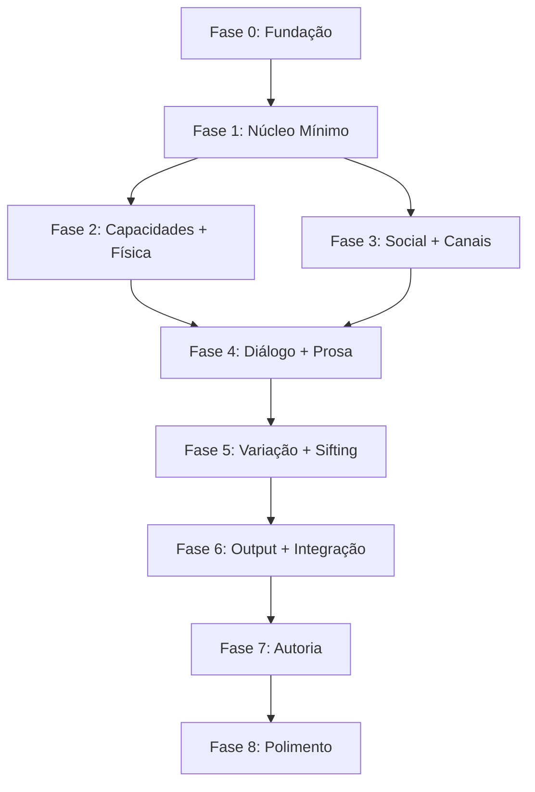

# DeepSeek — Exportação de Conversas

> **Exportado em:** 13/09/2026, 02:17:57
> **Conversas exportadas:** 1
> **Total de mensagens:** 6

---

## 1. Allegory.js

> **ID:** `de561454-37e2-430a-9937-af5afd192492` · **Criada:** 12/09/2026, 19:25:06 · **Atualizada:** 13/09/2026, 02:19:33 · **Mensagens:** últimas 6 de 78

### 📄 USER

FAÇA AGORA Implementation Plan (A ordem de construção") DESTA APLICAÇÃO DE FORMA COMPLETA, SEM FALTAR NADA

### 📄 ASSISTANT

# 🛠️ Implementation Plan — Sistema Integrado de Simulação Narrativa Determinística

> **Documento:** Plano de Implementação
> **Versão:** 1.0
> **Escopo:** Ordem de construção, dependências, fases, marcos e critérios de aceitação das 12 camadas.
> **Estratégia:** Contract-first, vertical slice, determinismo desde o dia 1.

---

## Índice

1. [Filosofia de Implementação](#1-filosofia-de-implementação)
2. [Estratégia Geral](#2-estratégia-geral)
3. [Fase 0 — Fundação](#3-fase-0--fundação)
4. [Fase 1 — Núcleo Mínimo Viável](#4-fase-1--núcleo-mínimo-viável)
5. [Fase 2 — Capacidades e Física](#5-fase-2--capacidades-e-física)
6. [Fase 3 — Social e Canais](#6-fase-3--social-e-canais)
7. [Fase 4 — Diálogo e Prosa](#7-fase-4--diálogo-e-prosa)
8. [Fase 5 — Variação e Sifting](#8-fase-5--variação-e-sifting)
9. [Fase 6 — Output e Integração](#9-fase-6--output-e-integração)
10. [Fase 7 — Autoria](#10-fase-7--autoria)
11. [Fase 8 — Polimento e Lançamento](#11-fase-8--polimento-e-lançamento)
12. [Cronograma Consolidado](#12-cronograma-consolidado)
13. [Estratégia de Testes](#13-estratégia-de-testes)
14. [Estratégia de CI/CD](#14-estratégia-de-cicd)
15. [Gestão de Riscos](#15-gestão-de-riscos)
16. [Equipe e Papéis](#16-equipe-e-papéis)
17. [Critérios de Aceitação por Fase](#17-critérios-de-aceitação-por-fase)
18. [Pós-Lançamento](#18-pós-lançamento)

---

## 1. Filosofia de Implementação

### 1.1 Princípios Norteadores

| Princípio | Significado |
|-----------|-------------|
| **Contract-first** | Contratos são definidos antes da implementação. Tipos e interfaces precedem código. |
| **Vertical slice** | Um caminho end-to-end mínimo funciona antes de aprofundar qualquer camada. |
| **Determinismo desde o dia 1** | Toda camada nasce com testes de replay. |
| **Mock-first para paralelismo** | Cada camada pode ser desenvolvida contra mocks das camadas vizinhas. |
| **Substituibilidade** | Nenhuma camada conhece a implementação interna de outra. |
| **Observabilidade** | Logs estruturados e métricas desde a primeira linha. |
| **Documentação viva** | Cada fase produz documentação junto com código. |

### 1.2 Estratégia de Camadas

A ordem de construção **não** segue a ordem numérica das camadas. Ela segue a **cadeia de dependências**:

```
Fundação (contratos, EventBus, tipos)
    ↓
Núcleo Mínimo Viável (Parsing → Seleção → Output simplificado)
    ↓
Capacidades → Física
    ↓
Social → Canais
    ↓
Diálogo → Prosa
    ↓
Variação → Sifting
    ↓
Integração completa
    ↓
Autoria
    ↓
Polimento
```

### 1.3 Estratégia de Verticais

Em vez de construir camadas horizontalmente (todas as camadas 100% antes da próxima), construímos **fatias verticais**:

- **Fatia 1**: Um comando simples (`LOOK`) atravessa todas as camadas com implementações mínimas.
- **Fatia 2**: Um comando com física (`ATTACK`) ativa Ananke.
- **Fatia 3**: Um comando social (`BRIBE`) ativa npcsts/TDRS.
- **Fatia 4**: Um comando com diálogo (`TALK`) ativa dramaturge.
- **Fatia 5**: Uma sessão completa com sifting (`Viv` detecta uma história).

Cada fatia é **end-to-end** e **testável**.

---

## 2. Estratégia Geral

### 2.1 Dependências entre Fases



### 2.2 Paralelismo Possível

| Fase | Pode rodar em paralelo com |
|------|---------------------------|
| Fase 2 | Fase 3 |
| Fase 4 | Fase 5 (parcialmente) |
| Fase 7 | Fase 6 (parcialmente) |

### 2.3 Duração Total Estimada

| Fase | Duração | Acumulado |
|------|---------|-----------|
| Fase 0 | 4 semanas | 4 semanas |
| Fase 1 | 6 semanas | 10 semanas |
| Fase 2 | 6 semanas | 16 semanas |
| Fase 3 | 6 semanas | 22 semanas |
| Fase 4 | 6 semanas | 28 semanas |
| Fase 5 | 4 semanas | 32 semanas |
| Fase 6 | 4 semanas | 36 semanas |
| Fase 7 | 6 semanas | 42 semanas |
| Fase 8 | 4 semanas | 46 semanas |

**Total:** ~46 semanas (~11 meses) com equipe dedicada.

---

## 3. Fase 0 — Fundação

**Duração:** 4 semanas
**Objetivo:** Estabelecer contratos, tipos, EventBus central, build system e infraestrutura de testes.

### 3.1 Entregáveis

| # | Entregável | Descrição |
|---|-----------|-----------|
| 0.1 | Monorepo setup | Bun workspaces + Rust workspaces + Elm workspace |
| 0.2 | Contratos TypeScript | Tipos de `Intent`, `Action`, `LayerMessage<T>`, `WorldSnapshot` |
| 0.3 | EventBus central | Implementação do Sharpee EventBus com streams tipados |
| 0.4 | Sistema de logging | Logger estruturado com `correlationId` |
| 0.5 | Build system | Pipeline de build para TS, Rust (WASM), Elm |
| 0.6 | Test harness | Configuração de testes para todas as linguagens |
| 0.7 | CI/CD básico | GitHub Actions com lint, test, build |
| 0.8 | Determinismo harness | Utilitário de replay e comparação de snapshots |
| 0.9 | Documentação de contratos | `CONTRACTS.md` gerado a partir dos tipos |

### 3.2 Tarefas Detalhadas

#### 3.2.1 Monorepo Setup (Semana 1)

```
/allegory-platform
├── packages/
│   ├── contracts/          # Tipos compartilhados (TypeScript)
│   ├── event-bus/          # EventBus central
│   ├── logger/             # Logger estruturado
│   ├── determinism/        # Harness de replay
│   └── testing/            # Utilitários de teste
├── layers/
│   ├── layer-0-authoring/  # Inform 7 + Curveship + SSG
│   ├── layer-1-parser/     # Inform 7 Parser
│   ├── layer-2-selection/  # ENE + Allegory.js
│   ├── layer-3-capabilities/ # Sharpee
│   ├── layer-4-physics/    # Ananke
│   ├── layer-5-social/     # npcsts + TDRS
│   ├── layer-6-channels/   # multilinear
│   ├── layer-7-dialogue/   # dramaturge
│   ├── layer-8-prose/      # sogh
│   ├── layer-9-variation/  # Curveship-js
│   ├── layer-10-sifting/   # Viv
│   └── layer-11-output/    # Sharpee EventBus + Text Service
├── apps/
│   ├── web/                # Aplicação web (React)
│   ├── cli/                # CLI para testes
│   └── ide/                # IDE de autoria
├── docs/
│   ├── architecture/
│   ├── specifications/
│   └── implementation/
└── tools/
    ├── build/
    ├── benchmark/
    └── migration/
```

**Ferramentas:**
- **Bun workspaces** para TypeScript
- **Cargo workspaces** para Rust
- **Elm** com `elm-json` para gerenciamento de dependências
- **wasm-pack** para compilar Rust → WASM
- **Vite** para build do frontend
- **Turborepo** ou **Nx** para orquestração

#### 3.2.2 Contratos TypeScript (Semana 1–2)

Criar o pacote `@allegory/contracts` com todos os tipos definidos na especificação:

```typescript
// packages/contracts/src/intent.ts
export interface Intent {
  name: string
  actors?: EntityId[]
  targets?: EntityId[]
  auxiliary?: EntityId[]
  raw: string
  dryRun: boolean
  confidence: number
}

// packages/contracts/src/action.ts
export interface Action {
  rule: string
  law: string
  mutations: MutationOp[]
  narrations: string[]
  events: SemanticEvent[]
  dryRun: boolean
}

// packages/contracts/src/layer-message.ts
export interface LayerMessage<T> {
  sourceLayer: number
  targetLayer: number
  timestamp: number
  correlationId: string
  payload: T
  metadata: {
    deterministic: boolean
    seed?: number
    version: string
  }
}

// packages/contracts/src/world-snapshot.ts
export interface WorldSnapshot {
  timestamp: number
  turn: number
  entities: Record<EntityId, WorldEntity>
  channels: Record<string, ChannelState>
  eventLog: LayerMessage<any>[]
  stories: DiscoveredStory[]
}

// ... todos os outros tipos
```

**Validação:** `tsc --noEmit` deve passar sem erros. Schemas JSON devem ser gerados para validação em runtime.

#### 3.2.3 EventBus Central (Semana 2)

Implementar o EventBus com:
- Streams tipados (`LayerEvents`)
- Prioridade de listeners
- Namespaces (`'intent:*'`)
- Wildcard (`'*'`)
- Buffering
- Cancelamento
- Isolamento de erro
- `correlationId` em todas as mensagens

**Testes:**
- Subscribe/emit básico
- Prioridade
- Wildcard e namespace
- Cancelamento
- Buffering
- Isolamento de erro
- Timeout

#### 3.2.4 Sistema de Logging (Semana 2)

Logger estruturado com:
- Níveis (`error`, `warn`, `info`, `debug`)
- `correlationId` obrigatório
- `sourceLayer` e `targetLayer`
- Timestamp
- Formato JSON para produção, pretty para dev

#### 3.2.5 Build System (Semana 3)

Pipeline que:
- Compila TypeScript → ESM
- Compila Rust → WASM (via `wasm-pack`)
- Compila Elm → JS
- Bundla para browser
- Gera source maps
- Versiona artefatos

**Comandos:**
```bash
bun run build          # Build completo
bun run build:ts       # Só TypeScript
bun run build:rust     # Só Rust/WASM
bun run build:elm      # Só Elm
bun run build:web      # Só web app
```

#### 3.2.6 Test Harness (Semana 3)

Configurar:
- **Bun test** para TypeScript
- **Cargo test** para Rust
- **elm-test** para Elm
- **Playwright** para integração
- **Benchmark.js** para performance

#### 3.2.7 CI/CD Básico (Semana 3–4)

GitHub Actions com:
- Lint (oxlint, clippy, elm-format)
- Test (todas as linguagens)
- Build (todos os alvos)
- Cache de dependências
- Matrix de OS (Linux, macOS, Windows)

#### 3.2.8 Determinismo Harness (Semana 4)

Utilitário que:
- Executa uma sessão com uma seed
- Grava todos os eventos
- Replaya com a mesma seed
- Compara snapshots
- Reporta divergências

```typescript
interface DeterminismHarness {
  record(session: Session): Promise<RecordedSession>
  replay(recorded: RecordedSession): Promise<WorldSnapshot>
  compare(a: WorldSnapshot, b: WorldSnapshot): Diff
}
```

### 3.3 Critérios de Aceitação

- [ ] Monorepo compila sem erros
- [ ] EventBus passa em 100% dos testes
- [ ] Logger emite JSON válido
- [ ] Build gera artefatos para todas as linguagens
- [ ] CI passa em todos os OS
- [ ] Determinismo harness detecta divergências
- [ ] Documentação de contratos está completa

---

## 4. Fase 1 — Núcleo Mínimo Viável

**Duração:** 6 semanas
**Objetivo:** Fazer um comando simples (`LOOK`) atravessar todas as camadas com implementações mínimas.

### 4.1 Entregáveis

| # | Entregável | Descrição |
|---|-----------|-----------|
| 1.1 | Layer 1 — Parser | Inform 7 Parser integrado, produz `Intent` |
| 1.2 | Layer 2 — Seleção | ENE + Allegory.js com regras mínimas |
| 1.3 | Layer 11 — Output | Text Service que renderiza `RenderedText` |
| 1.4 | Fatia vertical | `LOOK` end-to-end |
| 1.5 | Mock layers | Mocks para Layers 3–10 |
| 1.6 | Testes end-to-end | Testes de integração da fatia |

### 4.2 Tarefas Detalhadas

#### 4.2.1 Layer 1 — Parser (Semanas 1–2)

- Integrar Inform 7 compiler via WASM ou binário
- Implementar `parse(rawCommand): Promise<Intent>`
- Implementar `splitRawCommands` (comandos compostos)
- Implementar detecção de `dryRun`
- Implementar `confidence` scoring
- Testes com comandos simples e compostos

**Desafio:** O Inform 7 compiler é escrito em Inform 6 (para runtime) e em linguagens nativas (para compilação). A integração pode exigir um binário ou um WASM.

**Mitigação:** Se a integração for complexa, começar com um parser simplificado em TypeScript que imita o comportamento do Inform 7, e substituir depois.

#### 4.2.2 Layer 2 — Seleção (Semanas 2–4)

**ENE (Elm):**
- Portar o core do ENE para rodar em Web Worker
- Implementar ECS (tags, stats, links)
- Implementar regras ponderadas
- Implementar `findMatchingRule`
- Testes de matching

**Allegory.js (TypeScript):**
- Integrar o ECS do Allegory.js
- Implementar pipeline de leilão de Laws
- Implementar especificidade `[layer, score]`
- Implementar `#calculateBid`
- Testes de leilão

**Integração ENE + Allegory:**
- Definir qual camada decide o quê
- Criar adaptador que traduz entre Elm e TS
- Testes de integração

**Decisão arquitetural:** O ENE decide **qual regra narrativa** se aplica. O Allegory.js decide **qual Law** é mais específica. A integração usa o ENE como primário e o Allegory.js como refinador.

#### 4.2.3 Layer 11 — Output (Semanas 4–5)

- Implementar `render(variedProse, stories): Promise<RenderedText>`
- Implementar Text Service agnóstico de UI
- Implementar CLI renderer (para testes)
- Implementar browser renderer (básico)
- Testes de renderização

#### 4.2.4 Fatia Vertical `LOOK` (Semana 5–6)

Implementar o caminho completo:

```
"LOOK" → Intent { name: 'LOOK' }
       → Action { rule: 'LookLaw', narrations: ['look.room'] }
       → RenderedText { segments: ['You see a dusty cave.'] }
```

**Testes:**
- `LOOK` em sala vazia
- `LOOK` em sala com objetos
- `LOOK` em sala com NPCs
- `LOOK AT SWORD`
- `EXAMINE SWORD`

#### 4.2.5 Mocks para Layers 3–10

Criar mocks que:
- Aceitam `Action` e retornam resultados vazios
- Permitem testar Layers 1, 2, 11 sem dependências
- São substituíveis por implementações reais

### 4.3 Critérios de Aceitação

- [ ] `LOOK` funciona end-to-end
- [ ] `EXAMINE X` funciona end-to-end
- [ ] Comandos compostos funcionam
- [ ] `dryRun` funciona
- [ ] Testes de determinismo passam
- [ ] CLI renderiza narração
- [ ] Browser renderiza narração básica
- [ ] Performance: < 100ms por turn

---

## 5. Fase 2 — Capacidades e Física

**Duração:** 6 semanas
**Objetivo:** Ativar Layers 3 e 4. Comandos como `TAKE`, `OPEN`, `ATTACK` funcionam com traits e física.

### 5.1 Entregáveis

| # | Entregável | Descrição |
|---|-----------|-----------|
| 2.1 | Layer 3 — Sharpee | Traits/Behaviors para entidades |
| 2.2 | Layer 4 — Ananke | Física determinística |
| 2.3 | Fatia vertical `TAKE` | Comando com trait |
| 2.4 | Fatia vertical `ATTACK` | Comando com física |
| 2.5 | Integração Sharpee ↔ Ananke | Tradução de traits para física |

### 5.2 Tarefas Detalhadas

#### 5.2.1 Layer 3 — Sharpee (Semanas 1–3)

- Integrar o core do Sharpee (Traits, Behaviors, EventBus)
- Implementar traits base: `PortableTrait`, `OpenableTrait`, `ContainerTrait`, `WeaponTrait`, `WearableTrait`
- Implementar behaviors correspondentes
- Implementar `invokeBehavior(action, entity): Promise<BehaviorResult>`
- Implementar composição de traits
- Testes de traits e behaviors

#### 5.2.2 Layer 4 — Ananke (Semanas 3–6)

- Integrar o core do Ananke
- Implementar `simulate(mutations, worldState): Promise<PhysicalEvent[]>`
- Implementar física de combate (força, dano, morte)
- Implementar física de movimento (posição, colisão)
- Implementar ponto fixo (`q()`, `SCALE`)
- Implementar estado inicial (`createWorld`, `loadScenario`)
- Testes de física determinística

#### 5.2.3 Integração Sharpee ↔ Ananke (Semanas 4–6)

- Behavior do Sharpee emite `PhysicalMutation`
- Ananke recebe `PhysicalMutation` e simula
- Ananke emite `PhysicalEvent`
- Sharpee traduz `PhysicalEvent` em `SemanticEvent`
- Testes de integração

**Exemplo:**
```
TAKE SWORD
  → Sharpee: PortableTrait.canTake() → true
  → Sharpee: emite PhysicalMutation { type: 'move', entity: sword, to: player }
  → Ananke: simula movimento, verifica colisão
  → Ananke: emite PhysicalEvent { type: 'movement', entities: [sword, player] }
  → Sharpee: traduz para SemanticEvent { type: 'item.taken', item: sword, actor: player }
```

#### 5.2.4 Fatia Vertical `ATTACK` (Semanas 5–6)

Implementar o caminho completo:

```
"ATTACK GOBLIN WITH SWORD"
  → Intent { name: 'ATTACK', targets: [goblin], auxiliary: [sword] }
  → Action { rule: 'AttackLaw', mutations: [...] }
  → Sharpee: WeaponTrait.attack()
  → Ananke: simula dano, emite PhysicalEvent
  → Sharpee: traduz para SemanticEvent { type: 'combat:damage' }
  → RenderedText { segments: ['You strike the goblin!'] }
```

### 5.3 Critérios de Aceitação

- [ ] `TAKE`, `DROP`, `OPEN`, `CLOSE`, `WEAR`, `REMOVE` funcionam
- [ ] `ATTACK` funciona com física
- [ ] Traits podem ser compostos sem hierarquia
- [ ] Ananke é determinístico
- [ ] Performance: < 200ms por turn com física
- [ ] Testes de determinismo passam

---

## 6. Fase 3 — Social e Canais

**Duração:** 6 semanas
**Objetivo:** Ativar Layers 5 e 6. NPCs têm humor, memória e relacionamentos. Canais evoluem em paralelo.

### 6.1 Entregáveis

| # | Entregável | Descrição |
|---|-----------|-----------|
| 3.1 | Layer 5a — npcsts | Psicologia individual |
| 3.2 | Layer 5b — TDRS | Grafo de relacionamentos |
| 3.3 | Layer 6 — multilinear | Canais de estado |
| 3.4 | Fatia vertical `BRIBE` | Comando social |
| 3.5 | Fatia vertical canal `corruption` | Transição de canal |

### 6.2 Tarefas Detalhadas

#### 6.2.1 Layer 5a — npcsts (Semanas 1–3)

- Integrar o core do npcsts
- Implementar `Character` (stats, mood, memory, preferences)
- Implementar `InteractionEngine`
- Implementar estratégias (`GreetStrategy`, `JokeStrategy`, etc.)
- Implementar `updateSocialState(events, worldState): Promise<SocialStateUpdate[]>`
- Testes de psicologia

#### 6.2.2 Layer 5b — TDRS (Semanas 2–4)

- Integrar o core do TDRS
- Implementar `Relationship` (from, to, value, category, traits)
- Implementar `updateRelationships(events, worldState): Promise<SocialStateUpdate[]>`
- Implementar categorização (Enemy, Acquaintance, Friend)
- Testes de relacionamentos

**Desafio:** TDRS é C#/Unity. A integração requer bridge via .NET WebAssembly ou reimplementação em TypeScript.

**Mitigação:** Começar com uma reimplementação simplificada em TypeScript, com a possibilidade de usar o TDRS original via bridge.

#### 6.2.3 Layer 6 — multilinear (Semanas 3–6)

- Integrar o core do multilinear (Rust → WASM)
- Implementar `Channel` (states, transitions, initialState)
- Implementar `processChannels(events, worldState): Promise<ChannelTransition[]>`
- Implementar canais base: `economy`, `politics`, `factions`
- Testes de canais

#### 6.2.4 Integração npcsts + TDRS (Semanas 4–6)

- npcsts expõe `mood`, `memory`, `preferences`
- TDRS expõe `relationships[A][B]`
- Adaptador que lê mood do npcsts e ajusta relacionamento no TDRS
- Testes de integração

**Exemplo:**
```
BRIBE GUARD WITH 50 GOLD
  → npcsts: guard.mood += 1, guard.memory.add('bribe_received')
  → TDRS: guard.relationships.player += 15 (40 → 55)
  → multilinear: channel 'corruption' → guard_corrupted
  → multilinear: channel 'politics' → guard_faction_loyalty -= 5
```

### 6.3 Critérios de Aceitação

- [ ] NPCs têm humor, memória e preferências
- [ ] Relacionamentos evoluem com interações
- [ ] Canais evoluem independentemente
- [ ] Efeitos globais entre canais funcionam
- [ ] `BRIBE`, `PERSUADE`, `THREATEN` funcionam
- [ ] Performance: < 300ms por turn com social

---

## 7. Fase 4 — Diálogo e Prosa

**Duração:** 6 semanas
**Objetivo:** Ativar Layers 7 e 8. NPCs falam com diálogo ramificado. Prosa é gerada tematicamente.

### 7.1 Entregáveis

| # | Entregável | Descrição |
|---|-----------|-----------|
| 4.1 | Layer 7 — dramaturge | Grafos de diálogo |
| 4.2 | Layer 8 — sogh | Geração de prosa |
| 4.3 | Fatia vertical `TALK` | Comando com diálogo |
| 4.4 | Integração dramaturge ↔ sogh | Diálogo → prosa |

### 7.2 Tarefas Detalhadas

#### 7.2.1 Layer 7 — dramaturge (Semanas 1–3)

- Integrar o core do dramaturge (Rust → WASM)
- Implementar `DialogueGraph` (nodes, facts, startNode)
- Implementar `DialogueNode` (conditions, outcomes, nextNodes)
- Implementar `resolveDialogue(trigger, worldState): Promise<DialogueOutcome>`
- Implementar validação de grafo (sem becos sem saída)
- Testes de diálogo

#### 7.2.2 Layer 8 — sogh (Semanas 2–5)

- Integrar o core do sogh (Rust → WASM)
- Implementar pipeline de 8 estágios:
  1. Simulation Event
  2. Narrative Function Mapping
  3. Voice Selection
  4. Grammar Expansion
  5. Phrase Filling (Markov)
  6. Variety Pass
  7. Context Check
  8. Output
- Implementar `generateProse(events, worldState): Promise<Prose>`
- Treinar Markov offline
- Testes de prosa

#### 7.2.3 Integração dramaturge ↔ sogh (Semanas 4–6)

- dramaturge produz `DialogueOutcome` com `text`
- sogh recebe `DialogueOutcome` e gera prosa temática
- Voz do NPC é selecionada com base em seu estado (npcsts/TDRS)
- Testes de integração

**Exemplo:**
```
TALK TO GUARD
  → dramaturge: node 'bribe_accepted', text: "For 50 gold, I didn't see anything."
  → sogh: Narrative Function 'Transaction', Voice 'Guard (corrupt, relaxed)'
  → Prose: "O guarda olha para o ouro, depois para você. Um sorriso torto aparece. 'Por 50 moedas, eu não vi nada.'"
```

#### 7.2.4 Fatia Vertical `TALK` (Semanas 5–6)

Implementar o caminho completo:

```
"TALK TO GUARD"
  → Intent { name: 'TALK', targets: [guard] }
  → Action { rule: 'TalkLaw' }
  → dramaturge: resolveDialogue()
  → sogh: generateProse()
  → RenderedText { segments: ['O guarda olha para você...'] }
```

### 7.3 Critérios de Aceitação

- [ ] Diálogo ramificado funciona
- [ ] Grafo de diálogo é validado (sem becos sem saída)
- [ ] Prosa é gerada deterministicamente
- [ ] Vozes são consistentes com o estado do NPC
- [ ] `TALK`, `ASK`, `TELL` funcionam
- [ ] Performance: < 500ms por turn com diálogo + prosa

---

## 8. Fase 5 — Variação e Sifting

**Duração:** 4 semanas
**Objetivo:** Ativar Layers 9 e 10. A mesma história pode ser contada de formas diferentes. Histórias emergentes são detectadas.

### 8.1 Entregáveis

| # | Entregável | Descrição |
|---|-----------|-----------|
| 5.1 | Layer 9 — Curveship-js | Variação narrativa |
| 5.2 | Layer 10 — Viv | Story sifting |
| 5.3 | Fatia vertical `flashback` | Narrativa não-linear |
| 5.4 | Fatia vertical `story discovered` | Detecção de história |

### 8.2 Tarefas Detalhadas

#### 8.2.1 Layer 9 — Curveship-js (Semanas 1–2)

- Integrar o core do Curveship-js
- Implementar `SpinConfig` (narrating, narrator, focalizer, frequency, distance)
- Implementar `applySpin(prose, spin): Promise<VariedProse>`
- Implementar separação conteúdo/discurso
- Implementar não-perda de informação
- Testes de variação

#### 8.2.2 Layer 10 — Viv (Semanas 2–4)

- Integrar o core do Viv
- Implementar DSL própria para story sifting
- Implementar `siftStories(eventLog, worldState): Promise<DiscoveredStory[]>`
- Implementar cálculo de `significance`
- Implementar identificação de `ProppArc`
- Testes de sifting

#### 8.2.3 Integração (Semanas 3–4)

- Curveship-js aplica spin à prosa
- Viv analisa o event log completo
- Viv emite `DiscoveredStory`
- Curveship-js pode usar `DiscoveredStory` para sugerir spin
- Testes de integração

**Exemplo:**
```
Prose: "The guard falls."
  → Curveship-js: spin { narrating: 'flashback', narrator: 'guard' }
  → VariedProse: "I remember the moment I fell..."

EventLog: [bribe, corruption, politics]
  → Viv: DiscoveredStory { name: 'The Corruption of the Gate Guard', significance: 0.85 }
```

### 8.3 Critérios de Aceitação

- [ ] Mesma história pode ser contada de formas diferentes
- [ ] Não-perda de informação em variação
- [ ] Histórias emergentes são detectadas
- [ ] `significance` é calculado objetivamente
- [ ] Arcos Propp são identificados
- [ ] Performance: < 1s por turn com sifting

---

## 9. Fase 6 — Output e Integração

**Duração:** 4 semanas
**Objetivo:** Completar Layer 11 e integrar todas as camadas end-to-end.

### 9.1 Entregáveis

| # | Entregável | Descrição |
|---|-----------|-----------|
| 6.1 | Layer 11 completa | Output completo com todos os estilos |
| 6.2 | Integração end-to-end | Todas as 12 camadas funcionando juntas |
| 6.3 | Testes de determinismo | Replay de sessões completas |
| 6.4 | Testes de performance | Benchmarks de todas as camadas |
| 6.5 | Testes de estresse | Múltiplas sessões, mundos grandes |

### 9.2 Tarefas Detalhadas

#### 9.2.1 Layer 11 Completa (Semanas 1–2)

- Implementar `render(variedProse, stories): Promise<RenderedText>`
- Implementar estilos: `prose`, `dialogue`, `system`, `discovery`
- Implementar Text Service agnóstico de UI
- Implementar CLI renderer completo
- Implementar browser renderer completo
- Implementar React renderer
- Testes de renderização em todos os alvos

#### 9.2.2 Integração End-to-End (Semanas 2–4)

- Conectar todas as 12 camadas via EventBus
- Implementar `handleCommand` completo
- Implementar rollback em erro
- Implementar timeout
- Implementar idempotência
- Testes de integração

**Cenário de teste completo:**
```
> LOOK
> EXAMINE SWORD
> TAKE SWORD
> GO NORTH
> TALK TO GUARD
> BRIBE GUARD WITH 50 GOLD
> ATTACK GUARD WITH SWORD
> LOOK
```

Cada comando deve atravessar todas as camadas e produzir `RenderedText`.

#### 9.2.3 Testes de Determinismo (Semana 3)

- Gravar sessões completas
- Replayar com a mesma seed
- Comparar snapshots
- Detectar divergências
- Corrigir fontes de não-determinismo

#### 9.2.4 Testes de Performance (Semana 3–4)

- Benchmark de cada camada
- Benchmark end-to-end
- Identificar gargalos
- Otimizar

**Metas:**
| Camada | Latência Alvo |
|--------|--------------|
| Parser | < 10ms |
| Seleção | < 50ms |
| Capacidades | < 20ms |
| Física | < 100ms |
| Social | < 50ms |
| Canais | < 30ms |
| Diálogo | < 20ms |
| Prosa | < 200ms |
| Variação | < 50ms |
| Sifting | < 500ms |
| Output | < 20ms |
| **Total** | **< 1s** |

#### 9.2.5 Testes de Estresse (Semana 4)

- Múltiplas sessões simultâneas
- Mundos grandes (10.000 entidades)
- Muitos NPCs (1.000)
- Muitos canais (50)
- Longa duração (10.000 turns)

### 9.3 Critérios de Aceitação

- [ ] Todas as 12 camadas funcionam juntas
- [ ] Determinismo é 100% reprodutível
- [ ] Performance atinge metas
- [ ] Testes de estresse passam
- [ ] Rollback funciona em erro
- [ ] Timeout funciona
- [ ] Idempotência funciona

---

## 10. Fase 7 — Autoria

**Duração:** 6 semanas
**Objetivo:** Completar Layer 0 e construir a IDE de autoria.

### 10.1 Entregáveis

| # | Entregável | Descrição |
|---|-----------|-----------|
| 7.1 | Layer 0 — Inform 7 IDE | IDE integrado |
| 7.2 | Layer 0 — Curveship-js | Parâmetros de discurso |
| 7.3 | Layer 0 — SSG | Story structure generator |
| 7.4 | IDE web | Editor visual de autoria |
| 7.5 | Skein | Árvore de sessões |
| 7.6 | Index | Documentação automática |
| 7.7 | Validação visual | Feedback em tempo real |

### 10.2 Tarefas Detalhadas

#### 10.2.1 Layer 0 — Inform 7 IDE (Semanas 1–3)

- Integrar Inform 7 compiler
- Implementar `compileStory(source): Promise<CompiledStory>`
- Implementar `validateStory(source): Promise<ValidationResult>`
- Implementar Skein (árvore visual de sessões)
- Implementar Index (documentação automática)
- Testes de compilação e validação

#### 10.2.2 Layer 0 — Curveship-js (Semanas 2–3)

- Integrar Curveship-js para parâmetros de spin
- Implementar `SpinConfig` na IDE
- Testes de spin

#### 10.2.3 Layer 0 — SSG (Semanas 3–4)

- Integrar story-structure-generator
- Implementar geração de `ProppArc`
- Implementar sugestões de arcos
- Testes de geração

#### 10.2.4 IDE Web (Semanas 4–6)

- Editor de mundo (Inform 7-like)
- Editor de regras (ENE-like)
- Editor de capacidades (Sharpee-like)
- Editor de diálogo (dramaturge-like)
- Visualizador de canais (multilinear-like)
- Skein interativo
- Index interativo
- Validação em tempo real
- Playtest integrado
- Debug mode

### 10.3 Critérios de Aceitação

- [ ] Autor consegue escrever um mundo em linguagem natural
- [ ] Autor consegue definir regras narrativas
- [ ] Autor consegue aplicar traits
- [ ] Autor consegue definir diálogos
- [ ] Skein mostra árvore de sessões
- [ ] Index documenta o mundo
- [ ] Playtest funciona no IDE
- [ ] Debug mode mostra todas as camadas

---

## 11. Fase 8 — Polimento e Lançamento

**Duração:** 4 semanas
**Objetivo:** Polir, documentar, lançar.

### 11.1 Entregáveis

| # | Entregável | Descrição |
|---|-----------|-----------|
| 8.1 | Documentação | Guias, API, tutoriais |
| 8.2 | Exemplos | Jogos de exemplo |
| 8.3 | Site | Site oficial |
| 8.4 | SDK | SDK para desenvolvedores |
| 8.5 | Lançamento | v1.0.0 |

### 11.2 Tarefas Detalhadas

#### 11.2.1 Documentação (Semanas 1–2)

- Guia do autor
- Guia do desenvolvedor
- Referência da API
- Tutoriais
- Exemplos comentados
- FAQ
- Troubleshooting

#### 11.2.2 Exemplos (Semanas 2–3)

- Jogo de exemplo "Cyberpunk Saloon"
- Jogo de exemplo "Fantasy Quest"
- Jogo de exemplo "Sci-Fi Mystery"
- Cada exemplo demonstra uma faceta diferente

#### 11.2.3 Site (Semanas 3–4)

- Landing page
- Documentação online
- Playground online
- Blog
- Comunidade

#### 11.2.4 SDK (Semanas 3–4)

- Pacotes NPM
- Pacotes Cargo
- Pacotes Elm
- Exemplos de integração

#### 11.2.5 Lançamento (Semana 4)

- Publicar v1.0.0 no NPM
- Publicar no Cargo
- Publicar no Elm
- Anunciar
- Coletar feedback

### 11.3 Critérios de Aceitação

- [ ] Documentação completa
- [ ] Exemplos funcionam
- [ ] Site no ar
- [ ] SDK publicado
- [ ] v1.0.0 lançada
- [ ] Feedback inicial coletado

---

## 12. Cronograma Consolidado

```
SEMANA  1  2  3  4  5  6  7  8  9 10 11 12 13 14 15 16 17 18 19 20 21 22 23 24 25 26 27 28 29 30 31 32 33 34 35 36 37 38 39 40 41 42 43 44 45 46
        │  │  │  │  │  │  │  │  │  │  │  │  │  │  │  │  │  │  │  │  │  │  │  │  │  │  │  │  │  │  │  │  │  │  │  │  │  │  │  │  │  │  │  │  │  │
Fase 0  ████████████████
Fase 1                  ████████████████████████
Fase 2                                          ████████████████████████
Fase 3                                          ████████████████████████  (paralelo com Fase 2)
Fase 4                                                                  ████████████████████████
Fase 5                                                                  ████████████████  (paralelo com Fase 4)
Fase 6                                                                                  ████████████████
Fase 7                                                                                          ████████████████████████
Fase 8                                                                                                                  ████████████████
```

**Marcos:**
- **M0** (Semana 4): Fundação pronta
- **M1** (Semana 10): Núcleo mínimo viável (`LOOK`)
- **M2** (Semana 16): Capacidades + Física (`ATTACK`)
- **M3** (Semana 22): Social + Canais (`BRIBE`)
- **M4** (Semana 28): Diálogo + Prosa (`TALK`)
- **M5** (Semana 32): Variação + Sifting
- **M6** (Semana 36): Integração completa
- **M7** (Semana 42): Autoria
- **M8** (Semana 46): Lançamento v1.0.0

---

## 13. Estratégia de Testes

### 13.1 Pirâmide de Testes

```
                    ▲
                   ╱ ╲
                  ╱   ╲
                 ╱ E2E ╲          (5%)
                ╱───────╲
               ╱         ╲
              ╱ Integration╲      (15%)
             ╱─────────────╲
            ╱               ╲
           ╱   Unit Tests    ╲    (80%)
          ╱───────────────────╲
```

### 13.2 Tipos de Teste

| Tipo | Ferramenta | Cobertura Alvo |
|------|-----------|---------------|
| Unitário (TS) | Bun test | > 90% |
| Unitário (Rust) | Cargo test | > 90% |
| Unitário (Elm) | elm-test | > 90% |
| Integração | Playwright + Jest | Contratos entre camadas |
| E2E | Playwright | Fluxos completos |
| Determinismo | Harness custom | 100% reprodutível |
| Performance | Benchmark.js, criterion | Regressões detectadas |
| Estresse | k6, custom | Limites conhecidos |
| Acessibilidade | axe-core | WCAG 2.1 AA |

### 13.3 Cobertura por Camada

| Camada | Testes Unitários | Testes de Integração | Testes E2E |
|--------|-----------------|---------------------|-----------|
| 0 | ✅ | ✅ | ✅ |
| 1 | ✅ | ✅ | ✅ |
| 2 | ✅ | ✅ | ✅ |
| 3 | ✅ | ✅ | ✅ |
| 4 | ✅ | ✅ | ✅ |
| 5 | ✅ | ✅ | ✅ |
| 6 | ✅ | ✅ | ✅ |
| 7 | ✅ | ✅ | ✅ |
| 8 | ✅ | ✅ | ✅ |
| 9 | ✅ | ✅ | ✅ |
| 10 | ✅ | ✅ | ✅ |
| 11 | ✅ | ✅ | ✅ |

### 13.4 Testes de Determinismo

Para cada camada:
1. Executar com seed fixa
2. Gravar eventos
3. Replayar
4. Comparar snapshots
5. Reportar divergências

### 13.5 Testes de Contrato

Para cada contrato entre camadas:
1. Camada A emite `LayerMessage<T>`
2. Camada B recebe e processa
3. Verificar que o output está conforme especificação
4. Testar casos de erro
5. Testar casos extremos

---

## 14. Estratégia de CI/CD

### 14.1 Pipeline

```yaml
name: CI
on: [push, pull_request]
jobs:
  lint:
    - oxlint
    - clippy
    - elm-format
  test:
    - bun test
    - cargo test
    - elm-test
  build:
    - bun run build:ts
    - bun run build:rust
    - bun run build:elm
    - bun run build:web
  integration:
    - playwright test
  determinism:
    - bun run test:determinism
  benchmark:
    - bun run benchmark
  deploy:
    - only on main
    - publish to npm
    - publish to cargo
    - deploy website
```

### 14.2 Ambientes

| Ambiente | Propósito | Deploy |
|----------|-----------|--------|
| **Dev** | Desenvolvimento local | Manual |
| **Staging** | Testes de integração | Automático em PR |
| **Production** | Lançamento | Automático em main |

### 14.3 Versionamento

- **Semver** para todos os pacotes
- **Changesets** para gerenciar versões
- **Conventional Commits** para mensagens

---

## 15. Gestão de Riscos

| Risco | Probabilidade | Impacto | Mitigação |
|-------|--------------|---------|-----------|
| Integração Inform 7 complexa | Alta | Alto | Começar com parser simplificado, substituir depois |
| TDRS é C#/Unity | Alta | Médio | Reimplementar em TS, bridge opcional |
| Performance de determinismo | Média | Alto | Benchmarks contínuos, otimização incremental |
| Complexidade de interop Rust/TS/Elm | Média | Médio | WASM bem definido, contratos claros |
| Curva de aprendizado para autores | Média | Médio | IDE visual, documentação extensiva |
| Conflito de paradigmas (OOP vs ECS vs lógico) | Alta | Alto | Camada de tradução robusta, testes de contrato |
| Tempo de compilação Rust | Média | Baixo | Cache de build, incremental |
| Tamanho do bundle WASM | Média | Médio | Tree-shaking, code splitting |
| Complexidade de debug | Alta | Médio | Debug mode, logs estruturados |

---

## 16. Equipe e Papéis

### 16.1 Equipe Mínima

| Papel | Responsabilidade | Alocação |
|-------|-----------------|----------|
| **Tech Lead** | Arquitetura, revisão de código | 100% |
| **Engenheiro TypeScript** | Layers 1, 2, 3, 11 | 100% |
| **Engenheiro Rust** | Layers 6, 7, 8 | 100% |
| **Engenheiro Elm** | Layer 2 (ENE) | 50% |
| **Engenheiro Frontend** | IDE web, site | 100% |
| **Engenheiro de Testes** | CI/CD, testes | 50% |
| **Tech Writer** | Documentação | 50% |
| **Designer** | UI/UX | 50% |

### 16.2 Equipe Ideal

| Papel | Alocação |
|-------|----------|
| Tech Lead | 100% |
| Engenheiro TypeScript Sênior | 100% |
| Engenheiro Rust Sênior | 100% |
| Engenheiro Elm | 100% |
| Engenheiro Frontend Sênior | 100% |
| Engenheiro de Testes Sênior | 100% |
| Tech Writer | 100% |
| Designer | 100% |
| DevOps | 50% |
| Product Manager | 50% |

---

## 17. Critérios de Aceitação por Fase

### 17.1 Fase 0

- [ ] Monorepo compila sem erros
- [ ] EventBus passa em 100% dos testes
- [ ] Logger emite JSON válido
- [ ] Build gera artefatos para todas as linguagens
- [ ] CI passa em todos os OS
- [ ] Determinismo harness detecta divergências
- [ ] Documentação de contratos está completa

### 17.2 Fase 1

- [ ] `LOOK` funciona end-to-end
- [ ] `EXAMINE X` funciona end-to-end
- [ ] Comandos compostos funcionam
- [ ] `dryRun` funciona
- [ ] Testes de determinismo passam
- [ ] CLI renderiza narração
- [ ] Browser renderiza narração básica
- [ ] Performance: < 100ms por turn

### 17.3 Fase 2

- [ ] `TAKE`, `DROP`, `OPEN`, `CLOSE`, `WEAR`, `REMOVE` funcionam
- [ ] `ATTACK` funciona com física
- [ ] Traits podem ser compostos sem hierarquia
- [ ] Ananke é determinístico
- [ ] Performance: < 200ms por turn com física
- [ ] Testes de determinismo passam

### 17.4 Fase 3

- [ ] NPCs têm humor, memória e preferências
- [ ] Relacionamentos evoluem com interações
- [ ] Canais evoluem independentemente
- [ ] Efeitos globais entre canais funcionam
- [ ] `BRIBE`, `PERSUADE`, `THREATEN` funcionam
- [ ] Performance: < 300ms por turn com social

### 17.5 Fase 4

- [ ] Diálogo ramificado funciona
- [ ] Grafo de diálogo é validado
- [ ] Prosa é gerada deterministicamente
- [ ] Vozes são consistentes com o estado do NPC
- [ ] `TALK`, `ASK`, `TELL` funcionam
- [ ] Performance: < 500ms por turn com diálogo + prosa

### 17.6 Fase 5

- [ ] Mesma história pode ser contada de formas diferentes
- [ ] Não-perda de informação em variação
- [ ] Histórias emergentes são detectadas
- [ ] `significance` é calculado objetivamente
- [ ] Arcos Propp são identificados
- [ ] Performance: < 1s por turn com sifting

### 17.7 Fase 6

- [ ] Todas as 12 camadas funcionam juntas
- [ ] Determinismo é 100% reprodutível
- [ ] Performance atinge metas
- [ ] Testes de estresse passam
- [ ] Rollback funciona em erro
- [ ] Timeout funciona
- [ ] Idempotência funciona

### 17.8 Fase 7

- [ ] Autor consegue escrever um mundo em linguagem natural
- [ ] Autor consegue definir regras narrativas
- [ ] Autor consegue aplicar traits
- [ ] Autor consegue definir diálogos
- [ ] Skein mostra árvore de sessões
- [ ] Index documenta o mundo
- [ ] Playtest funciona no IDE
- [ ] Debug mode mostra todas as camadas

### 17.9 Fase 8

- [ ] Documentação completa
- [ ] Exemplos funcionam
- [ ] Site no ar
- [ ] SDK publicado
- [ ] v1.0.0 lançada
- [ ] Feedback inicial coletado

---

## 18. Pós-Lançamento

### 18.1 Roadmap Pós-v1.0

| Versão | Foco |
|--------|------|
| v1.1 | Melhorias de performance |
| v1.2 | Novos traits e behaviors |
| v1.3 | Novos canais |
| v1.4 | Melhorias de diálogo |
| v1.5 | Melhorias de prosa |
| v2.0 | Multiplayer |

### 18.2 Comunidade

- Fórum oficial
- Discord
- GitHub Discussions
- Tutoriais em vídeo
- Podcast
- Conferência anual

### 18.3 Manutenção

- Correção de bugs
- Atualização de dependências
- Melhorias de performance
- Novos exemplos
- Traduções

---

**Fim do Implementation Plan.**

Este documento especifica a ordem de construção, dependências, fases, marcos e critérios de aceitação do Sistema Integrado de Simulação Narrativa Determinística. A estratégia é contract-first, vertical slice, e determinismo desde o dia 1.

*Versão: 1.0 · Licença: MIT*

### 📄 USER

FAÇA AGORA (Documentação: O manual e guia prático do desenvolvedor) DESTA APLICAÇÃO DE FORMA COMPLETA, SEM FALTAR NADA

### 📄 ASSISTANT

# 📘 Manual do Desenvolvedor — Sistema Integrado de Simulação Narrativa Determinística

> **Documento:** Guia Prático do Desenvolvedor
> **Versão:** 1.0
> **Público:** Desenvolvedores que vão estender, integrar ou depurar a plataforma
> **Pré-requisitos:** TypeScript, Rust básico, Elm básico, familiaridade com ficção interativa

---

## Índice

1. [Introdução](#1-introdução)
2. [Primeiros Passos](#2-primeiros-passos)
3. [Arquitetura para Desenvolvedores](#3-arquitetura-para-desenvolvedores)
4. [Trabalhando com Cada Camada](#4-trabalhando-com-cada-camada)
5. [Estendendo o Sistema](#5-estendendo-o-sistema)
6. [Depuração](#6-depuração)
7. [Testes](#7-testes)
8. [Referência da API](#8-referência-da-api)
9. [Receitas Práticas](#9-receitas-práticas)
10. [Boas Práticas](#10-boas-práticas)
11. [Solução de Problemas](#11-solução-de-problemas)
12. [Contribuindo](#12-contribuindo)

---

## 1. Introdução

### 1.1 O Que É Este Sistema

Esta é uma **plataforma integrada de simulação narrativa determinística** que combina 12 motores independentes em camadas estanques. Cada motor opera exclusivamente em seu domínio de especialidade:

| Camada | Motor | Linguagem | Responsabilidade |
|--------|-------|-----------|-----------------|
| 0 | Inform 7 + Curveship + SSG | Inform 7 + TS | Autoria |
| 1 | Inform 7 Parser | TypeScript | Parsing |
| 2 | ENE + Allegory.js | Elm + TS | Seleção narrativa |
| 3 | Sharpee | TypeScript | Capacidades |
| 4 | Ananke | TypeScript | Física |
| 5 | npcsts + TDRS | TS + C# | Social |
| 6 | multilinear | Rust | Canais |
| 7 | dramaturge | Rust | Diálogo |
| 8 | sogh | Rust | Prosa |
| 9 | Curveship-js | JavaScript | Variação |
| 10 | Viv | JavaScript | Story sifting |
| 11 | Sharpee EventBus | TypeScript | Output |

### 1.2 O Que Você Vai Aprender

Ao final deste manual, você será capaz de:

- Configurar o ambiente de desenvolvimento
- Entender o fluxo de dados entre as 12 camadas
- Estender qualquer camada com novos traits, regras, canais, diálogos
- Depurar problemas em qualquer camada
- Escrever testes que garantem determinismo
- Contribuir com a plataforma

### 1.3 Filosofia de Desenvolvimento

| Princípio | Significado Prático |
|-----------|---------------------|
| **Contract-first** | Tipos e interfaces antes de implementação |
| **Vertical slice** | Um caminho end-to-end mínimo funciona antes de aprofundar |
| **Determinismo desde o dia 1** | Toda camada nasce com testes de replay |
| **Mock-first para paralelismo** | Cada camada pode ser desenvolvida contra mocks |
| **Substituibilidade** | Nenhuma camada conhece a implementação interna de outra |
| **Observabilidade** | Logs estruturados e métricas desde a primeira linha |

---

## 2. Primeiros Passos

### 2.1 Pré-requisitos

| Ferramenta | Versão | Instalação |
|------------|--------|-----------|
| Bun | ≥ 1.3 | `curl -fsSL https://bun.sh/install \| bash` |
| Rust | ≥ 1.75 | `curl --proto '=https' --tlsv1.2 -sSf https://sh.rustup.rs \| sh` |
| wasm-pack | ≥ 0.12 | `cargo install wasm-pack` |
| Elm | ≥ 0.19 | `npm install -g elm elm-json` |
| Node.js | ≥ 20 | `nvm install 20` |
| Git | ≥ 2.40 | Sistema |

### 2.2 Clonando e Configurando

```bash
# Clone o repositório
git clone git@github.com:allegory-platform/allegory-platform.git
cd allegory-platform

# Instale dependências TypeScript
bun install

# Instale dependências Rust
cargo build --workspace

# Instale dependências Elm
cd layers/layer-2-selection/ene && elm install
cd ../../..

# Configure o ambiente
cp .env.example .env
```

### 2.3 Estrutura do Repositório

```
allegory-platform/
├── packages/
│   ├── contracts/          # Tipos compartilhados (TypeScript)
│   ├── event-bus/          # EventBus central
│   ├── logger/             # Logger estruturado
│   ├── determinism/        # Harness de replay
│   └── testing/            # Utilitários de teste
├── layers/
│   ├── layer-0-authoring/  # Inform 7 + Curveship + SSG
│   ├── layer-1-parser/     # Inform 7 Parser
│   ├── layer-2-selection/  # ENE + Allegory.js
│   ├── layer-3-capabilities/ # Sharpee
│   ├── layer-4-physics/    # Ananke
│   ├── layer-5-social/     # npcsts + TDRS
│   ├── layer-6-channels/   # multilinear
│   ├── layer-7-dialogue/   # dramaturge
│   ├── layer-8-prose/      # sogh
│   ├── layer-9-variation/  # Curveship-js
│   ├── layer-10-sifting/   # Viv
│   └── layer-11-output/    # Sharpee EventBus + Text Service
├── apps/
│   ├── web/                # Aplicação web (React)
│   ├── cli/                # CLI para testes
│   └── ide/                # IDE de autoria
├── docs/
│   ├── architecture/
│   ├── specifications/
│   └── implementation/
└── tools/
    ├── build/
    ├── benchmark/
    └── migration/
```

### 2.4 Comandos Essenciais

```bash
# Build completo
bun run build

# Build por linguagem
bun run build:ts
bun run build:rust
bun run build:elm
bun run build:web

# Testes
bun test                    # Todos os testes TS
cargo test --workspace      # Todos os testes Rust
elm-test                    # Todos os testes Elm
bun run test:integration    # Testes de integração
bun run test:determinism    # Testes de determinismo

# Lint
bun run lint                # Lint TS
cargo clippy --workspace    # Lint Rust
elm-format --validate       # Lint Elm

# Dev
bun run dev                 # Dev server
bun run dev:cli             # CLI em modo watch
bun run dev:ide             # IDE em modo watch

# Benchmark
bun run benchmark           # Benchmark completo
bun run benchmark:layer 4   # Benchmark de uma camada
```

### 2.5 Seu Primeiro Comando End-to-End

Crie um arquivo `my-first-game.ts`:

```typescript
import { createEngine } from '@allegory/core'
import { createWorld } from '@allegory/layer-4-physics'
import { defineTrait, applyTrait } from '@allegory/layer-3-capabilities'

// 1. Crie o motor
const engine = await createEngine({
  seed: 1337,
  modules: {
    parser: 'inform7',
    selection: 'ene+allegory',
    capabilities: 'sharpee',
    physics: 'ananke',
    social: 'npcsts+tdrs',
    channels: 'multilinear',
    dialogue: 'dramaturge',
    prose: 'sogh',
    variation: 'curveship',
    sifting: 'viv',
  },
})

// 2. Crie uma sessão
const session = await engine.startSession(1337)

// 3. Defina o mundo
const world = await createWorld(1337, [
  {
    id: 1,
    teamId: 1,
    archetype: 'HUMAN_BASE',
    x_m: 0,
  },
])

// 4. Aplique traits
applyTrait(world.entities[1], 'PortableTrait')
applyTrait(world.entities[1], 'WeaponTrait')

// 5. Processe um comando
const result = await engine.handleCommand(session, 'LOOK')

// 6. Veja o resultado
console.log(result.renderedText.segments[0].content)
```

Execute:

```bash
bun run my-first-game.ts
```

---

## 3. Arquitetura para Desenvolvedores

### 3.1 Fluxo de Dados

```
Comando do jogador
    ↓
[Layer 1] Parser → Intent
    ↓
[Layer 2] Seleção → Action
    ↓
[Layer 3] Capacidades → BehaviorResult
    ↓
[Layer 4] Física → PhysicalEvent[]
    ↓
[Layer 5] Social → SocialStateUpdate[]
    ↓
[Layer 6] Canais → ChannelTransition[]
    ↓
[Layer 7] Diálogo → DialogueOutcome
    ↓
[Layer 8] Prosa → Prose
    ↓
[Layer 9] Variação → VariedProse
    ↓
[Layer 10] Sifting → DiscoveredStory[]
    ↓
[Layer 11] Output → RenderedText
```

### 3.2 Comunicação entre Camadas

Toda comunicação passa pelo **EventBus central** usando `LayerMessage<T>`:

```typescript
interface LayerMessage<T> {
  sourceLayer: number
  targetLayer: number
  timestamp: number
  correlationId: string
  payload: T
  metadata: {
    deterministic: boolean
    seed?: number
    version: string
  }
}
```

### 3.3 Contrato de cada Camada

Cada camada tem **uma pergunta central exclusiva**:

| Camada | Pergunta |
|--------|----------|
| 1 | O que o jogador quer? |
| 2 | Qual regra/lei se aplica? |
| 3 | Como executar tecnicamente? |
| 4 | Como o mundo evolui fisicamente? |
| 5 | Como os NPCs se sentem/relacionam? |
| 6 | Como economia/política evoluem? |
| 7 | O que este NPC diz? |
| 8 | Como narrar isto? |
| 9 | Como contar isto de forma diferente? |
| 10 | Que história emergiu? |
| 11 | Onde e como exibir? |

### 3.4 Determinismo

Para garantir reprodutibilidade:

1. **Seed global** definida no início da sessão
2. **Cada camada** mantém seu próprio estado determinístico
3. **Log de eventos** gravado e reproduzível
4. **Estado inicial** serializável e restaurável

```typescript
const session = await engine.startSession(1337)  // seed
await engine.handleCommand(session, 'TAKE SWORD')
const snapshot = engine.getState(session)
const save = engine.saveSession(session)

// Replay
const restored = await engine.loadSession(save)
const replayed = await engine.handleCommand(restored, 'TAKE SWORD')
// replayed === snapshot (bit-for-bit)
```

---

## 4. Trabalhando com Cada Camada

### 4.1 Camada 1 — Parser

**Responsabilidade:** Traduzir texto bruto em `Intent`.

```typescript
import { parse } from '@allegory/layer-1-parser'

const intent = await parse('TAKE THE SWORD')
// {
//   name: 'TAKE',
//   actors: [1],
//   targets: [2],
//   auxiliary: undefined,
//   raw: 'TAKE THE SWORD',
//   dryRun: false,
//   confidence: 0.95
// }
```

**Estendendo:** Adicione verbos personalizados no arquivo `layer-1-parser/src/verbs.ts`.

```typescript
export const customVerbs = {
  'FLARB': {
    pattern: /^flarb\s+(.+)$/i,
    handler: (match) => ({
      name: 'FLARB',
      targets: [resolveEntity(match[1])],
    }),
  },
}
```

### 4.2 Camada 2 — Seleção Narrativa

**Responsabilidade:** Decidir qual regra/lei se aplica.

#### ENE (Elm)

```elm
-- layers/layer-2-selection/ene/src/Rules.elm
rule : Rule
rule =
    { trigger = "TAKE"
    , conditions =
        [ HasTag "player"
        , HasTag "portable"
        ]
    , changes =
        [ SetStat "held" 1
        ]
    , weight = 10
    }
```

#### Allegory.js (TypeScript)

```typescript
// layers/layer-2-selection/allegory/src/Laws.ts
import { LawLayer, ContributionStatus } from '@allegory/contracts'

export const TakeLaw: Law = {
  layer: LawLayer.Kit,
  name: 'take-law',
  intents: ['TAKE'],
  matchers: [
    { target: { components: ['Portable'] } },
  ],
  apply: async (ctx) => ({
    status: ContributionStatus.completed,
    mutations: [
      { op: 'UPDATE', entity: ctx.target!, component: 'Location', value: { roomId: 'inventory' } },
    ],
    narrations: ['take.success'],
  }),
}
```

### 4.3 Camada 3 — Capacidades

**Responsabilidade:** Definir o que cada entidade pode fazer.

```typescript
import { defineTrait, applyTrait, invokeBehavior } from '@allegory/layer-3-capabilities'

// Definir um trait
defineTrait({
  name: 'FlammableTrait',
  data: { ignitionTemp: 100, burnRate: 5 },
  behavior: 'FlammableBehavior',
})

// Aplicar a uma entidade
applyTrait(entityId, 'FlammableTrait')

// Invocar behavior
const result = await invokeBehavior(action, entityId)
// { allowed: true, mutations: [...], events: [...] }
```

### 4.4 Camada 4 — Física

**Responsabilidade:** Simular física determinística.

```typescript
import { createWorld, stepWorld, loadScenario } from '@allegory/layer-4-physics'

// Criar mundo
const world = createWorld(1337, [
  { id: 1, teamId: 1, archetype: 'KNIGHT_INFANTRY', weaponId: 'wpn_longsword', armourId: 'arm_mail', x_m: -1.2 },
  { id: 2, teamId: 2, archetype: 'HUMAN_BASE', weaponId: 'wpn_club', x_m: 1.2 },
])

// Simular um tick
const events = stepWorld(world, [
  { type: 'attackNearest', mode: 'strike', intensity: q(1.0) },
])
// [{ type: 'damage', entities: [2], quantities: { damage: 20 } }]
```

### 4.5 Camada 5 — Social

**Responsabilidade:** Simular psicologia e relacionamentos.

```typescript
import { createCharacter, interact } from '@allegory/layer-5-social/npcsts'
import { createRelationship, updateRelationship } from '@allegory/layer-5-social/tdrs'

// npcsts
const guard = createCharacter({
  stats: { CHAR: 3, AUTH: 4, RAPP: 3 },
  mood: 2,
  personality: ['suspicious', 'greedy'],
})

const result = await interact(guard, player, 'greet')
// { tone: 'positive', deltas: { mood: +1 } }

// TDRS
const rel = createRelationship(guard.id, player.id)
updateRelationship(rel, 15)
// rel.value: 40 → 55, category: 'Acquaintance'
```

### 4.6 Camada 6 — Canais

**Responsabilidade:** Coordenar sistemas paralelos.

```rust
// layers/layer-6-channels/src/lib.rs
use multilinear::{Channel, Transition};

let corruption_channel = Channel {
    name: "corruption".to_string(),
    states: vec!["clean".to_string(), "corrupted".to_string()],
    transitions: hashmap! {
        "clean" => hashmap! {
            "bribe_accepted" => "corrupted"
        }
    },
    initial_state: "clean".to_string(),
};
```

### 4.7 Camada 7 — Diálogo

**Responsabilidade:** Grafos de diálogo ramificado.

```rust
// layers/layer-7-dialogue/src/lib.rs
use dramaturge::{DialogueGraph, DialogueNode};

let graph = DialogueGraph {
    nodes: hashmap! {
        "start" => DialogueNode {
            id: "start",
            speaker: guard_id,
            text: "What do you want?",
            conditions: vec![],
            outcomes: vec![],
            next_nodes: vec!["bribe".to_string(), "threaten".to_string()],
        },
        "bribe" => DialogueNode {
            id: "bribe",
            speaker: guard_id,
            text: "For 50 gold, I didn't see anything.",
            conditions: vec![Fact("bribe_received")],
            outcomes: vec![],
            next_nodes: vec![],
        },
    },
    start_node: "start".to_string(),
    facts: hashmap!{},
};
```

### 4.8 Camada 8 — Prosa

**Responsabilidade:** Gerar prosa temática.

```rust
// layers/layer-8-prose/src/lib.rs
use sogh_narrative_engine::{NarrativeEngine, Event, NarrativeFunction, Voice};

let engine = NarrativeEngine::new();

let prose = engine.generate(Event {
    event_type: "bribe_accepted",
    actor: "player",
    target: "guard",
    amount: 50,
});
// Prose { text: "...", narrative_function: "Transaction", voice: "Guard (corrupt)" }
```

### 4.9 Camada 9 — Variação

**Responsabilidade:** Variar o discurso narrativo.

```typescript
import { applySpin } from '@allegory/layer-9-variation'

const varied = await applySpin(prose, {
  narrating: 'flashback',
  narrator: 'first-person',
  focalizer: 'guard',
  frequency: 'single',
  distance: 'close',
})
// VariedProse { text: "I remember...", narrativeOrder: 'flashback', ... }
```

### 4.10 Camada 10 — Sifting

**Responsabilidade:** Detectar histórias emergentes.

```typescript
import { siftStories } from '@allegory/layer-10-sifting'

const stories = await siftStories(eventLog, worldState)
// [
//   {
//     storylineId: 'corruption_gate_guard',
//     name: 'The Corruption of the Gate Guard',
//     significance: 0.85,
//     events: [...],
//     actors: [player, guard],
//     arc: { functions: ['Lack', 'Mediation', 'Liquidation'], ... },
//   }
// ]
```

### 4.11 Camada 11 — Output

**Responsabilidade:** Renderizar narração.

```typescript
import { render } from '@allegory/layer-11-output'

const rendered = await render(variedProse, stories)
// {
//   segments: [
//     { type: 'narration', content: 'I remember the moment I fell...' },
//     { type: 'discovery', content: 'A story emerges: The Corruption of the Gate Guard' },
//   ],
//   style: 'prose',
//   metadata: { narrativeOrder: 'flashback', tone: 'neutral' },
// }
```

---

## 5. Estendendo o Sistema

### 5.1 Adicionar um Novo Trait

```typescript
// 1. Definir o trait
defineTrait({
  name: 'FrozenTrait',
  data: { meltTemp: 0, freezeDuration: 10 },
  behavior: 'FrozenBehavior',
})

// 2. Implementar o behavior
defineBehavior('FrozenBehavior', {
  async invoke(action, entity) {
    if (action.name === 'MELT') {
      return {
        allowed: true,
        mutations: [{ op: 'REMOVE', entity, component: 'FrozenTrait' }],
        events: [{ type: 'entity.melted', payload: { entity } }],
      }
    }
    return { allowed: false, reason: 'Not applicable', mutations: [], events: [] }
  },
})

// 3. Aplicar a uma entidade
applyTrait(swordId, 'FrozenTrait')
```

### 5.2 Adicionar uma Nova Law (Allegory.js)

```typescript
import { Law, LawLayer, ContributionStatus } from '@allegory/contracts'

export const FreezeLaw: Law = {
  layer: LawLayer.Game,
  name: 'freeze-law',
  intents: ['FREEZE'],
  matchers: [
    { target: { components: ['Water'] } },
    { target: { components: ['LivingBeing'] } },
  ],
  apply: async (ctx) => {
    const { target, ecsUtils } = ctx
    if (!target) {
      return { status: ContributionStatus.rejected, narrations: ['freeze.no_target'] }
    }

    const hasFrozenTrait = ecsUtils.entityHasTag(target, 'frozen')
    if (hasFrozenTrait) {
      return { status: ContributionStatus.rejected, narrations: ['freeze.already_frozen'] }
    }

    return {
      status: ContributionStatus.completed,
      mutations: [
        { op: 'SET', entity: target, component: 'FrozenTrait', value: { meltTemp: 0 } },
      ],
      narrations: ['freeze.success'],
      events: [{ type: 'entity.frozen', payload: { entity: target } }],
    }
  },
}

pipeline.ratifyLaw(FreezeLaw)
```

### 5.3 Adicionar uma Nova Regra ENE

```elm
-- layers/layer-2-selection/ene/src/Rules/Freeze.elm
module Rules.Freeze exposing (rule)

import Engine.Types exposing (Rule, Condition(..), Change(..))

rule : Rule
rule =
    { trigger = "FREEZE"
    , conditions =
        [ HasComponent "Water"
        , Not (HasTag "frozen")
        ]
    , changes =
        [ AddComponent "FrozenTrait" { meltTemp = 0 }
        , AddTag "frozen"
        ]
    , weight = 15
    }
```

### 5.4 Adicionar um Novo Canal

```rust
// layers/layer-6-channels/src/channels/weather.rs
use multilinear::{Channel, Transition};

pub fn weather_channel() -> Channel {
    Channel {
        name: "weather".to_string(),
        states: vec![
            "clear".to_string(),
            "cloudy".to_string(),
            "rainy".to_string(),
            "stormy".to_string(),
        ],
        transitions: hashmap! {
            "clear" => hashmap! {
                "clouds_gather" => "cloudy"
            },
            "cloudy" => hashmap! {
                "temperature_drops" => "rainy",
                "pressure_drops" => "stormy"
            },
            "rainy" => hashmap! {
                "clears_up" => "cloudy"
            },
            "stormy" => hashmap! {
                "subsides" => "cloudy"
            },
        },
        initial_state: "clear".to_string(),
    }
}
```

### 5.5 Adicionar um Nó de Diálogo

```rust
// layers/layer-7-dialogue/src/dialogues/guard.rs
use dramaturge::{DialogueGraph, DialogueNode, Fact, Condition};

pub fn guard_dialogue() -> DialogueGraph {
    DialogueGraph {
        nodes: hashmap! {
            "start" => DialogueNode {
                id: "start",
                speaker: 2,
                text: "Halt! Who goes there?",
                conditions: vec![],
                outcomes: vec![],
                next_nodes: vec!["identify".to_string(), "bribe".to_string(), "attack".to_string()],
            },
            "identify" => DialogueNode {
                id: "identify",
                speaker: 2,
                text: "I see. Move along.",
                conditions: vec![Fact("player_identified")],
                outcomes: vec![],
                next_nodes: vec![],
            },
            "bribe" => DialogueNode {
                id: "bribe",
                speaker: 2,
                text: "For 50 gold, I didn't see anything.",
                conditions: vec![Fact("bribe_received")],
                outcomes: vec![],
                next_nodes: vec![],
            },
            "attack" => DialogueNode {
                id: "attack",
                speaker: 2,
                text: "You'll regret that!",
                conditions: vec![Fact("combat_started")],
                outcomes: vec![],
                next_nodes: vec![],
            },
        },
        start_node: "start".to_string(),
        facts: hashmap!{},
    }
}
```

### 5.6 Adicionar uma Função Narrativa (sogh)

```rust
// layers/layer-8-prose/src/functions/transaction.rs
use sogh_narrative_engine::{NarrativeFunction, Grammar, Voice};

pub struct TransactionFunction;

impl NarrativeFunction for TransactionFunction {
    fn name(&self) -> &str {
        "Transaction"
    }

    fn grammar(&self) -> Grammar {
        Grammar::new()
            .rule("actor gives {amount} {currency} to {target}")
            .rule("a deal is struck between {actor} and {target}")
            .rule("{actor} hands over {amount} {currency}")
    }

    fn voices(&self) -> Vec<Voice> {
        vec![
            Voice::new("Guard (corrupt)", "relaxed", "sly"),
            Voice::new("Merchant", "eager", "professional"),
            Voice::new("Narrator", "neutral", "objective"),
        ]
    }
}
```

### 5.7 Adicionar um Padrão de Sifting (Viv)

```typescript
// layers/layer-10-sifting/src/patterns/corruption.ts
import { defineStoryline } from '@allegory/layer-10-sifting'

export const corruptionStoryline = defineStoryline({
  id: 'corruption_gate_guard',
  name: 'The Corruption of the Gate Guard',
  pattern: [
    { event: 'bribe_offered', actor: 'player', target: 'guard' },
    { event: 'bribe_accepted', actor: 'player', target: 'guard' },
    { event: 'guard_corrupted', actor: 'guard' },
    { event: 'politics.loyalty_dropped', target: 'guard_faction' },
  ],
  significance: (events) => {
    const bribeAmount = events[0].payload.amount
    return Math.min(1, bribeAmount / 100)
  },
  arc: {
    functions: ['Lack', 'Mediation', 'Liquidation'],
    startState: 'guard_loyal',
    endState: 'guard_corrupted',
  },
})
```

### 5.8 Adicionar um Plugin

```typescript
import { EnginePlugin } from '@allegory/contracts'

const MyPlugin: EnginePlugin = {
  name: 'my-plugin',
  layer: 5,
  async initialize(engine) {
    console.log('Plugin initialized')
  },
  async shutdown() {
    console.log('Plugin shutdown')
  },
  hooks: {
    async beforeTurn(session) {
      console.log('Before turn', session.turn)
    },
    async afterTurn(session, result) {
      console.log('After turn', result.renderedText.segments.length)
    },
    async onEvent(event) {
      if (event.sourceLayer === 4) {
        console.log('Physical event:', event.payload)
      }
    },
  },
}

engine.registerPlugin(MyPlugin)
```

---

## 6. Depuração

### 6.1 Habilitando Debug Mode

```typescript
const engine = await createEngine({
  seed: 1337,
  logging: { level: 'debug' },
  debug: true,
})
```

### 6.2 Debug Info por Camada

```typescript
const debugInfo = engine.getDebugInfo(session)
// {
//   layers: [
//     { layer: 1, state: { lastIntent: {...} }, metrics: { processingTime: 5 } },
//     { layer: 2, state: { lastAction: {...} }, metrics: { processingTime: 30 } },
//     ...
//   ]
// }
```

### 6.3 Trace de um Turn

```typescript
const trace = engine.getTurnTrace(session, correlationId)
// [
//   { layer: 1, message: 'parsed', timestamp: 1234, duration: 5 },
//   { layer: 2, message: 'selected', timestamp: 1239, duration: 30 },
//   { layer: 3, message: 'invoked', timestamp: 1269, duration: 10 },
//   ...
// ]
```

### 6.4 Event Log

```typescript
const eventLog = engine.getEventLog(session)
for (const event of eventLog) {
  console.log(`[Layer ${event.sourceLayer} → ${event.targetLayer}] ${event.payload.type}`)
}
```

### 6.5 Story Sifting Debug

```typescript
const stories = engine.getStorySifting(session)
console.log(`Discovered ${stories.length} stories:`)
for (const story of stories) {
  console.log(`  - ${story.name} (significance: ${story.significance})`)
  for (const event of story.events) {
    console.log(`    • ${event.type}`)
  }
}
```

### 6.6 Ferramentas de Linha de Comando

```bash
# Debug de uma camada específica
bun run debug:layer 4 --turn 10

# Trace de um comando
bun run trace "TAKE SWORD" --seed 1337

# Comparar dois snapshots
bun run diff snapshot-a.json snapshot-b.json

# Replay de uma sessão
bun run replay session.json

# Benchmark de uma camada
bun run benchmark:layer 4 --iterations 1000
```

### 6.7 Problemas Comuns e Soluções

| Sintoma | Causa Provável | Solução |
|---------|---------------|---------|
| Comando não reconhecido | Verb não registrado | Adicione em `layer-1-parser/src/verbs.ts` |
| Regra não selecionada | Weight baixo | Aumente `weight` ou adicione condições |
| Trait não aplicado | Behavior ausente | Registre o behavior |
| Física inconsistente | Seed diferente | Verifique propagação de seed |
| Diálogo não dispara | Condição não satisfeita | Verifique `facts` no grafo |
| Prosa repetitiva | Markov sem variedade | Retreine ou adicione sinônimos |
| Determinismo quebrado | Fonte de aleatoriedade não controlada | Use `q()` para todas as quantidades |
| Performance ruim | Gargalo identificado | Use `benchmark:layer` |

---

## 7. Testes

### 7.1 Testes Unitários (TypeScript)

```typescript
import { describe, expect, it, beforeEach } from 'bun:test'
import { parse } from '@allegory/layer-1-parser'

describe('Parser', () => {
  it('parses simple commands', async () => {
    const intent = await parse('TAKE SWORD')
    expect(intent.name).toBe('TAKE')
    expect(intent.targets).toHaveLength(1)
  })

  it('detects dryRun', async () => {
    const intent = await parse('CAN I TAKE SWORD')
    expect(intent.dryRun).toBe(true)
  })
})
```

### 7.2 Testes Unitários (Rust)

```rust
#[cfg(test)]
mod tests {
    use super::*;

    #[test]
    fn test_channel_transition() {
        let mut channel = weather_channel();
        channel.transition("clouds_gather");
        assert_eq!(channel.state, "cloudy");
    }
}
```

### 7.3 Testes Unitários (Elm)

```elm
module RulesTest exposing (suite)

import Expect
import Test exposing (Test, describe, test)
import Rules.Freeze exposing (rule)

suite : Test
suite =
    describe "Freeze rule"
        [ test "has correct trigger" <|
            \_ ->
                rule.trigger
                    |> Expect.equal "FREEZE"
        ]
```

### 7.4 Testes de Integração

```typescript
import { describe, expect, it } from 'bun:test'
import { createEngine } from '@allegory/core'

describe('End-to-end', () => {
  it('processes TAKE end-to-end', async () => {
    const engine = await createEngine({ seed: 1337 })
    const session = await engine.startSession(1337)

    const result = await engine.handleCommand(session, 'TAKE SWORD')

    expect(result.renderedText.segments).toHaveLength(1)
    expect(result.renderedText.segments[0].content).toContain('pick up')
  })
})
```

### 7.5 Testes de Determinismo

```typescript
import { describe, expect, it } from 'bun:test'
import { DeterminismHarness } from '@allegory/determinism'

describe('Determinism', () => {
  it('produces identical snapshots on replay', async () => {
    const harness = new DeterminismHarness()
    const engine = await createEngine({ seed: 1337 })
    const session = await engine.startSession(1337)

    // Grava
    await engine.handleCommand(session, 'TAKE SWORD')
    await engine.handleCommand(session, 'ATTACK GOBLIN')
    const recorded = await harness.record(session)

    // Replay
    const replayed = await harness.replay(recorded)

    // Compara
    expect(harness.compare(recorded.snapshot, replayed)).toEqual({ diff: [] })
  })
})
```

### 7.6 Testes de Contrato

```typescript
import { describe, expect, it } from 'bun:test'
import { EventBus } from '@allegory/event-bus'

describe('Layer contract', () => {
  it('Layer 1 emits Intent with correct shape', async () => {
    const bus = new EventBus()
    let received: any

    bus.subscribe('intent:parsed', (intent) => {
      received = intent
    })

    await bus.emit('intent:parsed', { name: 'TAKE', raw: 'TAKE SWORD', ... })

    expect(received).toMatchObject({
      name: expect.any(String),
      raw: expect.any(String),
      dryRun: expect.any(Boolean),
      confidence: expect.any(Number),
    })
  })
})
```

### 7.7 Testes de Performance

```typescript
import { describe, expect, it } from 'bun:test'
import { benchmark } from '@allegory/testing'

describe('Performance', () => {
  it('Layer 4 simulates in < 100ms', async () => {
    const { average } = await benchmark(async () => {
      const world = createWorld(1337, [...])
      stepWorld(world, [...])
    }, { iterations: 1000 })

    expect(average).toBeLessThan(100)
  })
})
```

### 7.8 Executando Testes

```bash
# Todos os testes
bun test

# Testes de um arquivo
bun test src/parser.test.ts

# Testes com watch
bun test --watch

# Cobertura
bun test --coverage

# Testes de determinismo
bun run test:determinism

# Testes de integração
bun run test:integration

# Testes Rust
cargo test --workspace

# Testes Elm
elm-test
```

---

## 8. Referência da API

### 8.1 Core

```typescript
import { createEngine, Engine } from '@allegory/core'

// Criar motor
const engine = await createEngine(config: EngineConfig): Promise<Engine>

// Interface do motor
interface Engine {
  // Ciclo de vida
  startSession(seed?: number): Promise<Session>
  loadSession(save: SessionSave): Promise<Session>
  saveSession(session: Session): SessionSave

  // Interação
  handleCommand(session: Session, command: string): Promise<TurnResult>
  getState(session: Session): WorldSnapshot

  // Autoria
  compileStory(source: string): Promise<CompiledStory>
  validateStory(source: string): Promise<ValidationResult>

  // Depuração
  getEventLog(session: Session): LayerMessage<any>[]
  getStorySifting(session: Session): DiscoveredStory[]
  getDebugInfo(session: Session): DebugInfo
  getTurnTrace(session: Session, correlationId: string): TraceEntry[]

  // Plugins
  registerPlugin(plugin: EnginePlugin): void
  unregisterPlugin(name: string): void
}
```

### 8.2 Layer 1 — Parser

```typescript
import { parse, splitRawCommands } from '@allegory/layer-1-parser'

parse(rawCommand: string): Promise<Intent>
splitRawCommands(rawCommand: string): SplitCommand[]
```

### 8.3 Layer 2 — Seleção

```typescript
// ENE (Elm)
import { findMatchingRule } from '@allegory/layer-2-selection/ene'

// Allegory.js (TS)
import { IntentPipeline } from '@allegory/layer-2-selection/allegory'

const pipeline = new IntentPipeline(eventBus, ecs, nlp, i18n, config, logger)
pipeline.ratifyLaw(law)
pipeline.repealLaw(name)
pipeline.handleCommand(command)
```

### 8.4 Layer 3 — Capacidades

```typescript
import { defineTrait, applyTrait, removeTrait, invokeBehavior } from '@allegory/layer-3-capabilities'

defineTrait(trait: Trait): void
applyTrait(entity: EntityId, traitName: string): void
removeTrait(entity: EntityId, traitName: string): void
invokeBehavior(action: Action, entity: EntityId): Promise<BehaviorResult>
```

### 8.5 Layer 4 — Física

```typescript
import { createWorld, stepWorld, loadScenario, validateScenario } from '@allegory/layer-4-physics'

createWorld(seed: number, entities: EntitySpec[]): World
stepWorld(world: World, commands: Command[]): PhysicalEvent[]
loadScenario(scenario: AnankeScenario): World
validateScenario(scenario: AnankeScenario): ValidationResult
```

### 8.6 Layer 5 — Social

```typescript
// npcsts
import { createCharacter, interact, updateSocialState } from '@allegory/layer-5-social/npcsts'

// TDRS
import { createRelationship, updateRelationship, updateRelationships } from '@allegory/layer-5-social/tdrs'
```

### 8.7 Layer 6 — Canais

```rust
use multilinear::{Channel, Transition, World};

let channel = Channel::new("economy");
let transition = channel.transition("boom");
```

### 8.8 Layer 7 — Diálogo

```rust
use dramaturge::{DialogueGraph, DialogueNode, resolve_dialogue};

let outcome = resolve_dialogue(&graph, trigger, &world_state)?;
```

### 8.9 Layer 8 — Prosa

```rust
use sogh_narrative_engine::{NarrativeEngine, Event, generate_prose};

let engine = NarrativeEngine::new();
let prose = engine.generate(event)?;
```

### 8.10 Layer 9 — Variação

```typescript
import { applySpin } from '@allegory/layer-9-variation'

applySpin(prose: Prose, spin: SpinConfig): Promise<VariedProse>
```

### 8.11 Layer 10 — Sifting

```typescript
import { siftStories, defineStoryline } from '@allegory/layer-10-sifting'

siftStories(eventLog: LayerMessage<any>[], worldState: WorldSnapshot): Promise<DiscoveredStory[]>
defineStoryline(config: StorylineConfig): Storyline
```

### 8.12 Layer 11 — Output

```typescript
import { render, TextService } from '@allegory/layer-11-output'

render(variedProse: VariedProse, stories: DiscoveredStory[]): Promise<RenderedText>

// Text services
import { CLITextService, BrowserTextService, ReactTextService } from '@allegory/layer-11-output'
```

### 8.13 EventBus

```typescript
import { EventBus, WILDCARD } from '@allegory/event-bus'

const bus = new EventBus()
bus.subscribe(stream, cb, opts)
bus.once(stream, cb, opts)
bus.emit(stream, payload)
bus.emitDynamic(stream, payload)
bus.unsubscribe(stream, cb)
bus.clear()
bus.dispose()
```

---

## 9. Receitas Práticas

### 9.1 Criar um Mundo Completo

```typescript
import { createEngine } from '@allegory/core'
import { createWorld } from '@allegory/layer-4-physics'
import { defineTrait, applyTrait } from '@allegory/layer-3-capabilities'
import { createCharacter } from '@allegory/layer-5-social/npcsts'

const engine = await createEngine({ seed: 1337 })
const session = await engine.startSession(1337)

// Física
const world = createWorld(1337, [
  { id: 1, teamId: 1, archetype: 'HUMAN_BASE', x_m: 0 },
  { id: 2, teamId: 2, archetype: 'HUMAN_BASE', x_m: 5 },
])

// Capacidades
applyTrait(1, 'PortableTrait')
applyTrait(2, 'WeaponTrait')

// Social
const guard = createCharacter({
  stats: { CHAR: 3, AUTH: 4, RAPP: 3 },
  mood: 2,
  personality: ['suspicious'],
})

// Jogar
await engine.handleCommand(session, 'LOOK')
await engine.handleCommand(session, 'TAKE SWORD')
await engine.handleCommand(session, 'ATTACK GUARD')
```

### 9.2 Criar uma Cadeia de Diálogo

```rust
use dramaturge::{DialogueGraph, DialogueNode};

let graph = DialogueGraph {
    nodes: hashmap! {
        "start" => DialogueNode {
            id: "start",
            speaker: guard_id,
            text: "Halt!",
            next_nodes: vec!["ask".to_string(), "bribe".to_string()],
            ..
        },
        "ask" => DialogueNode {
            id: "ask",
            speaker: guard_id,
            text: "What do you want?",
            next_nodes: vec!["leave".to_string()],
            ..
        },
        "bribe" => DialogueNode {
            id: "bribe",
            speaker: guard_id,
            text: "For 50 gold...",
            conditions: vec![Fact("player_gold", 50)],
            next_nodes: vec![],
            ..
        },
        "leave" => DialogueNode {
            id: "leave",
            speaker: guard_id,
            text: "Move along.",
            next_nodes: vec![],
            ..
        },
    },
    start_node: "start".to_string(),
    ..
};
```

### 9.3 Criar uma História Emergente

```typescript
import { defineStoryline } from '@allegory/layer-10-sifting'

const betrayalStoryline = defineStoryline({
  id: 'betrayal',
  name: 'The Betrayal',
  pattern: [
    { event: 'ally_join', actor: 'npc', target: 'player' },
    { event: 'secret_shared', actor: 'player', target: 'npc' },
    { event: 'ally_betray', actor: 'npc', target: 'player' },
  ],
  significance: (events) => {
    const trustLevel = events[1].payload.trustLevel
    return Math.min(1, trustLevel / 100)
  },
  arc: {
    functions: ['Lack', 'Mediation', 'Villainy', 'Liquidation'],
    startState: 'trust',
    endState: 'betrayal',
  },
})
```

### 9.4 Adicionar um Novo Verbo

```typescript
// layer-1-parser/src/verbs.ts
export const verbs = {
  // ...
  'TELEPORT': {
    pattern: /^teleport(?:\s+to\s+(.+))?$/i,
    handler: (match) => ({
      name: 'TELEPORT',
      targets: match[1] ? [resolveEntity(match[1])] : undefined,
    }),
  },
}
```

### 9.5 Adicionar uma Nova Propriedade Física

```rust
// layer-4-physics/src/components.rs
#[derive(Component)]
pub struct MagneticField {
    pub strength: FixedPoint,
    pub polarity: Polarity,
}

// Uso
world.entity_mut(entity).insert(MagneticField {
    strength: q(5.0),
    polarity: Polarity::North,
});
```

### 9.6 Serializar uma Sessão

```typescript
const save = engine.saveSession(session)
const json = JSON.stringify(save)
fs.writeFileSync('save.json', json)

// Restaurar
const json = fs.readFileSync('save.json', 'utf8')
const save = JSON.parse(json)
const session = await engine.loadSession(save)
```

### 9.7 Analisar Determinismo

```typescript
import { DeterminismHarness } from '@allegory/determinism'

const harness = new DeterminismHarness()
const recorded = await harness.record(session)
const replayed = await harness.replay(recorded)
const diff = harness.compare(recorded.snapshot, replayed)

if (diff.diff.length > 0) {
  console.error('Determinism broken:', diff.diff)
  process.exit(1)
}
```

### 9.8 Adicionar um Text Service

```typescript
import { TextService } from '@allegory/layer-11-output'

class SlackTextService implements TextService {
  async render(rendered: RenderedText): Promise<void> {
    for (const segment of rendered.segments) {
      await slack.chat.postMessage({
        channel: '#game',
        text: segment.content,
      })
    }
  }
}

engine.registerTextService(new SlackTextService())
```

---

## 10. Boas Práticas

### 10.1 Código

| Prática | Razão |
|---------|-------|
| Use `LayerMessage<T>` para comunicação | Rastreabilidade e determinismo |
| Nunca mute estado diretamente | Rollback em erro |
| Sempre propague `seed` | Determinismo |
| Use `q()` para quantidades físicas | Ponto fixo determinístico |
| Prefira composição a herança | Flexibilidade |
| Documente contratos | Substituibilidade |
| Escreva testes de determinismo | Reprodutibilidade |
| Use logs estruturados | Observabilidade |

### 10.2 Convenções de Código

**TypeScript:**
```typescript
// ✅ Bom
import type { Intent } from '@allegory/contracts'
import { parse } from '@allegory/layer-1-parser'

const intent: Intent = await parse('TAKE SWORD')

// ❌ Ruim
import { Intent, parse } from '@allegory/layer-1-parser'
const intent: any = await parse('TAKE SWORD')
```

**Rust:**
```rust
// ✅ Bom
use multilinear::{Channel, Transition};
use dramaturge::DialogueGraph;

pub fn create_weather() -> Channel {
    Channel::new("weather")
}

// ❌ Ruim
use multilinear::*;
pub fn create_weather() -> Channel { Channel::new("weather") }
```

**Elm:**
```elm
-- ✅ Bom
module Rules.Freeze exposing (rule)

import Engine.Types exposing (Rule)

rule : Rule
rule = { ... }

-- ❌ Ruim
module Rules.Freeze exposing (..)
```

### 10.3 Performance

| Prática | Impacto |
|---------|---------|
| Use `Map` em vez de `Object` para lookups frequentes | O(1) garantido |
| Evite alocações em hot paths | Menos GC |
| Use ponto fixo para física | Determinismo + performance |
| Cache de regras ENE | Evita recomputação |
| Lazy evaluation onde possível | Menos trabalho |
| Benchmark antes de otimizar | Evita otimização prematura |

### 10.4 Segurança

| Prática | Razão |
|---------|-------|
| Sanitize input do parser | Evita injeção |
| Valide `LayerMessage` | Evita corrupção |
| Use `deepFreeze` em leituras | Imutabilidade |
| Limite tamanho de eventLog | Evita OOM |
| Timeout em cada camada | Evita deadlock |

---

## 11. Solução de Problemas

### 11.1 Problemas de Build

| Problema | Causa | Solução |
|----------|-------|---------|
| `wasm-pack` falha | Rust desatualizado | `rustup update` |
| Elm não compila | Dependências faltando | `elm install` |
| TypeScript erro | Tipos desatualizados | `bun install` |
| Build lento | Cache vazio | `bun run build:clean` |

### 11.2 Problemas de Runtime

| Problema | Causa | Solução |
|----------|-------|---------|
| Comando não reconhecido | Verbo não registrado | Adicione em `verbs.ts` |
| Regra não selecionada | Weight baixo | Aumente `weight` |
| Trait não aplicado | Behavior ausente | Registre o behavior |
| Física inconsistente | Seed diferente | Verifique propagação |
| Diálogo não dispara | Condição não satisfeita | Verifique `facts` |
| Prosa repetitiva | Markov sem variedade | Retreine ou adicione sinônimos |
| Determinismo quebrado | Aleatoriedade não controlada | Use `q()` |

### 11.3 Problemas de Performance

| Problema | Causa | Solução |
|----------|-------|---------|
| Turn lento | Gargalo identificado | `benchmark:layer N` |
| Memória alta | EventLog grande | Limite tamanho |
| CPU alta | Física complexa | Otimize Ananke |
| Latência de rede | WASM carregando | Cache de módulos |

### 11.4 Problemas de Integração

| Problema | Causa | Solução |
|----------|-------|---------|
| Camada não responde | Timeout | Aumente timeout |
| Erro de contrato | Tipos incompatíveis | Verifique `LayerMessage` |
| Evento duplicado | Idempotência falhou | Verifique `correlationId` |
| Estado inconsistente | Rollback não executou | Verifique atomicidade |

---

## 12. Contribuindo

### 12.1 Fluxo de Contribuição

1. Fork do repositório
2. Crie uma branch descritiva (`feat/new-trait`)
3. Implemente seguindo as convenções
4. Escreva testes (unitário + determinismo)
5. Rode `bun run lint` e `bun test`
6. Abra um PR com descrição clara

### 12.2 Convenções de Commit

```
feat(layer-3): add FlammableTrait
fix(layer-4): correct collision detection
docs(layer-7): update dialogue graph docs
test(layer-2): add ENE rule tests
refactor(layer-8): simplify Markov pipeline
```

### 12.3 Checklist de PR

- [ ] Código segue convenções
- [ ] Testes unitários passam
- [ ] Testes de determinismo passam
- [ ] Lint passa
- [ ] Documentação atualizada
- [ ] CHANGELOG atualizado
- [ ] Sem breaking changes (ou documentados)

### 12.4 Áreas Prioritárias

- 🧠 NLP (Layer 1)
- 🎮 World Kits (Layer 3)
- 🛠️ Tooling (Layer 0)
- 📖 Documentação
- 🧪 Testes de determinismo
- ⚡ Performance

### 12.5 Código de Conduta

- Seja respeitoso
- Aceite críticas construtivas
- Foque no problema, não na pessoa
- Documente decisões
- Ajude iniciantes

---

## Apêndice A — Glossário

| Termo | Definição |
|-------|-----------|
| **Intent** | Representação estruturada do que o jogador quer fazer |
| **Action** | Resultado da seleção narrativa |
| **Trait** | Capacidade de uma entidade |
| **Behavior** | Lógica associada a um trait |
| **Channel** | Máquina de estado independente |
| **Spin** | Parâmetros de variação narrativa |
| **Story sifting** | Detecção de histórias emergentes |
| **ProppArc** | Arco narrativo baseado em Propp |
| **Bid** | Lance de uma Law |
| **Dry Run** | Validação sem mutação |
| **Snapshot** | Estado completo do mundo |
| **Turn** | Ciclo completo de processamento |
| **Session** | Sequência de turns |
| **CorrelationId** | Identificador único de um turn |
| **Determinismo** | Mesmo input → mesmo output |

## Apêndice B — Recursos

| Recurso | Link |
|---------|------|
| Documentação | `/docs` |
| Especificação | `/docs/specifications` |
| Blueprint | `/docs/architecture` |
| Exemplos | `/examples` |
| Fórum | `forum.allegory-platform.dev` |
| Discord | `discord.gg/allegory` |
| GitHub | `github.com/allegory-platform` |

## Apêndice C — Atalhos

```bash
# Build
bun run build              # Build completo
bun run build:ts           # Só TypeScript
bun run build:rust         # Só Rust/WASM
bun run build:elm          # Só Elm

# Testes
bun test                   # Todos os testes
bun test --watch           # Watch mode
bun test --coverage        # Cobertura

# Determinismo
bun run test:determinism   # Testes de determinismo

# Debug
bun run debug:layer N      # Debug de camada
bun run trace "cmd"        # Trace de comando
bun run replay session.json # Replay de sessão

# Benchmark
bun run benchmark          # Benchmark completo
bun run benchmark:layer N  # Benchmark de camada

# Lint
bun run lint               # Lint TS
cargo clippy --workspace   # Lint Rust
elm-format --validate      # Lint Elm

# Dev
bun run dev                # Dev server
bun run dev:cli            # CLI em watch
bun run dev:ide            # IDE em watch
```

---

**Fim do Manual do Desenvolvedor.**

Este documento é o guia prático completo para desenvolvedores que vão trabalhar com a plataforma. Ele cobre desde a configuração inicial até contribuições avançadas, com exemplos práticos, receitas e solução de problemas.

*Versão: 1.0 · Licença: MIT*

### 📄 USER

FAÇA AGORA Machine Context (O dado estruturado para operação direta da IA) DESTA APLICAÇÃO DE FORMA COMPLETA, SEM FALTAR NADA

### 📄 ASSISTANT

# 🤖 Machine Context — Sistema Integrado de Simulação Narrativa Determinística

> **Propósito:** Dado estruturado para operação direta de IA (LLMs, copilotos, agentes autônomos) sobre o código, contratos e operações da plataforma.
> **Formato:** Denso, estruturado, otimizado para consumo por máquina. Sem redundância.
> **Versão:** 1.0

---

## 0. IDENTIDADE DO SISTEMA

```yaml
NAME: Sistema Integrado de Simulação Narrativa Determinística
ALIAS: Allegory Platform
TYPE: Plataforma de ficção interativa baseada em simulação
PARADIGM: Multi-motor, camadas estanques, contract-first
LAYERS: 12 (0-11)
LANGUAGES: [TypeScript, Rust, Elm, Inform 7, C#, JavaScript]
RUNTIME: [Bun, Node.js, WASM, Browser]
STATUS: Design
LICENSE: MIT

PILARES:
  - Estanqueidade: nenhuma camada invade o domínio de outra
  - Determinismo: mesmo input + mesma seed = mesmo output
  - Contract-first: tipos precedem implementação
  - Substituibilidade: qualquer motor pode ser trocado
  - Observabilidade: logs estruturados em todas as camadas

IA NO SISTEMA:
  - IA SÓ interpreta input (NLP local, WASM, offline)
  - IA NÃO gera narrativa nem lógica em runtime
  - IA NÃO substitui autor
  - Lógica é determinística e escrita à mão
```

---

## 1. QUICK REFERENCE — FATOS CRÍTICOS

```
LAYERS:           0 a 11
ENTITY_ID:        Inteiro positivo, começa em 1, nunca reutilizado
CORRELATION_ID:   String única global por turn
SEED:             Inteiro propagado para todas as camadas
TURN:             Inteiro estritamente crescente
DRY_RUN:          Boolean propagado por todo o turn
TIMEOUT:          5000ms por mensagem

LAYER_NAMES:
  0: Autoria (Inform 7 + Curveship-js + SSG)
  1: Parser (Inform 7)
  2: Seleção (ENE + Allegory.js)
  3: Capacidades (Sharpee)
  4: Física (Ananke)
  5: Social (npcsts + TDRS)
  6: Canais (multilinear)
  7: Diálogo (dramaturge)
  8: Prosa (sogh/narrative-engine)
  9: Variação (Curveship-js)
  10: Sifting (Viv)
  11: Output (Sharpee EventBus)

LAYER_LANGUAGES:
  0: [Inform 7, TypeScript]
  1: [TypeScript]
  2: [Elm, TypeScript]
  3: [TypeScript]
  4: [TypeScript]
  5: [TypeScript, C#]
  6: [Rust]
  7: [Rust]
  8: [Rust]
  9: [JavaScript]
  10: [JavaScript]
  11: [TypeScript]

LAW_LAYERS:       Core=0, Kit=1, Game=2, Instance=3
CONTRIBUTION:     PASS | COMPLETED | REJECTED
MATCH_WEIGHTS:    ID=100, Prop=20, Component=10, Tag=2.5
CONFIDENCE_MIN:   0.7
WILDCARD:         '*'
NAMESPACE:        'prefix:*'
NARRATE_STREAM:   'narrate'
ERR_REJECTED:     'intent-rejected'
PATH_ALIAS:       '@/*' → './src/*'
```

---

## 2. VOCABULÁRIO CANÔNICO

```yaml
Intent:
  def: Representação estruturada do que o jogador quer fazer
  fields: [name, actors, targets, auxiliary, raw, dryRun, confidence]
  not: [comando, input, ação]

Action:
  def: Resultado da seleção narrativa (regra + mutações)
  fields: [rule, law, mutations, narrations, events, dryRun]
  not: [intent, contribution]

Trait:
  def: Capacidade de uma entidade (dados + comportamento)
  fields: [name, data, behavior]
  not: [tag, componente]

Behavior:
  def: Lógica associada a um trait
  fields: [invoke]
  not: [trait, law]

Law:
  def: Middleware do Allegory.js que responde a Intents
  fields: [layer, name, intents, apply, matchers]
  not: [rule, behavior]

Rule:
  def: Regra narrativa do ENE
  fields: [trigger, conditions, changes, weight]
  not: [law, behavior]

Channel:
  def: Máquina de estado independente (multilinear)
  fields: [name, states, transitions, initialState]
  not: [layer, stream]

Layer:
  def: Nível hierárquico (0-11) ou de Law (Core/Kit/Game/Instance)
  not: [camada, nível]

Mutation:
  def: Operação declarativa de mudança de estado
  types: [CREATE, DESTROY, REMOVE, SET, UPDATE]
  not: [contribution, action]

Contribution:
  def: Resultado de uma Law
  fields: [status, mutations, narrations, events]
  not: [action, mutation]

Snapshot:
  def: Estado completo do mundo num instante
  fields: [timestamp, turn, entities, channels, eventLog, stories]

Turn:
  def: Ciclo completo de processamento de um comando
  not: [frame, tick]

Session:
  def: Sequência de turns desde o início
  not: [game, save]

CorrelationId:
  def: Identificador único de um turn
  not: [id, uuid]

Determinism:
  def: Mesmo input + mesma seed = mesmo output

LayerMessage:
  def: Mensagem entre camadas
  fields: [sourceLayer, targetLayer, timestamp, correlationId, payload, metadata]
```

---

## 3. ARQUITETURA EM UM DIAGRAMA

```
┌──────────────────────────────────────────────────────────────┐
│ L0: AUTORIA (Inform 7 + Curveship + SSG)                     │
│ Q: O que o autor quer criar?                                 │
│ OUT: CompiledStory + narrativeStructure + worldMetadata      │
└────────────────────────────┬─────────────────────────────────┘
                             │ compila
                             ▼
┌──────────────────────────────────────────────────────────────┐
│ L1: PARSER (Inform 7)                                        │
│ Q: O que o jogador quer?                                     │
│ IN: texto bruto  OUT: Intent                                 │
└────────────────────────────┬─────────────────────────────────┘
                             │ Intent
                             ▼
┌──────────────────────────────────────────────────────────────┐
│ L2: SELEÇÃO (ENE + Allegory.js)                              │
│ Q: Qual regra/lei se aplica?                                 │
│ IN: Intent  OUT: Action                                      │
└────────────────────────────┬─────────────────────────────────┘
                             │ Action
                             ▼
┌──────────────────────────────────────────────────────────────┐
│ L3: CAPACIDADES (Sharpee)                                    │
│ Q: Como executar tecnicamente?                               │
│ IN: Action  OUT: BehaviorResult                              │
└────────────────────────────┬─────────────────────────────────┘
                             │ BehaviorResult
                             ▼
┌──────────────────────────────────────────────────────────────┐
│ L4: FÍSICA (Ananke)                                          │
│ Q: Como o mundo evolui fisicamente?                          │
│ IN: Mutation  OUT: PhysicalEvent[]                           │
└────────────────────────────┬─────────────────────────────────┘
                             │ PhysicalEvent[]
                             ▼
┌──────────────────────────────────────────────────────────────┐
│ L5: SOCIAL (npcsts + TDRS)                                   │
│ Q: Como os NPCs se sentem/relacionam?                        │
│ IN: PhysicalEvent[]  OUT: SocialStateUpdate[]                │
└────────────────────────────┬─────────────────────────────────┘
                             │ SocialStateUpdate[]
                             ▼
┌──────────────────────────────────────────────────────────────┐
│ L6: CANAIS (multilinear)                                     │
│ Q: Como economia/política evoluem?                           │
│ IN: WorldEvent[]  OUT: ChannelTransition[]                   │
└────────────────────────────┬─────────────────────────────────┘
                             │ ChannelTransition[]
                             ▼
┌──────────────────────────────────────────────────────────────┐
│ L7: DIÁLOGO (dramaturge)                                     │
│ Q: O que este NPC diz?                                       │
│ IN: DialogueTrigger  OUT: DialogueOutcome                    │
└────────────────────────────┬─────────────────────────────────┘
                             │ DialogueOutcome
                             ▼
┌──────────────────────────────────────────────────────────────┐
│ L8: PROSA (sogh)                                             │
│ Q: Como narrar isto?                                         │
│ IN: SemanticEvent[]  OUT: Prose                              │
└────────────────────────────┬─────────────────────────────────┘
                             │ Prose
                             ▼
┌──────────────────────────────────────────────────────────────┐
│ L9: VARIAÇÃO (Curveship-js)                                  │
│ Q: Como contar isto de forma diferente?                      │
│ IN: Prose  OUT: VariedProse                                  │
└────────────────────────────┬─────────────────────────────────┘
                             │ VariedProse
                             ▼
┌──────────────────────────────────────────────────────────────┐
│ L10: SIFTING (Viv)                                           │
│ Q: Que história emergiu?                                     │
│ IN: EventLog  OUT: DiscoveredStory[]                         │
└────────────────────────────┬─────────────────────────────────┘
                             │ DiscoveredStory[]
                             ▼
┌──────────────────────────────────────────────────────────────┐
│ L11: OUTPUT (Sharpee EventBus)                               │
│ Q: Onde e como exibir?                                       │
│ IN: VariedProse + Stories  OUT: RenderedText                 │
└──────────────────────────────────────────────────────────────┘
```

---

## 4. INVARIANTES — NUNCA VIOLAR

```
INV-001  Estanqueidade: nenhuma camada executa lógica de outra
INV-002  Comunicação só via LayerMessage<T> no EventBus
INV-003  Determinismo: mesmo seed+input → mesmo snapshot+output
INV-004  Atomicidade de turn: erro → rollback ao snapshot inicial
INV-005  Imutabilidade de leitura: clones deep-frozen
INV-006  Monotonicidade de turn: turn++ estritamente
INV-007  Unicidade de correlationId
INV-008  Rastreabilidade: toda mutação rastreável a Action
INV-009  Isolamento de erro: erro não propaga entre camadas
INV-010  Dry run: nenhuma mutação se dryRun=true
INV-011  Propagação de dryRun em todo o turn
INV-012  Idempotência: mesmo correlationId não processa 2x
INV-013  Consistência de seed: propagada para todas as camadas
INV-014  Versionamento: LayerMessage tem version semver
INV-015  Observabilidade: logs estruturados obrigatórios
```

---

## 5. CONTRATOS POR CAMADA

### 5.1 L0 — Autoria

```typescript
compileStory(source: string): Promise<CompiledStory>
  PRE: source não-vazio, sintaxe Inform 7 válida
  POST: CompiledStory com compiledStory + narrativeStructure + worldMetadata
  ERR: CompilationError se sintaxe inválida

validateStory(source: string): Promise<ValidationResult>
  POST: { valid, errors[], warnings[] }
  POST: valid === (errors.length === 0)

SpinConfig:
  narrating: 'chronological'|'flashback'|'flashforward'|'nonlinear'
  narrator: 'omniscient'|'first-person'|'third-person-limited'
  focalizer: EntityId | 'player' | 'narrator'
  frequency: 'single'|'repetitive'|'iterative'
  distance: 'close'|'medium'|'far'

ProppArc:
  functions: ProppFunction[] (1-31)
  startState ≠ endState
  conditions: ArcCondition[]
```

### 5.2 L1 — Parser

```typescript
parse(rawCommand: string): Promise<Intent>
  PRE: rawCommand não-vazio
  POST: Intent com name, actors?, targets?, auxiliary?, raw, dryRun, confidence
  POST: confidence ∈ [0,1]
  POST: se não reconhecido, confidence < 0.7 e name='UNKNOWN'
  POST: se interrogativo, dryRun=true
  ERR: NÃO lança para comandos não-reconhecidos

splitRawCommands(rawCommand: string): SplitCommand[]
  POST: comandos vazios omitidos
  POST: se subcomando é interrogativo, todos os subsequentes são dryRun=true
  POST: NÃO divide em abreviações (Mr., Dr., Ph.D., St., Ave., approx.)
  POST: NÃO divide em contrações (don't, can't, it's)

Intent:
  name: string
  actors?: EntityId[]
  targets?: EntityId[]
  auxiliary?: EntityId[]
  raw: string
  dryRun: boolean
  confidence: number
```

### 5.3 L2 — Seleção

```typescript
selectAction(intent: Intent, worldState: WorldSnapshot): Promise<Action>
  PRE: intent.confidence >= 0.7
  PRE: worldState válido
  POST: Action com rule (ENE) + law (Allegory.js) + mutations + narrations + events
  POST: rule = regra ENE com maior weight
  POST: law = Law com maior especificidade [layer desc, score desc]
  POST: se nenhuma regra casa, rule='unknown', narrations=['engine.unknown_command']
  POST: se intent.dryRun=true, action.dryRun=true

ENERule:
  trigger: string
  conditions: Condition[]
  changes: Change[]
  weight: number (calculado por especificidade)

Law:
  layer: 0-3 (Core/Kit/Game/Instance)
  name: string
  intents: string[]
  apply: (ctx) => Promise<Contribution>
  matchers: LawMatcher[]

ORDENAÇÃO: tuple sort [layer desc, score desc]
LAYER DOMINA SCORE: Instance > Game > Kit > Core
SCORE = ID*100 + Prop*20 + Component*10 + Tag*2.5
CONCERN CATEGÓRICO FALHA: retorna -1, mata matcher
ORDEM DE ACTORS/TARGETS/AUXILIARY: NÃO afeta vencedor
AUXILIARY PERMUTATION: testa todas, usa maior score, passa ambas ordens
```

### 5.4 L3 — Capacidades

```typescript
invokeBehavior(action: Action, entity: EntityId): Promise<BehaviorResult>
  PRE: action.law requer trait específico
  PRE: entity existe
  POST: BehaviorResult com allowed, reason?, mutations, events
  POST: se allowed=false, mutations vazio
  POST: se allowed=true, mutations não-vazio
  ERR: BehaviorError se entity não tem trait
  ERR: BehaviorError se behavior não registrado

Trait:
  name: string (único global)
  data: Record<string, unknown>
  behavior: string (registrado)
  REGRA: NÃO muta estado diretamente

BehaviorResult:
  allowed: boolean
  reason?: string
  mutations: MutationOp[]
  events: SemanticEvent[]

COMPOSIÇÃO: traits compostos sem hierarquia rígida
ADIÇÃO: não requer modificação de outros traits
REMOÇÃO: não afeta outros traits
```

### 5.5 L4 — Física

```typescript
simulate(mutations: MutationOp[], worldState: WorldSnapshot): Promise<PhysicalEvent[]>
  PRE: mutations físicas válidas
  PRE: worldState consistente
  POST: array de PhysicalEvent (possivelmente vazio)
  POST: estado físico atualizado
  POST: determinístico (mesmo input → mesmo output)
  POST: quantidades em ponto fixo (q(), SCALE)
  ERR: PhysicsError se viola leis físicas
  ERR: PhysicsError se worldState inconsistente

PhysicalEvent:
  type: 'collision'|'damage'|'movement'|'death'
  entities: EntityId[] (>= 1)
  quantities: { force?, distance?, damage? }
  timestamp: number

createWorld(seed: number, entities: EntitySpec[]): World
  POST: cada entidade tem id, teamId, archetype
  POST: estado inicial serializável

loadScenario(scenario: AnankeScenario): World
  POST: estado inicial restaurável

validateScenario(scenario: AnankeScenario): ValidationResult

PONTO FIXO: q() e SCALE obrigatórios
DETERMINISMO: mesmo seed+initialState+mutations → mesmo PhysicalEvent[]
```

### 5.6 L5 — Social

```typescript
// npcsts
updateSocialState(events: PhysicalEvent[], worldState: WorldSnapshot): Promise<SocialStateUpdate[]>
  PRE: events físicos válidos
  PRE: worldState consistente
  POST: array de SocialStateUpdate
  POST: mood ∈ [0,4]
  ERR: SocialError se events contém não-NPC
  ERR: SocialError se worldState inconsistente

Character:
  stats: { CHAR, AUTH, RAPP } (somam 10)
  mood: 0-4
  relationships: Record<EntityId, number> (0-100)
  personality: string[]
  traits: string[]
  memory: MemoryManager
  preferences: PreferenceManager

// TDRS
updateRelationships(events: PhysicalEvent[], worldState: WorldSnapshot): Promise<SocialStateUpdate[]>
  PRE: events válidos
  PRE: worldState com grafo de relacionamentos
  POST: array de SocialStateUpdate com relationship
  POST: relationship.newValue ∈ [0,100]
  POST: mudanças atômicas
  ERR: RelationshipError se entidades não-existentes

Relationship:
  from: EntityId
  to: EntityId
  value: 0-100
  category: 'Enemy'|'Acquaintance'|'Friend'
    Enemy: 0-30
    Acquaintance: 31-70
    Friend: 71-100
  traits: string[]
  lastUpdated: number

SocialStateUpdate:
  npcId: EntityId
  mood?: number
  memory?: MemoryEntry
  preference?: Preference
  relationship?: { target, delta, newValue }
  factionAffinity?: { faction, delta }
```

### 5.7 L6 — Canais

```typescript
processChannels(events: WorldEvent[], worldState: WorldSnapshot): Promise<ChannelTransition[]>
  PRE: events válidos
  PRE: worldState com estado de todos os canais
  POST: array de ChannelTransition
  POST: cada canal é máquina de estado independente
  POST: transições atômicas por canal
  ERR: ChannelError se estado inválido
  ERR: ChannelError se conflito entre canais

Channel:
  name: string
  states: string[] (>= 2)
  transitions: Record<string, Record<string, string>>
  initialState: string (∈ states)

ChannelTransition:
  channel: string
  fromState: string
  toState: string (≠ fromState)
  trigger: string
  globalEffects: GlobalEffect[]

CANAL BASE: 'economy', 'politics', 'factions'
INDEPENDÊNCIA: transição não altera outro canal diretamente
```

### 5.8 L7 — Diálogo

```typescript
resolveDialogue(trigger: DialogueTrigger, worldState: WorldSnapshot): Promise<DialogueOutcome>
  PRE: trigger tem actor, target, context
  PRE: worldState consistente
  POST: DialogueOutcome com nodeId, speaker, text, tone, effects, nextNodes
  POST: tone ∈ {'positive','neutral','negative'}
  ERR: DialogueError se não há nó válido
  ERR: DialogueError se worldState inconsistente

DialogueTrigger:
  actor: EntityId
  target: EntityId
  context: string
  facts?: string[]

DialogueOutcome:
  nodeId: string
  speaker: EntityId
  text: string
  tone: 'positive'|'neutral'|'negative'
  effects: DialogueEffect[]
  nextNodes: string[]

DialogueGraph:
  nodes: Record<string, DialogueNode>
  startNode: string (existe em nodes)
  facts: Record<string, Fact>
  REGRA: sem becos sem saída
  REGRA: dados puros (serializável JSON)
```

### 5.9 L8 — Prosa

```typescript
generateProse(events: SemanticEvent[], worldState: WorldSnapshot): Promise<Prose>
  PRE: events semânticos válidos
  PRE: worldState consistente
  POST: Prose com text, narrativeFunction, voice, tone, structure
  POST: determinístico
  POST: NÃO usa inferência de rede neural
  ERR: ProseError se função narrativa ausente
  ERR: ProseError se worldState inconsistente

Prose:
  text: string (não-vazio)
  narrativeFunction: string (registrada)
  voice: string (registrada)
  tone: 'positive'|'neutral'|'negative'
  structure: { sentences: number, complexity: 'simple'|'moderate'|'complex' }

PIPELINE (ordem obrigatória):
  1. Simulation Event → Evento estruturado
  2. Narrative Function Mapping
  3. Voice Selection
  4. Grammar Expansion
  5. Phrase Filling (Markov)
  6. Variety Pass
  7. Context Check
  8. Output

MARKOV: treinado offline, determinístico
VARIEDADE: evita repetição
```

### 5.10 L9 — Variação

```typescript
applySpin(prose: Prose, spin: SpinConfig): Promise<VariedProse>
  PRE: prose válida
  PRE: spin com parâmetros válidos
  POST: VariedProse com text, narrativeOrder, narrator, focalizer, spinApplied
  POST: text reflete spin
  ERR: SpinError se spin inválido
  ERR: SpinError se prose incompatível

SpinConfig:
  narrating: 'chronological'|'flashback'|'flashforward'|'nonlinear'
  narrator: 'omniscient'|'first-person'|'third-person-limited'
  focalizer: EntityId | 'player' | 'narrator'
  frequency: 'single'|'repetitive'|'iterative'
  distance: 'close'|'medium'|'far'

VariedProse extends Prose:
  narrativeOrder: 'chronological'|'flashback'|'nonlinear'
  narrator: string
  focalizer: EntityId
  spinApplied: SpinConfig

SEPARAÇÃO: NÃO altera conteúdo, só discurso
NÃO-PERDA: todos os eventos originais presentes
```

### 5.11 L10 — Sifting

```typescript
siftStories(eventLog: LayerMessage<any>[], worldState: WorldSnapshot): Promise<DiscoveredStory[]>
  PRE: eventLog válido
  PRE: worldState consistente
  POST: array de DiscoveredStory
  POST: significance ∈ [0,1]
  ERR: SiftingError se eventLog corrompido
  ERR: SiftingError se worldState inconsistente

DiscoveredStory:
  storylineId: string
  name: string
  significance: number (0-1)
  events: StoryEvent[] (>= 2)
  actors: EntityId[]
  arc: ProppArc
  narrativeSuggestion: string

REGRA: sem intervenção do autor
REGRA: sem LLMs para detecção
DSL: declarativa, determinística
```

### 5.12 L11 — Output

```typescript
render(variedProse: VariedProse, stories: DiscoveredStory[]): Promise<RenderedText>
  PRE: variedProse válida
  PRE: stories válidos
  POST: RenderedText com segments, style, metadata
  POST: segments ordenados por apresentação
  ERR: RenderError se inválido

RenderedText:
  segments: TextSegment[] (>= 1)
  style: 'prose'|'dialogue'|'system'|'discovery'
  metadata: { storyId?, narrativeOrder, tone }

TextSegment:
  type: 'narration'|'dialogue'|'event'|'prompt'
  content: string (não-vazio)
  speaker?: EntityId
  style?: CSSProperties

EVENTBUS: streams tipados, isolamento de erro
TEXT SERVICE: agnóstico de UI (CLI, browser, React)
```

---

## 6. CONTRATOS DE COMUNICAÇÃO

```typescript
LayerMessage<T>:
  sourceLayer: number (0-11)
  targetLayer: number (0-11, ≠ source)
  timestamp: number
  correlationId: string (único global)
  payload: T
  metadata:
    deterministic: boolean
    seed?: number
    version: string (semver)

STREAMS:
  'intent:parsed'       → L2
  'action:selected'     → L3
  'behavior:invoked'    → L4
  'physical:event'      → L5
  'social:update'       → L6
  'channel:transition'  → L7
  'dialogue:outcome'    → L8
  'prose:generated'     → L9
  'prose:varied'        → L10
  'story:discovered'    → L11
  'narration:rendered'  → Output

ORDEM: FIFO por stream
IDEMPOTÊNCIA: mesmo correlationId não processa 2x
TIMEOUT: 5000ms
```

---

## 7. DETERMINISMO

```
SEED: definida no início da sessão, propagada para todas as camadas
REPLAY: mesmo seed+initialState+commands → mesmo snapshot+output
SNAPSHOT: serializável JSON, restaurável sem perda
EVENTLOG: append-only, nunca mutado após escrita
PONTO FIXO: q() e SCALE obrigatórios para física

VERIFICAÇÃO:
  1. Executar com seed fixa
  2. Gravar eventos
  3. Replayar
  4. Comparar snapshots
  5. Reportar divergências
```

---

## 8. ERROS

```yaml
L0: [CompilationError, ValidationError]
L1: []  # comandos não-reconhecidos retornam confidence baixa
L2: [SelectionError]
L3: [BehaviorError]
L4: [PhysicsError]
L5: [SocialError, RelationshipError]
L6: [ChannelError]
L7: [DialogueError]
L8: [ProseError]
L9: [SpinError]
L10: [SiftingError]
L11: [RenderError]

REGRAS:
  - Mensagens descritivas com IDs/nomes
  - Não vazar detalhes internos
  - Propagar para chamador da camada
  - Rollback em erro (atomicidade)
  - Log com correlationId + stack trace
```

---

## 9. ASSINCRONIA

```
handleCommand: assíncrono, aguarda cada camada
Processamento: sequencial (não paralelo dentro do turn)
Turnos múltiplos: cada um atômico
Reentrância: NÃO chamar handleCommand recursivamente
Cancelamento: rollback ao snapshot inicial
```

---

## 10. EXTENSÃO

```yaml
Nova Camada:
  - Pergunta central exclusiva
  - LayerMessage<T> bem-definido
  - Respeitar invariantes globais
  - Substituível

Substituir Motor:
  - Implementar mesmo contrato
  - Determinístico
  - Não alterar interface

Novo Trait:
  - defineTrait({ name, data, behavior })
  - applyTrait(entity, name)
  - Não requer modificação de outros traits

Nova Law:
  - ratifyLaw(law)
  - layer, name, intents, apply, matchers
  - Retorna Contribution válida

Nova Regra ENE:
  - trigger, conditions, changes, weight
  - Avaliável em runtime
  - Sem ambiguidade

Novo Canal:
  - name, states, transitions, initialState
  - Independente

Novo Nó de Diálogo:
  - id, speaker, text, conditions, outcomes, nextNodes
  - Sem becos sem saída

Nova Função Narrativa:
  - name, grammar, voices
  - Determinística

Novo Padrão de Sifting:
  - defineStoryline({ id, name, pattern, significance, arc })

Plugin:
  - name, layer, initialize, shutdown, hooks
  - registerPlugin(plugin)
```

---

## 11. PERSISTÊNCIA

```typescript
SessionSave:
  version: string (semver)
  seed: number
  snapshot: WorldSnapshot (serializável JSON)
  metadata:
    createdAt: number (ms epoch)
    playtime: number (ms)
    turnCount: number

REGRAS:
  - saveSession serializa sem perda
  - loadSession restaura exatamente
  - Compatibilidade: mesma major
  - Migração: se major diferente
```

---

## 12. OBSERVABILIDADE

```yaml
Logging:
  - Estruturado com correlationId
  - sourceLayer, targetLayer, timestamp, message
  - Níveis: error, warn, info, debug

Debug Mode:
  - getDebugInfo() por camada
  - state, lastMessage, metrics

Traces:
  - getTurnTrace(correlationId)
  - Fluxo completo de mensagens

Métricas:
  - turns processados
  - erros por camada
  - tempo médio por camada
```

---

## 13. ANTI-PADRÕES — NUNCA FAÇA

```
❌ Mutar ECS diretamente em Law/System
✅ Retornar MutationOp declarativa

❌ Acessar estado interno de outra camada
✅ Usar LayerMessage<T> no EventBus

❌ Usar aleatoriedade não controlada
✅ Usar seed propagada + q() para física

❌ Pular estágios do pipeline sogh
✅ Seguir ordem 1-8

❌ Retornar COMPLETED para continuar cadeia
✅ Usar PASS para continuar

❌ Referenciar alias antes de CREATE
✅ CREATE primeiro, depois referência

❌ Executar mutação em dryRun
✅ Checar dryRun em todas as camadas

❌ Usar LLM em runtime
✅ NLP local + lógica determinística

❌ Hardcodar strings
✅ Usar slugs de tradução

❌ console.log direto
✅ Logger injetado

❌ Object.freeze raso
✅ deepFreeze

❌ Confiar em TDD.md (divergências)
✅ Confiar no código + especificação

❌ Importar de '../'
✅ Usar '@/*'

❌ Usar ponto e vírgula
✅ Sem semicolons
```

---

## 14. STACK E COMANDOS

```bash
# Setup
git clone git@github.com:allegory-platform/allegory-platform.git
cd allegory-platform && bun install && cargo build --workspace

# Build
bun run build              # Completo
bun run build:ts           # TypeScript
bun run build:rust         # Rust/WASM
bun run build:elm          # Elm
bun run build:web          # Web app

# Testes
bun test                   # TS
cargo test --workspace     # Rust
elm-test                   # Elm
bun run test:integration   # Integração
bun run test:determinism   # Determinismo

# Lint
bun run lint               # TS
cargo clippy --workspace   # Rust
elm-format --validate      # Elm

# Debug
bun run debug:layer N      # Debug camada
bun run trace "cmd"        # Trace comando
bun run replay session.json # Replay sessão

# Benchmark
bun run benchmark          # Completo
bun run benchmark:layer N  # Por camada

# Dev
bun run dev                # Dev server
bun run dev:cli            # CLI watch
bun run dev:ide            # IDE watch
```

---

## 15. ESTRUTURA DE DIRETÓRIOS

```
allegory-platform/
├── packages/
│   ├── contracts/              # Tipos compartilhados
│   ├── event-bus/              # EventBus central
│   ├── logger/                 # Logger estruturado
│   ├── determinism/            # Harness de replay
│   └── testing/                # Utilitários de teste
├── layers/
│   ├── layer-0-authoring/      # Inform 7 + Curveship + SSG
│   ├── layer-1-parser/         # Inform 7 Parser
│   ├── layer-2-selection/      # ENE + Allegory.js
│   ├── layer-3-capabilities/   # Sharpee
│   ├── layer-4-physics/        # Ananke
│   ├── layer-5-social/         # npcsts + TDRS
│   ├── layer-6-channels/       # multilinear
│   ├── layer-7-dialogue/       # dramaturge
│   ├── layer-8-prose/          # sogh
│   ├── layer-9-variation/      # Curveship-js
│   ├── layer-10-sifting/       # Viv
│   └── layer-11-output/        # Sharpee EventBus
├── apps/
│   ├── web/                    # React
│   ├── cli/                    # CLI
│   └── ide/                    # IDE autoria
├── docs/
│   ├── architecture/
│   ├── specifications/
│   └── implementation/
└── tools/
    ├── build/
    ├── benchmark/
    └── migration/
```

---

## 16. TAREFAS COMUNS — COMO FAZER

### 16.1 Criar um Mundo

```typescript
const engine = await createEngine({ seed: 1337 })
const session = await engine.startSession(1337)
const world = createWorld(1337, [
  { id: 1, teamId: 1, archetype: 'HUMAN_BASE', x_m: 0 },
])
```

### 16.2 Adicionar um Trait

```typescript
defineTrait({ name: 'FlammableTrait', data: { ignitionTemp: 100 }, behavior: 'FlammableBehavior' })
applyTrait(entityId, 'FlammableTrait')
```

### 16.3 Adicionar uma Law

```typescript
pipeline.ratifyLaw({
  layer: LawLayer.Game,
  name: 'my-law',
  intents: ['MY_INTENT'],
  matchers: [{ actor: { components: ['Combatant'] } }],
  apply: async (ctx) => ({
    status: ContributionStatus.completed,
    mutations: [{ op: 'UPDATE', entity: ctx.target!, component: 'Health', value: { current: 0 } }],
    narrations: ['my.success'],
  }),
})
```

### 16.4 Adicionar um Canal

```rust
let channel = Channel {
    name: "weather".to_string(),
    states: vec!["clear".to_string(), "rainy".to_string()],
    transitions: hashmap! { "clear" => hashmap!{ "clouds" => "rainy" } },
    initial_state: "clear".to_string(),
};
```

### 16.5 Processar um Comando

```typescript
const result = await engine.handleCommand(session, 'TAKE SWORD')
console.log(result.renderedText.segments[0].content)
```

### 16.6 Salvar/Restaurar

```typescript
const save = engine.saveSession(session)
const restored = await engine.loadSession(save)
```

### 16.7 Testar Determinismo

```typescript
const harness = new DeterminismHarness()
const recorded = await harness.record(session)
const replayed = await harness.replay(recorded)
expect(harness.compare(recorded.snapshot, replayed).diff).toEqual([])
```

---

## 17. CONVENÇÕES DE CÓDIGO

```yaml
TypeScript:
  - Sem semicolons
  - Single quotes
  - Trailing commas
  - 100 chars max
  - import type obrigatório
  - @/ alias
  - strict: true
  - verbatimModuleSyntax: true
  - noUncheckedIndexedAccess: true

Rust:
  - cargo fmt
  - cargo clippy
  - Sem unsafe desnecessário
  - Doc comments em APIs públicas

Elm:
  - elm-format
  - Sem debug.log em produção
  - Tipos explícitos em APIs públicas

Nomes canônicos:
  - Entity, EntityId, Intent, Action, Trait, Behavior
  - Law, Rule, Channel, Layer, Mutation, Contribution
  - Snapshot, Turn, Session, CorrelationId, LayerMessage
```

---

## 18. DIVERGÊNCIAS CONHECIDAS

```
DOC vs CÓDIGO:
  - TDD.md: Core(0) < StdLib(1) < Domain(2) < Instance(3)
  - Código: Core(0) < Kit(1) < Game(2) < Instance(3)
  - TDD.md: Intent.actor (singular)
  - Código: Intent.actors (array)
  - TDD.md: StdLib, Domain
  - Código: Kit, Game

REGRA: Confiar no CÓDIGO quando houver conflito
```

---

## 19. SINAIS DE ALERTA

```
Se o usuário pedir:
  - "Gere narrativa com IA" → ❌ Não é o propósito
  - "Integre OpenAI/Anthropic" → ❌ Fora do escopo
  - "Use Fluent API ThereIsA..." → ⏳ Não implementada
  - "Use StdLib/Domain layer" → ❌ Use Kit/Game
  - "Mute ECS dentro da Law" → ❌ Retorne mutations
  - "Importe de '../'" → ❌ Use '@/'
  - "Use ponto e vírgula" → ❌ Sem semicolons
  - "Retorne COMPLETED para continuar" → ❌ Use PASS
  - "Confie no TDD.md" → ⚠️ Divergências conhecidas
  - "Pule estágios do sogh" → ❌ Ordem obrigatória
```

---

## 20. CHECKLIST ANTES DE GERAR CÓDIGO

```
[ ] Sem semicolons
[ ] Single quotes
[ ] Trailing commas
[ ] <= 100 chars
[ ] import type para tipos
[ ] @/ em vez de ../
[ ] Laws retornam Contribution
[ ] Systems usam ReadonlyFacade
[ ] Erros descritivos
[ ] Testes bun:test / cargo test / elm-test
[ ] Nomes canônicos
[ ] dryRun respeitado
[ ] Aliases criados antes de referenciados
[ ] Seed propagada
[ ] q() para física
[ ] deepFreeze em leituras
[ ] Logger injetado
[ ] EventBus para comunicação
[ ] LayerMessage<T> tipado
[ ] Determinismo verificado
```

---

## 21. GLOSSÁRIO DE SÍMBOLOS

```
#private         Campo privado ES
@/              Path alias → ./src/
T[K]            Tipo indexado
Partial<T>      T com campos opcionais
Readonly<T>     T com campos readonly
Disposer        Função que remove listener
EntityRef       Entity | string (alias)
T | undefined   Resultado de acesso indexado
q()             Quantidade em ponto fixo
SCALE           Fator de escala para ponto fixo
```

---

## 22. REFERÊNCIAS RÁPIDAS

```
Tipos compartilhados:     packages/contracts/src/
EventBus:                 packages/event-bus/src/
Logger:                   packages/logger/src/
Determinismo:             packages/determinism/src/
Testes:                   packages/testing/src/

Contratos L0:             layers/layer-0-authoring/
Contratos L1:             layers/layer-1-parser/
Contratos L2:             layers/layer-2-selection/
Contratos L3:             layers/layer-3-capabilities/
Contratos L4:             layers/layer-4-physics/
Contratos L5:             layers/layer-5-social/
Contratos L6:             layers/layer-6-channels/
Contratos L7:             layers/layer-7-dialogue/
Contratos L8:             layers/layer-8-prose/
Contratos L9:             layers/layer-9-variation/
Contratos L10:            layers/layer-10-sifting/
Contratos L11:            layers/layer-11-output/

Especificação:            docs/specifications/
Blueprint:                docs/architecture/
Implementation Plan:      docs/implementation/
```

---

## 23. RESUMO EXECUTIVO EM UMA FRASE

> **Plataforma de ficção interativa com 12 camadas estanques: Inform 7 traduz, ENE+Allegory.js decidem, Sharpee executa, Ananke simula, npcsts+TDRS sentem, multilinear orquestra, dramaturge fala, sogh narra, Curveship-js varia, Viv detecta histórias, Sharpee EventBus exibe — cada um no seu domínio, comunicando-se por LayerMessage<T>, com determinismo propagado por seed, atomicidade por turn, e rollback em erro.**

---

**Fim do Machine Context.**

Este documento é o dado estruturado canônico para operação direta de IA sobre a plataforma. Use-o como system prompt, contexto de copiloto, ou referência para geração de código.

*Versão: 1.0 · Licença: MIT*

---

